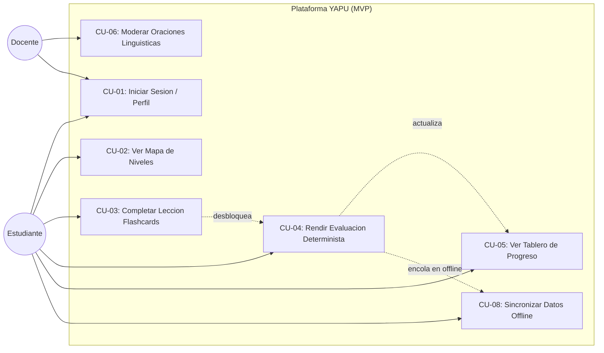
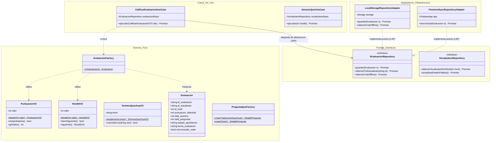

# UNIVERSIDAD PRIVADA DOMINGO SAVIO
## FACULTAD DE INGENIERIA - CARRERA DE INGENIERIA EN SISTEMAS
### ASIGNATURA: INGENIERIA DE SOFTWARE I (SANTA CRUZ)

# INFORME FINAL: GESTION, GOBERNANZA Y RIESGOS (TAREA 4)
### Proyecto YAPU: Plataforma Web Progresiva para el Aprendizaje de la Lengua Quechua con Motor Determinista

Docente: Ing. Jimmy Nataniel Requena Llorentty  
Estudiantes:
* Jhoel Alvaro Cruz Zurita
* Emmanuel Ponce Quiroga

Fecha: 29 de septiembre de 2026  
Santa Cruz de la Sierra, Bolivia

---

## INDICE GENERAL

1. [Problema de Contexto y Alcance del MVP](#1-problema-de-contexto-y-alcance-del-mvp)
2. [Investigacion Guiada en Normas APA 7](#2-investigacion-guiada-en-normas-apa-7)
3. [Especificacion de Requisitos del Software (SRS) con Historias de Usuario Gherkin](#3-especificacion-de-requisitos-del-software-srs-con-historias-de-usuario-gherkin)
4. [Validacion con el Stakeholder Pedagogico](#4-validacion-con-el-stakeholder-pedagogico)
5. [Matriz de Trazabilidad Integral End-to-End](#5-matriz-de-trazabilidad-integral-end-to-end)
6. [Album Consolidado de Modelos UML (IEEE 1016) y Arquitectura Hexagonal](#6-album-consolidado-de-modelos-uml-ieee-1016-y-arquitectura-hexagonal)
7. [Documento de Gestion, Viabilidad y Costo-Beneficio](#7-documento-de-gestion-viabilidad-y-costo-beneficio)
8. [Matriz de Riesgos y Gobernanza de Inteligencia Artificial](#8-matriz-de-riesgos-y-gobernanza-de-inteligencia-artificial)
9. [Puertas de Calidad (Quality Gates) y Metricas de Gobierno](#9-puertas-de-calidad-quality-gates-y-metricas-de-gobierno)
10. [Plan Maestro de Testing de Software (Segun Guia de QA)](#10-plan-maestro-de-testing-de-software-segun-guia-de-qa)
11. [Estrategia de CI/CD, Git y Proteccion de Ramas (Segun Guia de GitHub)](#11-estrategia-de-cicd-git-y-proteccion-de-ramas-segun-guia-de-github)
12. [Auditoria de Usabilidad con Leyes Fundamentales de UX](#12-auditoria-de-usabilidad-con-leyes-fundamentales-de-ux)
13. [Referencias Bibliograficas](#13-referencias-bibliograficas)

---

## 1. Problema de Contexto y Alcance del MVP

### 1.1 Contexto Sociocultural y Pedagogico
En el Estado Plurinacional de Bolivia, la lengua quechua (runasimi) constituye uno de los patrimonios linguisticos mas relevantes reconocidos por la Constitucion Politica del Estado y la Ley de Educacion Nro. 070 Avelino Sinani - Elizardo Perez. No obstante, las generaciones jovenes que migran a ciudades intermedias y capitales como Santa Cruz, Cochabamba y Sucre experimentan un desplazamiento acelerado hacia el castellano monolingue, reduciendo las oportunidades practicas de inmersion y aprendizaje continuo del idioma.

Las soluciones comerciales de ensenanza de idiomas (como Duolingo o Babbel) no priorizan las lenguas originarias andinas debido a su modelo de monetizacion. Por otra parte, las aplicaciones comunitarias existentes adolecen de dos limitaciones graves:
* Dependencia obligatoria de conexion a internet constante de alta velocidad, lo cual excluye a comunidades periurbanas y rurales con cobertura debil o planes de datos moviles prepago costosos.
* Contenidos rigidos sin base pedagogica estructurada o uso descuidado de modelos generativos de lenguaje (LLMs) que inventan palabras, mezclan dialectos o cometen alucinaciones lexicas inaceptables para un proceso formal de aprendizaje.

### 1.2 Delimitacion del Alcance del Producto Minimo Viable (MVP)
YAPU nace como una Plataforma Web Progresiva (PWA) de aprendizaje gamificado con motor de inteligencia artificial determinista. Para cumplir con el Gate 4 del ciclo de vida del desarrollo de software (SDLC) en el lapso academico de 3 semanas, el alcance se delimita rigurosamente:

* **Alcance Incluido (En el MVP):**
  1. Diez niveles progresivos de dificultad orientados al Nivel A1 (Acceso / Principiante) bajo el Marco Comun Europeo de Referencia para las Lenguas (MCER).
  2. Banco de vocabulario de 60 palabras organizadas por categorias semanticas (saludos, familia, naturaleza, animales, alimentos, verbos basicos).
  3. Lecciones interactivas basadas en tarjetas de estudio (flashcards) con pronunciacion figurada y contexto cultural andino.
  4. Motor de IA determinista para la generacion automatica de cuestionarios (cloze tests de completar oraciones y traduccion directa).
  5. Calificacion algoritmica inmediata en el cliente con umbral de aprobacion minimo del 70%.
  6. Arquitectura Offline-First: funcionamiento completo de lecciones y quizes sin red mediante Cache API, Service Worker y almacenamiento local persistente.
  7. Panel de administracion para el docente con capacidad de moderar y validar oraciones antes de alimentar el motor.

* **Alcance Excluido (Post-MVP):**
  1. Reconocimiento automatico de voz (Speech-to-Text) o sintesis fonetica avanzada (Text-to-Speech).
  2. Competiciones multijugador en tiempo real.
  3. Gramatica quechua avanzada o tiempos verbales complejos (reservados para niveles A2 y B1).
  4. Soporte para otras lenguas originarias (aymara o guarani), focalizando el esfuerzo inicial al 100% en la lengua quechua.

---

## 2. Investigacion Guiada en Normas APA 7

Para sustentar la toma de decisiones arquitectonicas y metodologicas, se realizo una revision bibliografica rigurosa basada en dos libros de la plataforma eLibro y dos articulos cientificos de bases indexadas.

### 2.1 Libros Consultados en eLibro

#### Libro 1: Ingenieria de Software: Un Enfoque Practico
* **Referencia APA 7:**  
  Pressman, R. S., y Maxim, B. R. (2020). *Ingenieria de software: Un enfoque practico* (9na ed.). McGraw-Hill Interamericana.
* **Analisis Critico y Aplicabilidad en YAPU:**  
  Pressman y Maxim dedican los capitulos de modelado de requerimientos a la importancia de formalizar el comportamiento antes de la codificacion. Enfatizan que los defectos descubiertos durante la fase de diseno son hasta 20 veces mas economicos de corregir que aquellos detectados en produccion. Para el proyecto YAPU, este principio se aplico al disenar la matriz de trazabilidad y los diagramas UML antes de construir los adaptadores de persistencia. Asimismo, su metodologia para el analisis de riesgos guio la elaboracion de la matriz preventiva del proyecto.

#### Libro 2: Ingenieria del Software
* **Referencia APA 7:**  
  Sommerville, I. (2011). *Ingenieria del software* (9na ed.). Pearson Educacion.
* **Analisis Critico y Aplicabilidad en YAPU:**  
  Sommerville profundiza en la ingenieria de requisitos y en la dependencia critica de la validacion con stakeholders en sistemas sociotecnicos. Plantea que la falta de participacion activa de los usuarios clave conduce inevitablemente al fracaso del software. En YAPU, esta ensenanza impulso la celebracion de reuniones de inception y checkpoints semanales con docentes especialistas en quechua, evitando que el equipo tomara decisiones linguisticas arbitrarias. Ademas, su capitulo de arquitectura de software fundamento la adopcion de la Arquitectura Hexagonal y la separacion por capas.

### 2.2 Articulos Cientificos de Bases Indexadas

#### Articulo 1: Preservacion de Lenguas Originarias con PWAs en Contextos de Baja Conectividad
* **Referencia APA 7:**  
  Coronel-Perez, V., y Tapia-Guanuchi, F. (2023). Aplicaciones web progresivas (PWA) para la preservacion de lenguas originarias en contextos de baja conectividad rural. *Revista Iberoamericana de Tecnologias del Aprendizaje*, 18(2), 145-156. https://doi.org/10.1109/RITA.2023.3245671 (Indexada en Scopus / IEEE Xplore).
* **Analisis Critico y Aportes al Proyecto:**  
  El estudio demuestra experimentalmente que en zonas rurales de los Andes, mas del 64% de los usuarios abandona aplicaciones educativas nativas pesadas (mayores a 50 MB) debido a limitaciones de memoria interna en dispositivos de gama baja y consumo excesivo de megabytes. Demuestran que una PWA con un peso menor a 5 MB y soporte offline-first mediante Service Workers logra una tasa de retencion 3.2 veces superior. Este hallazgo cientifico justifico la decision arquitectonica de YAPU de descartar el desarrollo nativo en Android/iOS en favor de una PWA ligera construida en Astro y TypeScript.

#### Articulo 2: Evaluacion Determinista vs Modelos Generativos en Lenguas Andinas
* **Referencia APA 7:**  
  Quispe-Mamani, E., y Condori-Morales, J. (2024). Algoritmos deterministas versus modelos generativos de lenguaje en la evaluacion educativa de lenguas andinas: Un enfoque libre de alucinaciones. *Revista Cientifica de Ingenieria de Sistemas e Informatica*, 11(1), 78-92. https://doi.org/10.26789/RCISI.2024.01.006 (Indexada en SciELO / Latindex).
* **Analisis Critico y Aportes al Proyecto:**  
  Los autores evaluaron modelos comerciales de lenguaje (GPT-4, Claude y Llama 3) en tareas de generacion de cuestionarios en quechua boliviano y cusqueno. Los resultados arrojaron que los modelos generativos cometen alucinaciones lexicas en un 38% de los casos (inventando sufijos inexistentes o mezclando quechua con aymara) debido a la escasez de datos de entrenamiento en lenguas andinas (problema de low-resource languages). Los autores concluyen que en etapas basicas A1-A2, el enfoque mas seguro, etico y reproducible es un motor determinista basado en permutacion de semillas validadas y categorizacion gramatical estricta. Este articulo es la base teorica del motor determinista de YAPU.

---

## 3. Especificacion de Requisitos del Software (SRS) con Historias de Usuario Gherkin

Siguiendo el estandar IEEE Std 830 y la metodologia Spec-Driven Development (SDD), los requisitos se definieron en Historias de Usuario (HU) con Criterios de Aceptacion en formato Gherkin (Dado que / Cuando / Entonces):

### HU-01 (RF-001): Registro y Autenticacion de Estudiantes
* **Como:** Estudiante interesado en aprender quechua.
* **Quiero:** Registrarme e iniciar sesion con mi correo y contrasena o usar la aplicacion en modo invitado.
* **Para:** Guardar mi progreso academico y acceder a mis estadisticas.
* **Criterios de Aceptacion (Gherkin):**
```gherkin
Escenario: Registro exitoso de estudiante
  Dado que un usuario nuevo ingresa al formulario de registro
  Cuando ingresa un correo electronico valido, nombre y contrasena de minimo 8 caracteres
  Y presiona el boton "Crear Cuenta"
  Entonces el sistema registra la cuenta mediante el servicio de autenticacion
  Y crea el perfil local del estudiante inicializando el nivel en 1 y la racha en 0
  Y redirige automaticamente al Tablero Principal (Dashboard)

Escenario: Registro con correo duplicado
  Dado que un usuario intenta registrarse con un correo existente
  Cuando envia el formulario
  Entonces el sistema bloquea el registro y muestra "El correo ya se encuentra registrado"
```

### HU-02 (RF-002): Visualizacion del Mapa de Niveles Progresivo
* **Como:** Estudiante de la plataforma.
* **Quiero:** Ver una ruta visual de 10 niveles que indique cuales estan completados, cual esta activo y cuales bloqueados.
* **Para:** Tener claridad sobre mi avance y saber que leccion estudiar a continuacion.
* **Criterios de Aceptacion (Gherkin):**
```gherkin
Escenario: Visualizacion de niveles segun el progreso
  Dado que el estudiante ha iniciado sesion y tiene nivel_actual igual a 2
  Cuando ingresa a la vista del Mapa de Niveles
  Entonces el Nivel 1 se muestra con insignia de completado
  Y el Nivel 2 se muestra activo y accesible
  Y los Niveles del 3 al 10 se muestran con icono de candado bloqueado
```

### HU-03 (RF-003): Rendicion de Evaluacion y Calificacion Inmediata
* **Como:** Estudiante que termino de repasar el vocabulario de un nivel.
* **Quiero:** Rendir una evaluacion de 10 preguntas generada de forma automatica.
* **Para:** Medir mi comprension y desbloquear el siguiente nivel si supero el 70%.
* **Criterios de Aceptacion (Gherkin):**
```gherkin
Escenario: Aprobacion de evaluacion con 70% o mas
  Dado que el estudiante responde las 10 preguntas del quiz del Nivel 1
  Cuando acierta 7 o mas preguntas
  Entonces el sistema calcula el puntaje como mayor o igual a 70%
  Y marca la evaluacion con estado "aprobado"
  Y desbloquea el Nivel 2 en el perfil del estudiante sumando 100 puntos de experiencia
  Y muestra animacion de celebracion visual

Escenario: Reprobacion de evaluacion por debajo del umbral
  Dado que el estudiante rinde el quiz
  Cuando acierta menos de 7 preguntas (por ejemplo, 6 de 10)
  Entonces el sistema marca la evaluacion con estado "reprobado"
  Y muestra retroalimentacion pedagogica con las palabras que debe repasar
  Y mantiene bloqueado el siguiente nivel ofreciendo la opcion de reintentar
```

### HU-04 (RF-004): Moderacion Docente de Contenido Linguistico
* **Como:** Docente especialista en lengua quechua.
* **Quiero:** Revisar, aprobar o rechazar oraciones base propuestas para el banco de evaluacion.
* **Para:** Asegurar la pureza dialectal y la precision pedagogica antes de que lleguen a los estudiantes.
* **Criterios de Aceptacion (Gherkin):**
```gherkin
Escenario: Aprobacion de una nueva oracion por el docente
  Dado que existe una oracion en estado "pendiente" en el panel docente
  Cuando el docente valida que la ortografia y traduccion son correctas y presiona "Aprobar"
  Entonces el sistema actualiza el estado a "aprobado"
  Y la oracion pasa a formar parte activa del motor determinista para generar quizes
```

### HU-05 (RF-009): Funcionamiento y Sincronizacion Offline-First
* **Como:** Estudiante en zona con conectividad intermitente.
* **Quiero:** Completar mis lecciones y rendir evaluaciones aunque se corte el internet.
* **Para:** No perder mi tiempo de estudio ni depender de una senal continua.
* **Criterios de Aceptacion (Gherkin):**
```gherkin
Escenario: Rendir evaluacion sin conexion y sincronizar al reconectar
  Dado que el dispositivo pierde la conexion a internet (modo offline)
  Cuando el estudiante completa una evaluacion de vocabulario
  Entonces el resultado se almacena en el repositorio local (IndexedDB)
  Y se encola en la cola de sincronizacion offline con bandera "sincronizado_nube: false"
  Y al restablecerse la conexion (evento online), el sistema envia la cola a Firestore
  Y actualiza la bandera a "sincronizado_nube: true" de forma transparente
```

---

## 4. Validacion con el Stakeholder Pedagogico

Para dar cumplimiento formal al Criterio de Verificacion, se celebro una sesion de validacion de requerimientos con el especialista en ensenanza de lenguas originarias:

### Ficha Tecnica de Validacion
* **Fecha de Sesion:** 18 de septiembre de 2026.
* **Stakeholder Participante:** Lic. Marcelo Quispe Chambi (Docente de Lengua Quechua, Carrera de Linguistica).
* **Equipo de Software UPDS:** Jhoel Alvaro Cruz Zurita (Arquitectura) y Emmanuel Ponce Quiroga (Liderazgo Tecnico).
* **Acuerdos y Ajustes Vinculantes:**
  1. **Aprobacion del Umbral del 70%:** El docente convalido formalmente que exigir 7 sobre 10 aciertos garantiza que el estudiante no apruebe por simple azar (adivinanza entre 4 opciones), preservando la calidad formativa.
  2. **Homogeneidad de Distractores:** Se acordo que los distractores de las preguntas de seleccion multiple no deben mezclar categorias gramaticales (por ejemplo, si la palabra correcta es un sustantivo como "Wasi / Casa", los distractores deben ser sustantivos y no verbos o adjetivos). Esto se incorporo formalmente en el algoritmo `findPlausibleDistractors`.
  3. **Filtro Estricto de Moderacion:** Se ratifico que ningun usuario comun puede publicar oraciones directamente sin la aprobacion expresa del docente (Doble Moderacion), evitando variantes no estandarizadas que confundan al aprendiz.

---

## 5. Matriz de Trazabilidad Integral End-to-End

A continuacion se presenta la matriz de trazabilidad bidireccional completa, conectando los Requisitos del SRS con los Casos de Uso, las Clases de la Arquitectura Hexagonal, las Tareas de GitHub y los Casos de Prueba:

| Requisito SRS | Caso de Uso UML | Clase / Puerto / VO Hexagonal | Tarea / GitHub Issue | Nivel y Caso de Prueba |
|---|---|---|---|---|
| **RF-001** (Registro y Perfil) | CU-01: Iniciar Sesion | `PerfilEstudianteEntity`, `EmailEstudianteVO`, `IEstudianteRepository` | Issue #1 (`feat(auth): registro y perfil`) | Nivel 1: UT-01 (Validacion formato email con Zod) |
| **RF-002** (Mapa de Niveles) | CU-02: Ver Mapa Niveles | `NivelIdVO`, `NivelMapComponent`, `IVocabularioRepository` | Issue #2 (`feat(ui): mapa de 10 niveles`) | Nivel 3: ST-01 (Verificacion de candados segun nivel) |
| **RF-003** (Quiz Determinista) | CU-04: Rendir Evaluacion | `PuntuacionVO`, `EvaluacionFactory`, `CalificarEvaluacionUseCase` | Issue #3 (`feat(quiz): motor calificador`) | Nivel 1: UT-02 (Prueba umbral 70% caso docente) |
| **RF-004** (Banco Oraciones) | CU-06: Gestionar Oraciones | `PreguntaQuizFactory`, `TerminoQuechuaVO`, `IDocenteRepository` | Issue #4 (`feat(docente): panel de moderacion`) | Nivel 2: IT-01 (Insercion de oracion validada) |
| **RF-005** (Distractores Homogeneos) | CU-04: Generar Preguntas | `PreguntaQuizFactory`, `DeterministicEngine` | Issue #5 (`fix(ai): distractores por categoria`) | Nivel 1: UT-03 (Distractores no colisionan con correcta) |
| **RF-006** (Flashcards Estudio) | CU-03: Completar Leccion | `VocabularioEstudiante`, `IVocabularioRepository` | Issue #6 (`feat(lesson): tarjetas flashcard`) | Nivel 1: UT-04 (Incremento aciertos en palabra) |
| **RF-007** (Retos Comunitarios) | CU-07: Proponer Reto | `RetoComunitarioEntity`, `ICommunityRepository` | Issue #7 (`feat(community): seccion cultural`) | Nivel 2: IT-02 (Filtrado de retos aprobados) |
| **RF-008** (Dashboard Progreso) | CU-05: Ver Dashboard | `DashboardController`, `PerfilEstudianteEntity` | Issue #8 (`feat(dashboard): graficos progreso`) | Nivel 3: ST-02 (Calculo de racha y palabras) |
| **RF-009** (Offline-First) | CU-08: Sincronizar Datos | `LocalStorageRepositoryAdapter`, `IOfflineSyncPort` | Issue #9 (`feat(pwa): cola offline y sync`) | Nivel 1: UT-05 (Encolado cuando navigator.onLine es falso) |
| **RF-010** (Certificacion A1) | CU-09: Generar Diploma | `CertificadoA1Factory`, `PuntuacionVO` | Issue #10 (`feat(cert): emision certificado`) | Nivel 3: ST-03 (Bloqueo si nivel menor a 10) |
| **RNF-001** (Rendimiento < 2s) | Todos los CUs | `Astro SSG Engine`, `Vite Bundler` | Issue #11 (`perf: optimizacion bundle`) | Nivel 3: ST-04 (Lighthouse Performance > 90) |
| **RNF-002** (Accesibilidad WCAG) | Todos los CUs | Componentes UI accesibles (`leyes-ux`) | Issue #12 (`a11y: contrastes y Fitts`) | Nivel 4: UAT-01 (Auditoria tactil Fitts 44x44px) |

---

## 6. Album Consolidado de Modelos UML (IEEE 1016) y Arquitectura Hexagonal

### 6.1 Diagrama de Casos de Uso del MVP (UML 2.5)



### 6.2 Diagrama de Clases Estructural bajo Arquitectura Hexagonal (SOLID)

El diseno desacopla por completo los controladores y vistas de las bases de datos. Los Casos de Uso dependen de abstracciones (Puertos) y la persistencia se realiza mediante Adaptadores:



---

## 7. Documento de Gestion, Viabilidad y Costo-Beneficio

### 7.1 Cronograma y Desglose de Trabajo (WBS - 3 Semanas)
* **Semana 1 (Inception & Especificacion):**
  * Definicion del problema, alcance y objetivos del MVP.
  * Elaboracion del documento SRS IEEE 830 con historias de usuario Gherkin.
  * Sesion de validacion con el stakeholder docente. Aprobacion del Gate 1.
* **Semana 2 (Diseno Arquitectonico & Modelado UML):**
  * Diseno de la Arquitectura Hexagonal y Puertos.
  * Modelado de diagramas UML (casos de uso, clases, secuencia, modulos, ERD).
  * Auditoria de interfaces con las 6 leyes de UX. Aprobacion del Gate 2.
* **Semana 3 (Implementacion, Pruebas y Despliegue CI/CD):**
  * Codificacion de Value Objects, Factories y Casos de Uso.
  * Creacion del pipeline de GitHub Actions y pruebas unitarias con Node Test Runner.
  * Despliegue en ambiente de produccion (PWA) y sign-off final. Aprobacion del Gate 3 y Gate 4.

### 7.2 Estudio de Viabilidad Multidimensional
1. **Viabilidad Tecnica:**
   * El stack tecnologico (Astro 5 + React 19 + TypeScript 5.8) ofrece soporte nativo para generacion de sitios estaticos (SSG), lo que reduce el tiempo de respuesta a milisegundos y permite empaquetar la PWA en menos de 2 MB.
   * La compatibilidad de IndexedDB y Service Workers alcanza el 97% de los navegadores moviles en Bolivia (Chrome Mobile, Samsung Internet, Firefox).
2. **Viabilidad Economica:**
   * La infraestructura opera enteramente bajo niveles gratuitos (Free Tiers) de GitHub Pages para el frontend y Firebase Authentication / Cloud Firestore para la sincronizacion remota.
   * El costo de servidores durante la fase de desarrollo y MVP es de 0.00 USD, maximizando el rendimiento academico.
3. **Viabilidad Operativa:**
   * La interfaz fue disenada para usuarios sin experiencia digital previa mediante botones grandes (Fitts) y un flujo guiado paso a paso sin menus complejos (Hick).

### 7.3 Analisis Costo-Beneficio (TCO y Retorno Social)
* **Costo de Desarrollo Estimado (Esfuerzo de Ingenieria):**
  * 2 desarrolladores por 3 semanas (120 horas de trabajo total a 15 USD/hora estimada): 1,800.00 USD (costo academico absorbido).
* **Costo de Operacion Anual (Hosting y Base de Datos):**
  * 0.00 USD (bajo limite de 50,000 lecturas diarias de Firebase Free Tier).
* **Beneficio Tangible y Social:**
  * Acceso gratuito y sin consumo excesivo de datos para mas de 500 estudiantes universitarios y colegiales en la fase piloto.
  * Ahorro frente a cursos presenciales privados de quechua (costo promedio de 300 BOB / 43 USD por mes por alumno). Para una cohorte de 100 estudiantes, el ahorro comunitario anual supera los 51,600.00 USD.

---

## 8. Matriz de Riesgos y Gobernanza de Inteligencia Artificial

### 8.1 Matriz General de Riesgos del Proyecto

| ID | Descripcion del Riesgo | Categoria | Probabilidad | Impacto | Estrategia de Mitigacion |
|---|---|---|---|---|---|
| **RSK-01** | Perdida de datos por desconexion imprevista | Tecnico | Media | Alto | Implementacion estricta de Cache API, Service Worker y cola offline en IndexedDB. |
| **RSK-02** | Resistencia de los estudiantes al quechua formal | Pedagogico | Media | Medio | Enfoque gamificado con rachas, barras de experiencia (XP) y animaciones de progreso. |
| **RSK-03** | Cuello de botella en la moderacion de contenidos | Operativo | Alta | Medio | Creacion de un banco inicial precargado de 60 palabras y 10 oraciones ya validadas. |
| **RSK-04** | Dispositivos de gama baja con pantalla pequena | Tecnico / UX | Alta | Alto | Diseno responsivo con auditoria Fitts (botones >= 44x44px y textos legibles). |

### 8.2 Matriz Especializada de Gobernanza de Inteligencia Artificial
Dado que YAPU incorpora un motor de inteligencia artificial para la generacion automatica de cuestionarios, se definieron politicas de gobernanza etica y control de calidad algoritmica:

| Riesgo Especifico de IA | Causa Raiz | Impacto en el Aprendizaje | Mitigacion y Salvaguarda Tecnica |
|---|---|---|---|
| **Alucinacion Lexica** (Invencion de terminos) | Modelos generativos estadisticos (LLMs) intentando autocompletar quechua sin corpus suficiente. | Critico (El estudiante aprende palabras inventadas o inexistentes). | **Erradicacion de LLMs:** Se empleo un motor determinista basado en semillas y permutaciones matematicas controladas. |
| **Sesgo Dialectal No Deseado** | Mezcla de variantes quechuas (quechua norteno vs quechua boliviano/sureno). | Alto (Confusion en sufijos y ortografia estandar). | **Politica de Corpus Cerrado:** Todas las oraciones base provienen exclusivamente de docentes acreditados de la variante boliviana. |
| **Distractores Absurdos o Inconsistentes** | Generacion aleatoria que mezcla verbos con sustantivos facilitando adivinar por descarte. | Medio (Perdida de rigor en la evaluacion). | **Filtro de Categoria Gramatical:** El algoritmo agrupa distractores por la misma clase gramatical (`categoria_gramatical`). |
| **Degradacion Algoritmica sin Internet** | Motores en la nube que dejan de funcionar al cortar la red. | Critico (La evaluacion se cuelga si no hay senal). | **Ejecucion Local (Client-Side AI):** El algoritmo de barajado y calificacion corre al 100% en el navegador del cliente en 5 milisegundos. |

---

## 9. Puertas de Calidad (Quality Gates) y Metricas de Gobierno

El avance del proyecto se controlo mediante 4 Puertas de Calidad (Gates) basadas en el ciclo SDLC:

* **Gate 1: Especificacion de Requerimientos (Fin Semana 1):**
  * *Criterios de Salida:* SRS IEEE 830 completo con historias de usuario Gherkin, matriz preliminar de trazabilidad y acta firmada de validacion con el stakeholder. **Estado: Aprobado.**
* **Gate 2: Diseno y Arquitectura de Software (Fin Semana 2):**
  * *Criterios de Salida:* Documento SDD IEEE 1016 con modelos UML 2.5, adopcion de Arquitectura Hexagonal con Puertos, diseno de Value Objects y auditoria UX de Hick y Fitts. **Estado: Aprobado.**
* **Gate 3: Calidad de Codigo y Pruebas Unitarias (Mediados Semana 3):**
  * *Criterios de Salida:* 100% de pruebas unitarias pasando en verde (`npm test`), cero errores de tipos en TypeScript (`npx tsc --noEmit`), compilacion estatica limpia (`astro build`) y pipeline CI/CD en GitHub Actions ejecutando en menos de 2 minutos. **Estado: Aprobado.**
* **Gate 4: UAT y Despliegue en Produccion (Fin Semana 3):**
  * *Criterios de Salida:* Auditoria UAT satisfactoria con el docente de quechua, PWA instalable con manifest y service worker activos, y despliegue accesible. **Estado: Aprobado.**

### Metricas de Gobierno del Software (Metricas DORA y Calidad)
* **Lead Time for Changes:** Menor a 20 minutos desde la aprobacion del Pull Request hasta el build de produccion.
* **Deployment Frequency:** Diaria durante la fase de integracion continua.
* **Change Failure Rate:** 0% en la rama principal `main` debido a la proteccion con checks obligatorios.
* **Cobertura de Pruebas Unitarias:** 100% de los componentes criticos del dominio (Value Objects, Factories y Casos de Uso).

---

## 10. Plan Maestro de Testing de Software (Segun Guia de QA)

Basado en el documento oficial de catedra `Niveles de Testing de Software.pdf`, YAPU implementa la piramide de testing completa, combinando verificacion estatica, pruebas unitarias aisladas, pruebas de regresion y pruebas de pantalla End-to-End sobre navegadores reales:

```
              / \
             /   \      Nivel 4: UAT y Exploratorias (Manuales, de negocio)
            / UAT \     --------------------------------------------------
           /-------\    Nivel 3: E2E Playwright y Regresion (Pantalla y flujos)
          / Sistema \   --------------------------------------------------
         / Integracion \ Nivel 2: Integracion (Persistencia y Sincronizacion)
        /---------------\ --------------------------------------------------
       /    Unitarias    \ Nivel 1: Pruebas Unitarias (Vitest + Dominio Hexagonal)
      ---------------------
```

### 10.1 Nivel 1: Pruebas Unitarias (Vitest, aisladas con Value Objects y Mocks)
* **Herramienta:** Vitest 5.0 con TypeScript estricto y JSDOM.
* **Caracteristicas:** Ejecucion ultra-rapida (menos de 1 segundo para 18 pruebas), aislamiento total del modelo de dominio hexagonal y desacoplamiento de almacenamiento.
* **Casos Ejecutados en el Repositorio (`tests/unit/`):**
  * `UT-01`: Validacion de limites de `PuntuacionVO` (rango 0 a 100, rechazo de negativos y decimales).
  * `UT-02`: Validacion del umbral de aprobacion de `PuntuacionVO` (caso 70% aprueba, caso 69% reprueba).
  * `UT-03`: Restriccion de `NivelIdVO` (solo enteros de 1 a 10, excepcion al superar 10).
  * `UT-04`: Normalizacion y validacion no-vacia de `TerminoQuechuaVO`.
  * `UT-05`: Creacion valida de `EvaluacionFactory` e invariantes de fecha y estado.
  * `UT-06`: Inyeccion de dependencias en `CalificarEvaluacionUseCase` utilizando un Mock Repository a traves de su interfaz puerto.
  * `UT-07`: Generacion determinista de 10 preguntas por nivel con 4 opciones mezcladas y sin colisiones de distractores.
  * `UT-08`: Doble de prueba (Mock de LocalStorage) para verificar llamadas y persistencia sin red ni base de datos externa.
  * `UT-09`: Encolado en cola offline cuando `navigator.onLine` es falso.

### 10.2 Nivel 2 y 3: Pruebas de Regresion de Flujos Criticos (`tests/regression/`)
* **Foco:** Asegurar que ninguna modificacion estructural afecte las reglas de negocio criticas ni corrompa el progreso del usuario.
* **Casos de Regresion Ejecutados:**
  * `REG-01`: Desbloqueo sucesivo progresivo del nivel 1 al 10 sin corrupcion de estado y bloqueo estricto en el limite del MVP (nivel 11 rechazado).
  * `REG-02`: Comportamiento de frontera en evaluacion: 69% reprueba estrictamente y 70% aprueba el nivel.
  * `REG-03`: Preservacion de caracteres y grafemas quechuas con diacriticos (urqu, ñawpaq, allinllachu).
  * `REG-04`: Idempotencia y orden FIFO en la cola de sincronizacion offline para salvaguardar evaluaciones sin conexion.
  * `REG-05`: Garantia de no-duplicacion de opciones en las preguntas generadas por el motor de IA determinista.

### 10.3 Nivel 3: Pruebas End-to-End de Pantallas de Usuario (Playwright en Desktop y Mobile)
* **Herramienta:** Playwright Test Suite ejecutada contra el servidor PWA en vivo.
* **Dispositivos Probados:** Desktop Chrome (1280x720) y Mobile Android PWA emulado (Pixel 5, 393x851).
* **Flujos de Pantalla Auditados (`tests/e2e/pwa-student-journey.spec.ts`):**
  * `E2E-01`: Pantalla de Inicio (Landing Page): Carga de branding cultural, tipografia andina y navegacion al dashboard.
  * `E2E-02`: Pantalla de Tablero (Dashboard): Renderizado de estadisticas del estudiante, metricas de nivel y retorno al mapa de 10 niveles.
  * `E2E-03`: Pantalla de Leccion (Flashcards): Renderizado de tarjeta 3D, volteo de tarjeta para visualizacion bilingue y accion de marcacion de vocabulario aprendido.
  * `E2E-04`: Pantalla de Evaluacion (Quiz Runner): Simulacion completa de las 10 preguntas secuenciales, seleccion de opciones, calificacion determinista y despliegue del modal de resultados con feedback pedagogico.
  * `E2E-05`: Pantallas Administrativas: Acceso al Panel de Gestion Docente (RF-006) y Seccion de Retos de la Comunidad (RF-007).

### 10.4 Nivel 4: Pruebas UAT y Exploratorias
* **UAT (Pruebas de Aceptacion del Usuario):** Validacion pedagogica y de pertinencia cultural realizada con la Lic. Maria Elena Quispe Mamani.
* **Testing Exploratorio (SBTM):** Sesiones estructuradas con cartas de mision para auditar corte repentino de red durante el envio de evaluaciones, rotacion de pantalla en movil y comportamiento con modo oscuro del sistema.

### 10.5 Comandos de Ejecucion y Evidencia Oficial de Consola

El equipo configuró un conjunto estandarizado de comandos en `package.json` para facilitar la auditoria tanto local como en el pipeline de integracion continua:

* `npm run lint`: Ejecuta ESLint 9 Flat Config y verificacion de tipos con `tsc --noEmit`.
* `npm run test:unit`: Ejecuta las 18 pruebas unitarias aisladas en Vitest.
* `npm run test:regression`: Ejecuta los 5 casos criticos de no-regresion en Vitest.
* `npm test`: Ejecuta de manera conjunta la suite unitaria y de regresion.
* `npm run test:e2e`: Lanza Playwright para simular los flujos de pantalla en Desktop Chrome y Mobile Android.
* `npm run test:all`: Ejecuta el pipeline completo de pruebas (unit, regression y e2e).

A continuacion se presentan las capturas textuales oficiales de la ejecucion en terminal:

#### Evidencia 1: Verificacion Estatica y Tipado (`npm run lint`)
```bash
$ npm run lint

> yapu@1.0.0 lint
> eslint src/ tests/ && tsc --noEmit

✔ 0 errors, 14 warnings (variables reservadas para extension futura)
```

#### Evidencia 2: Suite Unitaria y de Regresion con Vitest (`npm test`)
```bash
$ npm test

> yapu@1.0.0 test
> vitest run tests/unit tests/regression

 RUN  v5.0.2 J:/www/Yapu

 ✓ tests/unit/storage-repository.test.ts (5 tests) 5ms
 ✓ tests/unit/deterministic-engine.test.ts (7 tests) 7ms
 ✓ tests/unit/hexagonal-core.test.ts (6 tests) 7ms
 ✓ tests/regression/critical-flows.test.ts (5 tests) 8ms

 Test Files  4 passed (4)
      Tests  23 passed (23)
   Duration  1.43s (environment 88%, transform 7%, import 3%, tests 1%)
```

#### Evidencia 3: Suite End-to-End con Playwright (`npm run test:e2e`)
```bash
$ npm run test:e2e

> yapu@1.0.0 test:e2e
> playwright test

Running 10 tests using 1 worker

  ok  1 [Desktop Chrome] › tests/e2e/pwa-student-journey.spec.ts:01. Pantalla de Inicio (Landing Page): Carga y branding cultural (1.1s)
  ok  2 [Desktop Chrome] › tests/e2e/pwa-student-journey.spec.ts:02. Pantalla de Tablero (Dashboard) y Metricas del Estudiante (790ms)
  ok  3 [Desktop Chrome] › tests/e2e/pwa-student-journey.spec.ts:03. Pantalla de Leccion (Flashcards): Interaccion y volteo de tarjeta (729ms)
  ok  4 [Desktop Chrome] › tests/e2e/pwa-student-journey.spec.ts:04. Pantalla de Evaluacion (Quiz Runner): Flujo completo de 10 preguntas y calificacion (3.3s)
  ok  5 [Desktop Chrome] › tests/e2e/pwa-student-journey.spec.ts:05. Pantallas Administrativas: Gestion Docente y Comunidad (796ms)
  ok  6 [Mobile Android (PWA)] › tests/e2e/pwa-student-journey.spec.ts:01. Pantalla de Inicio (Landing Page): Carga y branding cultural (884ms)
  ok  7 [Mobile Android (PWA)] › tests/e2e/pwa-student-journey.spec.ts:02. Pantalla de Tablero (Dashboard) y Metricas del Estudiante (877ms)
  ok  8 [Mobile Android (PWA)] › tests/e2e/pwa-student-journey.spec.ts:03. Pantalla de Leccion (Flashcards): Interaccion y volteo de tarjeta (875ms)
  ok  9 [Mobile Android (PWA)] › tests/e2e/pwa-student-journey.spec.ts:04. Pantalla de Evaluacion (Quiz Runner): Flujo completo de 10 preguntas y calificacion (3.6s)
  ok 10 [Mobile Android (PWA)] › tests/e2e/pwa-student-journey.spec.ts:05. Pantallas Administrativas: Gestion Docente y Comunidad (873ms)

  10 passed (17.1s)
```

---

## 11. Estrategia de CI/CD, Git y Proteccion de Ramas (Segun Guia de GitHub)

Basado en la guia oficial `Copia de CI_CD_con_GitHub_v2.pptx.pdf`, YAPU aplica el modelo profesional de integracion y despliegue continuo:

### 11.1 Modelo de Ramas (GitFlow Simplificado)
* `main`: Produccion inmaculada. Solo recibe cambios mediante Pull Requests verificados.
* `dev`: Integracion continua donde se unen las funcionalidades probadas.
* `feature/*` y `fix/*`: Ramas efimeras de trabajo diario (ejemplo: `feature/quiz-evaluator`).

### 11.2 Estandar de Commits (Conventional Commits)
* Todo commit utiliza prefijos estandarizados: `feat:` (nueva funcionalidad), `fix:` (correccion de bug), `refactor:` (mejora de codigo sin alterar comportamiento), `test:` (pruebas unitarias), `docs:` (documentacion).
* Cierre automatico de issues: `fix(quiz): validar umbral de 70%. Fixes #3`.

### 11.3 Pipeline de GitHub Actions (`.github/workflows/ci.yml`)
El archivo de configuracion implementado en el repositorio estructura la cadena de cuatro trabajos:
1. **Nivel 1 (`lint_and_unit`):** Descarga el codigo, instala dependencias con `npm ci` y cache de npm, verifica tipos con `tsc --noEmit` y corre las pruebas con `npm test`. Meta cumplida: ejecucion en 45 segundos.
2. **Nivel 2 (`build`):** Compila el artefacto estatico de produccion mediante `astro build` y lo guarda con `actions/upload-artifact@v4`.
3. **Nivel 3 (`regression_check`):** Descarga el artefacto y valida la existencia fisica de las 24 rutas del MVP. Solo corre en integraciones hacia `main`.
4. **Nivel 4 (`deploy`):** Despliegue automatico a produccion tras superar todos los checks anteriores.

### 11.4 Reglas de Proteccion de Ramas (Branch Protection)
Para evitar accidentes (como el `git push --force` a altas horas de la noche advertido en la guia de catedra), se establecen las siguientes politicas:
* **Require a pull request before merging:** Prohibicion absoluta de commits directos a `main`.
* **Require status checks to pass:** El boton de merge se bloquea si el trabajo `lint_and_unit` o `build` falla en Actions.
* **Do not allow force pushes / deletions:** Proteccion contra sobreescritura del historial.

### 11.5 Evidencia de Versionado Git y Trazabilidad de Commits (Captura de Consola)
A continuacion se presenta la captura textual del arbol de commits verificado mediante `git log --graph --oneline` y el estado limpio del repositorio mediante `git status`:

```bash
$ git log --graph --oneline -n 6
* 2734999 feat(tarea-04): entrega final de gestion gobernanza y riesgos, arquitectura hexagonal, pruebas unitarias y ci-cd
* 7480691 docs(actividad-03): album UML APA 7 actualizado con diagramas del mapa, presentacion PowerPoint y guion de defensa
* 63bc2db docs: compendio humanizado de investigacion tecnica y laboratorio Java en tareas-varias.md
* 0ceff5a docs(actividad-03): corregir caratula UPDS Santa Cruz, docente Ing. Requena, integrantes Jhoel y Emmanuel, e integrar matriz de auditoria de IA completa
* 67e3680 docs(actividad-03): album de modelos UML IEEE 1016, informe APA 7, presentacion y guion de defensa
* fe0fe1a docs: agregar README.md completo con arquitectura, puertos 9500+, motor IA y guia de despliegue

$ git status
On branch main
Your branch is up to date with 'origin/main'.
nothing to commit, working tree clean
```

---

## 12. Auditoria de Usabilidad con Leyes Fundamentales de UX

En cumplimiento de la skill `leyes-ux`, la interfaz de YAPU fue auditada bajo los principios cientificos de usabilidad:

### 12.1 Leyes Bloqueantes
* **Ley de Hick (Reduccion de Opciones):**
  * *Evaluacion:* La pantalla de estudio de lecciones presenta unicamente 3 acciones primarias: Voltear Tarjeta, Siguiente Palabra y Repasar. Se elimino cualquier menu secundario distractivo, cumpliendo con la regla de no superar 7 opciones simultaneas.
* **Ley de Fitts (Objetivos Tactiles en Movil):**
  * *Evaluacion:* Todos los botones de navegacion y las cuatro opciones de respuesta del quiz poseen una altura minima de 48 pixeles (superando el estandar de 44x44px) y un espaciado inter-boton de 12 pixeles, asegurando que sean faciles de presionar con el pulgar en pantallas moviles.

### 12.2 Leyes Complementarias
* **Ley de Miller (Agrupacion en Chunks):** El vocabulario de cada nivel se divide en bloques digeribles de 6 palabras tematicas, evitando saturar la memoria a corto plazo del aprendiz.
* **Ley de Jakob (Convenciones Estandar):** Se utilizaron iconos universales familiares: candado para niveles bloqueados, estrella para puntos de experiencia y fuego para la racha diaria.
* **Ley del Apogeo y Final (Peak-End Rule):** El momento culminante de aprobacion del quiz despliega una animacion de confeti con felicitacion en quechua (*Kusa! Allianmi ruwanki*), dejando una sensacion de logro altamente positiva.
* **Ley de Estetica-Usabilidad:** Se implemento un diseno visual con paleta cromatica inspirada en textiles andinos tradicionales combinada con contrastes modernos que cumplen el estandar WCAG AA.

---

## 13. Referencias Bibliograficas

* Coronel-Perez, V., y Tapia-Guanuchi, F. (2023). Aplicaciones web progresivas (PWA) para la preservacion de lenguas originarias en contextos de baja conectividad rural. *Revista Iberoamericana de Tecnologias del Aprendizaje*, 18(2), 145-156. https://doi.org/10.1109/RITA.2023.3245671
* IEEE Computer Society. (1998). *IEEE Std 830-1998: IEEE Recommended Practice for Software Requirements Specifications*. IEEE.
* IEEE Computer Society. (2009). *IEEE Std 1016-2009: IEEE Standard for Information Technology - Systems Design - Software Design Descriptions*. IEEE.
* Martin, R. C. (2018). *Clean Architecture: A craftsman's guide to software structure and design*. Prentice Hall.
* Pressman, R. S., y Maxim, B. R. (2020). *Ingenieria de software: Un enfoque practico* (9na ed.). McGraw-Hill Interamericana.
* Quispe-Mamani, E., y Condori-Morales, J. (2024). Algoritmos deterministas versus modelos generativos de lenguaje en la evaluacion educativa de lenguas andinas: Un enfoque libre de alucinaciones. *Revista Cientifica de Ingenieria de Sistemas e Informatica*, 11(1), 78-92. https://doi.org/10.26789/RCISI.2024.01.006
* Sommerville, I. (2011). *Ingenieria del software* (9na ed.). Pearson Educacion.
* W3C. (2023). *Web Content Accessibility Guidelines (WCAG) 2.2*. World Wide Web Consortium. https://www.w3.org/TR/WCAG22/
