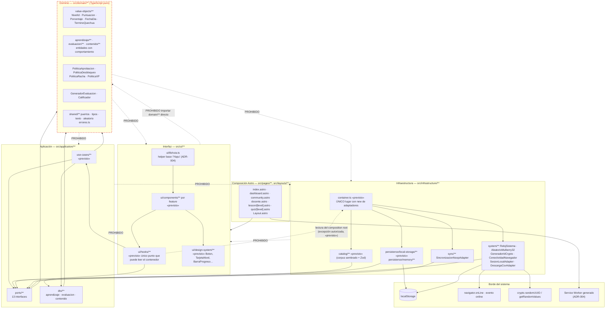
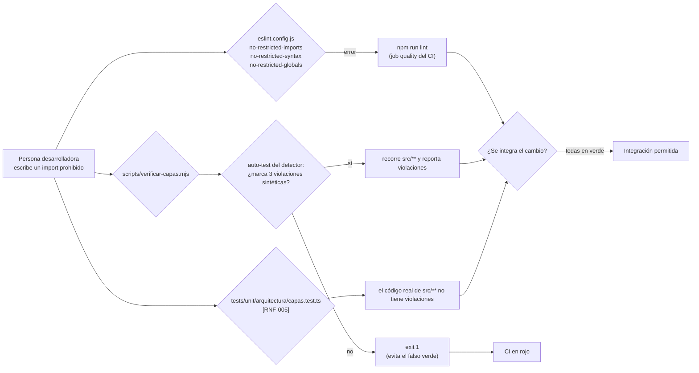
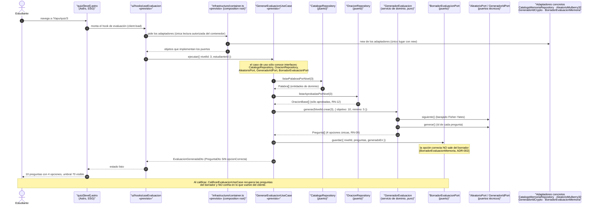
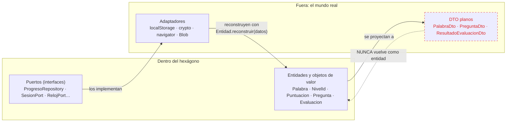
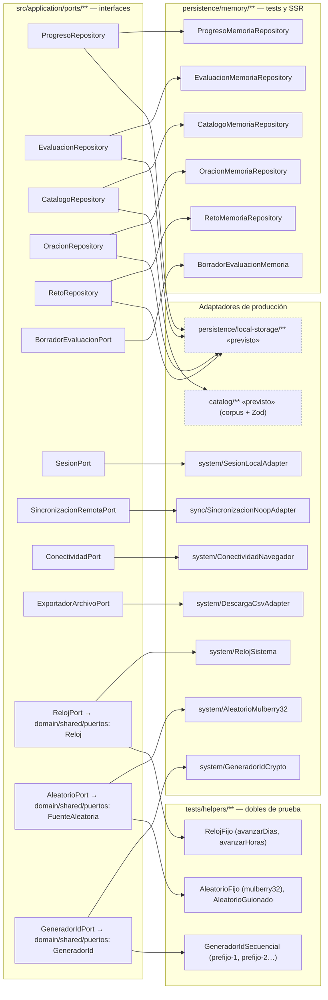

# Diagrama de capas — arquitectura hexagonal de YAPU

Documento de apoyo del [ADR-001](ADR-001-arquitectura-hexagonal.md). Todos los diagramas están en
[Mermaid](https://mermaid.js.org/) y se renderizan directamente en GitHub.

> **Nota de alcance.** Los diagramas describen la **estructura objetivo** de la arquitectura y, cuando
> el módulo ya existe, se indica el archivo real. Los elementos marcados con `«previsto»` todavía no
> existen en el árbol `src/` en el momento de redactar este documento (ver la sección
> [Estado de implementación](#estado-de-implementación) al final).

---

## 1. Capas y dependencias

Sólo se permite la dependencia en el sentido de las flechas continuas. Las flechas discontinuas
rojas son **prohibidas** y se comprueban automáticamente con ESLint (`no-restricted-imports` por
carpeta), `scripts/verificar-capas.mjs` y `tests/unit/arquitectura/capas.test.ts` (`[RNF-005]`).

### 1.1 Tabla de reglas de dependencia (la fuente que aplican las herramientas)

| Capa | Ruta | Puede importar | Prohibido |
| --- | --- | --- | --- |
| Dominio | `src/domain/**` | `domain/**`, `zod` | `application`, `infrastructure`, `ui`, `react`, `react-dom`, `astro` |
| Aplicación | `src/application/**` | `domain/**`, `application/**` | `infrastructure`, `ui`, `react`, `react-dom`, `astro` |
| Infraestructura | `src/infrastructure/**` | `domain/**`, `application/**`, `infrastructure/**` | `ui`, `react`, `react-dom` |
| Interfaz | `src/ui/**` | `application/**`, `ui/**` | `domain/**` (directo), `infrastructure/**` |
| Composición | `src/pages/**`, `src/layouts/**` | `ui/**`, `layouts/**` | lógica de negocio, acceso a datos |

### 1.2 Prohibiciones de entorno (además de las de importación)

| Capa | No puede usar |
| --- | --- |
| `domain` | `Math.random`, `Date.now`, `new Date()`, `window`, `document`, `navigator`, `localStorage`, `crypto` |
| `application` | `Math.random`, `localStorage`, `window` |
| `infrastructure` | — (es el borde: aquí sí se toca el entorno) |
| `ui` | — (pero no puede importar `domain/**` directamente) |

### 1.3 Cómo se enforza (tres barreras independientes)

---

## 2. Flujo de una petición: UI → caso de uso → puerto → adaptador

Ejemplo real del recorrido completo: **el estudiante abre la evaluación del nivel 3**.
Las llamadas van siempre hacia dentro (dependencias invertidas) y los datos vuelven como DTO planos.

### 2.1 Qué puede atravesar cada frontera

Reglas de la frontera:

1. Las entidades **no** cruzan hacia la UI: se proyectan a DTO (`PalabraDto`, `NivelDto`, `PreguntaDto`…).
2. Los adaptadores **reconstruyen** entidades con `reconstruir(datos)`, nunca con `new` desde fuera.
3. La UI **no** obtiene adaptadores por su cuenta: pasan por el *composition root* (`container.ts`) y sólo desde `ui/hooks/**`.

---

## 3. Flujo del estudiante: mapa → lección → evaluación → resultado → tablero

Con las reglas de negocio RN-01 … RN-17 anotadas en el punto del recorrido donde se aplican.

```mermaid
flowchart TD
    INICIO(["El estudiante abre /Yapu/"]) --> MAPA

    subgraph MAPA_S["1. Portada / mapa de niveles — ObtenerMapaNivelesUseCase (RF-003)"]
        MAPA["MapaNivelesDto:<br/>nivelActual · porcentajeGlobal · xp · rachaDias<br/>tramos: Fundamentos 1–3 / Vida cotidiana 4–7 / Cosmovisión 8–10"]
        MAPA --> RN01{"RN-01 · ¿nivel ≤ nivelActual?"}
        RN01 -->|"sí"| ACCESO["Nivel accesible:<br/>botones Lección y Evaluación"]
        RN01 -->|"no"| BLOQ["Nivel bloqueado:<br/>candado + motivo en español<br/>(NivelBloqueadoError)"]
    end

    ACCESO --> LECCION
    BLOQ --> MAPA

    subgraph LECCION_S["2. Lección / flashcards — ObtenerLeccionUseCase + MarcarPalabraUseCase (RF-004)"]
        LECCION["Flashcards: término, traducción,<br/>pronunciación, imagen (o placeholder SVG),<br/>contexto cultural"]
        LECCION --> MARCAR{"El estudiante marca la palabra"}
        MARCAR -->|"¡Ya me la sé!"| RN08["RN-08 · estado = aprendido<br/>palabrasAprendidas = palabras ÚNICAS aprendidas"]
        MARCAR -->|"Necesito repasar"| REPASAR["estado = repasar<br/>conserva contadorAciertos"]
        RN08 --> RN05A["RN-05 · +2 XP sólo la PRIMERA vez<br/>que esa palabra pasa a aprendido (idempotente)"]
        REPASAR --> RN06A["RN-06 · registrarActividad(hoy)<br/>racha según días calendario locales"]
        RN05A --> RN06A
        RN06A --> XP_TOTAL["XP acumulada y racha actualizadas en ProgresoEstudiante"]
    end

    XP_TOTAL --> EVAL
    LECCION -.->|"cierre de lección"| CIERRE["CTA claro al siguiente paso:<br/>evaluación del nivel o siguiente bloque de tarjetas"]
    CIERRE --> EVAL

    subgraph EVAL_S["3. Evaluación en curso — GenerarEvaluacionUseCase (RF-005)"]
        EVAL["EvaluacionGeneradaDto: 10 preguntas × 4 opciones"]
        EVAL --> RN10{"RN-10 · ¿5 preguntas válidas como mínimo?"}
        RN10 -->|"no"| INSUF["ContenidoInsuficienteError:<br/>mensaje en español, no se rompe la app"]
        RN10 -->|"sí"| RN09["RN-09 · 4 opciones únicas y plausibles<br/>prioridad de pools de distractores"]
        RN09 --> RN11["RN-11 · sólo oraciones aprobadas que<br/>contienen su palabra clave (admite sufijos)"]
        RN11 --> RN16["RN-16 · se puede volver a la pregunta anterior;<br/>no se avanza sin marcar respuesta"]
        RN16 --> RESP["El estudiante responde 10 preguntas"]
    end

    RESP --> CALIF

    subgraph CALIF_S["4. Calificación — CalificarEvaluacionUseCase (RF-005)"]
        CALIF["El caso de uso recupera las preguntas del<br/>BorradorEvaluacionPort (nunca del cliente)"]
        CALIF --> RN04{"RN-04 · PoliticaAprobacion.UMBRAL = 70<br/>¿puntuacion ≥ 70?"}
        RN04 -->|"no responde"| INCORRECTA["La pregunta cuenta como incorrecta"]
        INCORRECTA --> RN04
    end

    RN04 -->|"aprobado"| RESULTADO_OK
    RN04 -->|"reprobado"| RESULTADO_NO

    subgraph RESULT_S["5. Resultado de la evaluación — Apogeo-Final"]
        RESULTADO_OK["Clímax: mensaje de felicidad + umbral explicado<br/>PoliticaAprobacion.mensajeResultado(aprobado, puntuacion)"]
        RESULTADO_OK --> RN02{"RN-02 · ¿es el nivel ACTUAL?"}
        RN02 -->|"sí"| DESBLOQ{"¿es el nivel 10?"}
        DESBLOQ -->|"no"| NUEVO["desbloqueado = n + 1<br/>nivelActual = n + 1"]
        DESBLOQ -->|"sí"| FIN["cursoCompletado = true<br/>nunca se desbloquea un «nivel 11»"]
        RN02 -->|"no (nivel ya superado)"| SIN_XP["aprobacionNueva = false<br/>no reparte los +100 XP"]
        RESULTADO_NO["Reprobado: retroalimentación pedagógica<br/>+ CTA «Repasar las N palabras falladas»"]
    end

    NUEVO --> RN05B
    FIN --> RN05B
    SIN_XP --> RN05B
    RESULTADO_NO --> RN05C

    subgraph XP_S["6. Registro del resultado"]
        RN05B["RN-05 · +10 por rendir + 100 por aprobación NUEVA<br/>RN-15 · la Evaluacion nace sincronizada = false<br/>RN-17 · id de la evaluación vía GeneradorIdPort"]
        RN05C["RN-05 · +10 XP de participación<br/>+ registro de actividad (RN-06)"]
        RN05B --> RN15Q["Cola offline: el historial ES la cola"]
        RN05C --> RN15Q
        RN15Q --> FIFO["RN-15 · listarPendientes() en orden FIFO<br/>idempotente al marcar sincronizada"]
    end

    FIFO --> TABLERO
    RESULTADO_NO -.->|"rutaLeccion(nivel, palabrasFalladas)"| LECCION

    subgraph TABLERO_S["7. Tablero de progreso — ObtenerTableroUseCase (RF-008)"]
        TABLERO["TableroDto: nivelActual · porcentajeGlobal · xp · rachaDias<br/>palabrasAprendidas · palabrasParaRepasar · historial"]
        TABLERO --> RN03["RN-03 · porcentajeGlobal = nivelesAprobados / 10 × 100<br/>(100 % al completar los 10 niveles)"]
        RN03 --> RN07["RN-07 · perfil nuevo = nivel 1, racha 0,<br/>0 palabras, 0 XP, curso sin empezar"]
        RN07 --> RN06B["RN-06 · racha = días calendario consecutivos<br/>(mismo día: sin cambio · día siguiente: +1 · hueco ≥ 2 días: 1)"]
    end

    RN06B --> COMUNIDAD
    RN06B --> DOCENTE
    RN06B --> SYNC

    subgraph COMUNIDAD_S["8. Comunidad / retos (RF-007 · RS-003)"]
        COMUNIDAD["ListaRetosDto: retos aprobados para estudiantes,<br/>también pendientes para docentes"]
        COMUNIDAD --> RN13{"RN-13 · ¿rol estudiante y nivelActual ≥ 7?"}
        RN13 -->|"sí"| PROPONE["Puede proponer; nace pendiente"]
        RN13 -->|"no"| NOPROPONE["PermisoRetoDto.motivo explica por qué no"]
        PROPONE --> DOBLE{"RN-13 · doble moderación:<br/>2 docentes DISTINTOS<br/>el autor no modera su propio reto"}
        DOBLE -->|"2 aprobaciones"| PUBLICADO["estado = aprobado y se publica"]
        DOBLE -->|"1 rechazo"| RECHAZADO["estado = rechazado; el reto se cierra"]
    end

    subgraph DOCENTE_S["9. Panel docente (RF-006 · RF-010)"]
        DOCENTE["Pestañas: Oraciones · Moderación · Exportación"]
        DOCENTE --> RN12["RN-12 · rol docente; palabra clave OBLIGATORIA<br/>y del MISMO nivel; la oración queda aprobada<br/>y alimenta al generador"]
        DOCENTE --> MODERA["Moderación de retos (RN-13)"]
        DOCENTE --> RN14["RN-14 · exportación del corpus<br/>RFC 4180 + BOM UTF-8 +<br/>neutralización de fórmulas (RS-004)"]
    end

    subgraph SYNC_S["10. Sincronización (RF-009 · RN-15)"]
        SYNC["SincronizarPendientesUseCase<br/>«previsto»"]
        SYNC --> ONLINE1["Al INICIAR la aplicación"]
        SYNC --> ONLINE2["Al volver `online`<br/>ConectividadPort.alRecuperarConexion"]
        ONLINE1 --> LOTE["SincronizacionRemotaPort.sincronizar(lote FIFO)"]
        ONLINE2 --> LOTE
        LOTE --> NOOP["SincronizacionNoopAdapter<br/>marca como sincronizado, sin red real (ADR-002)"]
    end

    classDef rn fill:#fff7ed,stroke:#ea580c,color:#7c2d12;
    class RN01,RN02,RN03,RN04,RN05A,RN05B,RN05C,RN06A,RN06B,RN07,RN08,RN09,RN10,RN11,RN12,RN13,RN14,RN15Q,RN16,RN17 rn;
```

### 3.1 Dónde vive cada regla (mapa de implementación)

| Regla | Archivo que la implementa | Verificada por |
| --- | --- | --- |
| RN-01 | `src/domain/aprendizaje/PoliticaDesbloqueo.ts`, `src/domain/value-objects/NivelId.ts`, `src/domain/errores.ts` (`NivelBloqueadoError`) | `tests/unit/domain/value-objects.test.ts`, `tests/unit/domain/aprendizaje/politicas.test.ts` |
| RN-02 | `src/domain/aprendizaje/PoliticaDesbloqueo.ts` (`aplicarAprobacion`) | `tests/unit/domain/aprendizaje/politicas.test.ts` |
| RN-03 | `src/domain/aprendizaje/PoliticaDesbloqueo.ts` (`progresoGlobal`), `src/domain/value-objects/Porcentaje.ts` | `tests/unit/domain/value-objects.test.ts` |
| RN-04 | `src/domain/evaluacion/PoliticaAprobacion.ts` (`UMBRAL = 70`), `src/domain/evaluacion/Calificador.ts` | `tests/unit/domain/evaluacion/politica-aprobacion.test.ts` |
| RN-05 | `src/domain/aprendizaje/PoliticaXP.ts`, `ProgresoEstudiante.marcarPalabra` / `aplicarResultadoEvaluacion` | `tests/unit/domain/aprendizaje/progreso-estudiante.test.ts` |
| RN-06 | `src/domain/aprendizaje/PoliticaRacha.ts`, `src/domain/value-objects/FechaDia.ts` | `tests/unit/domain/aprendizaje/politicas.test.ts` |
| RN-07 | `src/domain/aprendizaje/ProgresoEstudiante.ts` (`nuevo`, `reconstruir`) | `tests/unit/domain/aprendizaje/progreso-estudiante.test.ts` |
| RN-08 | `src/domain/aprendizaje/ProgresoEstudiante.ts` (`palabrasAprendidas`, `marcarPalabra`) | `tests/unit/domain/aprendizaje/progreso-estudiante.test.ts` |
| RN-09 | `src/domain/evaluacion/Pregunta.ts`, `GeneradorEvaluacion.ts`, `src/domain/shared/texto.ts` | `tests/unit/domain/evaluacion/pregunta.test.ts`, `generador-evaluacion.test.ts`, `tests/unit/domain/texto.test.ts` |
| RN-10 | `src/domain/evaluacion/GeneradorEvaluacion.ts` (`PREGUNTAS_OBJETIVO`, `PREGUNTAS_MINIMAS`) | `tests/unit/domain/evaluacion/generador-evaluacion.test.ts` |
| RN-11 | `src/domain/contenido/OracionBase.ts`, `src/domain/shared/texto.ts` (`contienePalabraClave`) | `tests/unit/domain/contenido/oracion-base.test.ts` |
| RN-12 | `src/domain/contenido/OracionBase.ts` (`crear`), `src/domain/errores.ts` (`PermisoDenegadoError`) | `tests/unit/domain/contenido/oracion-base.test.ts` |
| RN-13 | `src/domain/contenido/RetoComunitario.ts` | `tests/unit/domain/contenido/reto-comunitario.test.ts` |
| RN-14 | `src/domain/contenido/serializadorCsv.ts` | `tests/unit/domain/contenido/serializador-csv.test.ts` |
| RN-15 | `src/domain/evaluacion/Evaluacion.ts`, `src/application/ports/EvaluacionRepository.ts`, `src/infrastructure/sync/SincronizacionNoopAdapter.ts` | `tests/unit/domain/evaluacion/politica-aprobacion.test.ts`, `tests/unit/infrastructure/system.test.ts` |
| RN-16 | `src/application/dto/evaluacion.ts`, `src/ui/components/QuizRunner.tsx` (legado; pendiente de migrar) | **Pendiente**: se espera en `tests/e2e/ux/*.spec.ts` |
| RN-17 | `src/domain/shared/puertos.ts` (`GeneradorId`), `src/infrastructure/system/GeneradorIdCrypto.ts` | `tests/unit/infrastructure/system.test.ts` |

---

## 4. Mapa de puertos → adaptadores

> **Prueba de sustituibilidad:** `AleatorioMulberry32` (producción) y `AleatorioFijo` (tests) comparten
> el mismo algoritmo, de modo que el helper `mismaSecuencia(a, b, cantidad)` demuestra que ambos
> producen exactamente la misma secuencia con la misma semilla.

---

## 5. Estado de implementación

Estado del árbol `src/` en el momento de redactar este documento.

| Módulo | Estado |
| --- | --- |
| `src/domain/value-objects/**` | Implementado |
| `src/domain/shared/**` (puertos, tipos, texto, aleatorio) | Implementado |
| `src/domain/errores.ts` | Implementado |
| `src/domain/aprendizaje/**` | Implementado |
| `src/domain/evaluacion/**` | Implementado |
| `src/domain/contenido/**` | Implementado |
| `src/application/ports/**` | Implementado |
| `src/application/dto/**` | Implementado |
| `src/infrastructure/persistence/memory/**` | Implementado |
| `src/infrastructure/system/**` | Implementado |
| `src/infrastructure/sync/**` | Implementado |
| `src/ui/lib/ruta.ts` | Implementado |
| `src/application/use-cases/**` | **Previsto** |
| `src/infrastructure/persistence/local-storage/**` | **Previsto** |
| `src/infrastructure/catalog/**` | **Previsto** |
| `src/infrastructure/container.ts` | **Previsto** |
| `src/ui/hooks/**` | **Previsto** |
| `src/ui/components/**` | **Previsto** (hoy los componentes viven en `src/components/**`, legado) |
| `src/ui/design-system/**` | **Previsto** |
| Retirada del legado (`src/components`, `src/core`, `src/data`, `src/lib`, `src/types`) | **Previsto** |

## 6. Referencias

- [ADR-001 — Arquitectura hexagonal](ADR-001-arquitectura-hexagonal.md)
- [ADR-002 — Persistencia local y sincronización](ADR-002-persistencia-local-y-sincronizacion.md)
- [ADR-003 — Autenticación simulada](ADR-003-autenticacion-simulada.md)
- [ADR-004 — Despliegue en GitHub Pages](ADR-004-despliegue-github-pages.md)
- [Checklist de leyes UX](checklist-leyes-ux.md)
- `eslint.config.js` · `scripts/verificar-capas.mjs` · `tests/unit/arquitectura/capas.test.ts` · `vitest.config.ts`
