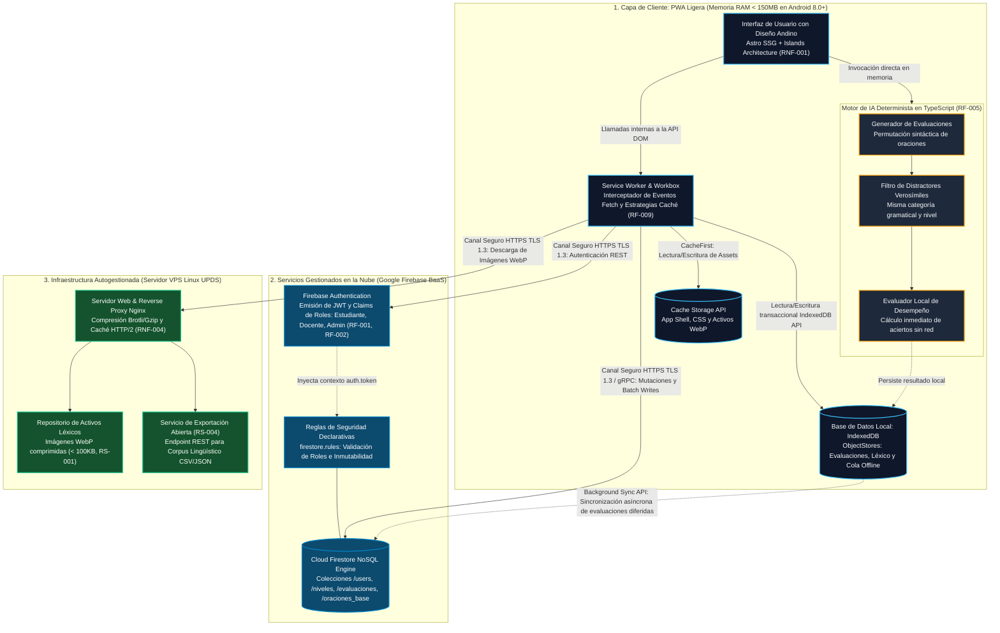
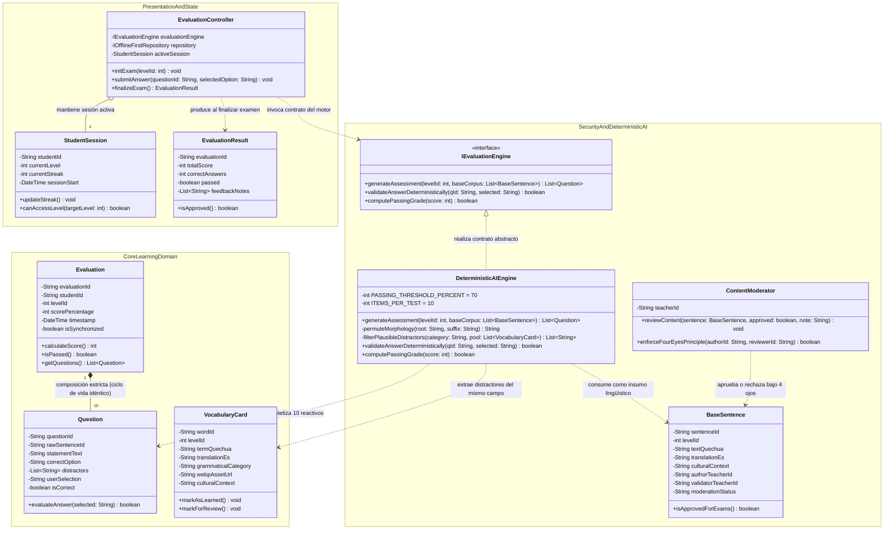
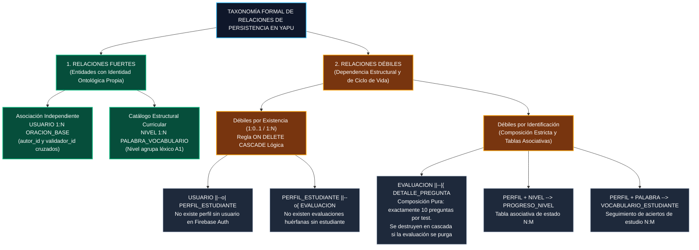
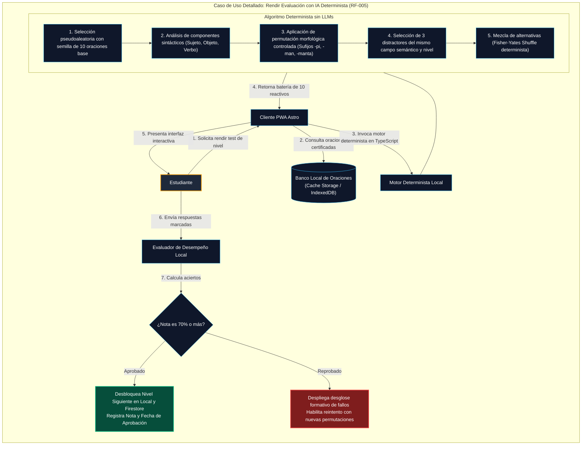
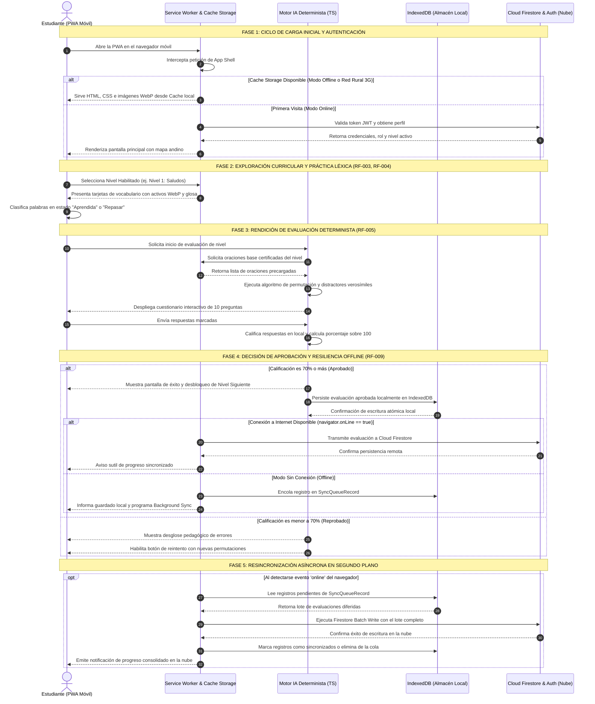
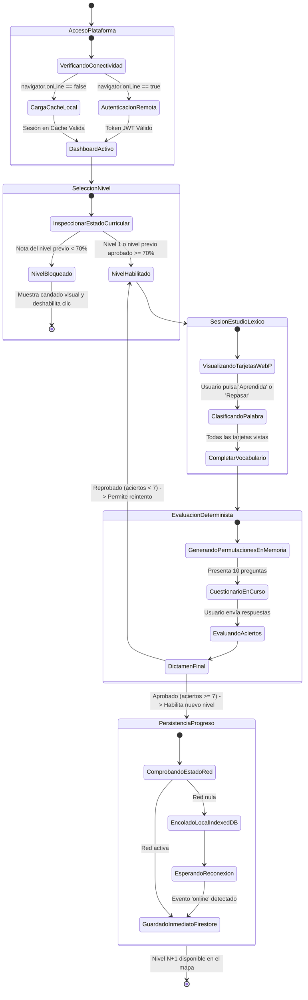
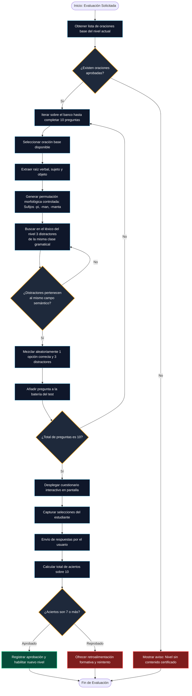
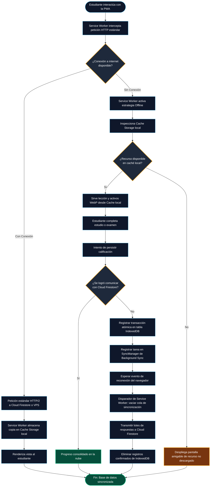

# UNIVERSIDAD PRIVADA DOMINGO SAVIO
## FACULTAD DE INGENIERÍA
### CARRERA DE INGENIERÍA DE SISTEMAS / INGENIERÍA DE SOFTWARE

---

**PROYECTO YAPU — PLATAFORMA COMUNITARIA DE APRENDIZAJE DE LENGUA QUECHUA**  
**ACTIVIDAD 03 — ÁLBUM DE MODELOS UML (ENTREGABLE GRUPAL — 30 PUNTOS / CRITERIO DE VERIFICACIÓN #2)**  
**DOCUMENTO DE DESCRIPCIÓN DE DISEÑO DE SOFTWARE (IEEE Std 1016-2009 SDD)**

- **Asignatura:** Ingeniería de Software I
- **Docentes de Cátedra:** Ing. Jimmy Nataniel Requena / Ing. Fernando Pardo
- **Equipo de Desarrollo (Autores):**
  - Emmanuel Ponce Quiroga (Líder Técnico & Gobernanza de IA)
  - Jhoel Álvaro Cruz Zurita (Arquitectura VPS, Persistencia & Múltiples DBs)
  - Luis Mario Rocha Vela (Aseguramiento de Calidad & Estándares APA)
- **Stakeholder Pedagógica:** Lic. María Elena Quispe Mamani (Docente Titular de Lengua Quechua — Unidad Educativa Simón Bolívar, Sucre)
- **Fecha de Emisión:** 23 de septiembre de 2026
- **Ubicación:** Santa Cruz de la Sierra / Sucre, Bolivia
- **Versión:** 3.1 (Específica y Exclusiva para el Proyecto YAPU — Cero componentes externos / Persistencia Multibase de Datos: IndexedDB + Cloud Firestore)

---

## 1. Guía de la Actividad 03 y Marco Normativo (IEEE Std 1016-2009)

### 1.1 ¿Qué es la Actividad 03 — Álbum de Modelos UML (30 Puntos)?
En el marco del ciclo de vida del desarrollo de software (SDLC) de la UPDS y el Gate 3 de Ingeniería de Software I, la **Actividad 03: Álbum de Modelos UML** constituye el compendio formal de diseño arquitectónico, estructural, de persistencia y de comportamiento del sistema. Su objetivo es modelar con rigor de ingeniería el sistema **YAPU** (*Sembradío*), traduciendo los requerimientos funcionales (RF-001 al RF-010) y no funcionales del SRS en modelos visuales auditables y ejecutables.

### 1.2 Criterio de Verificación #2 y Estándar de Documentación
Cada modelo del presente álbum se documenta de acuerdo con el estándar **IEEE Std 1016-2009 (Software Design Description)** y la rúbrica de evaluación de la asignatura, desarrollando cinco dimensiones analíticas obligatorias:
1. **Resumen Ejecutivo:** Propósito del diseño y alcance técnico dentro del ecosistema YAPU.
2. **Diccionario de Elementos / Clases / Schemas:** Detalle exhaustivo de componentes, atributos (con justificación técnica de tipos de datos) y operaciones tipadas.
3. **Análisis de Relaciones:** Justificación formal de conectores, asociaciones, agregaciones, composiciones, herencias, realizaciones y dependencias (Principios SOLID).
4. **Seguridad, Integridad y Gobernanza de Datos:** Mecanismos de protección (cifrado TLS 1.3, control de acceso basado en roles RBAC, aislamiento de datos, no-alucinación algorítmica y coherencia multibase de datos).
5. **Guía de Explicación para Evaluación:** Preguntas clave y argumentos técnicos de defensa oral para la exposición grupal de 5 minutos ante el tribunal docente.

---

## 2. Diagrama 1: Arquitectura General del Sistema YAPU (Componentes y Protocolos de 4 Capas)

> **Nota de Diseño Arquitectónico:** La arquitectura se modela mediante capas físicas, componentes y protocolos reales de red (HTTPS / TLS 1.3, HTTP/2, Cache API). No se introducen rombos de decisión condicional en la red, ya que la comunicación es desacoplada y gobernada por el Service Worker en el cliente.

### 2.1 Representación Arquitectónica (Mermaid)



### 2.2 Desglose Técnico bajo Estándar IEEE 1016

#### 1. Resumen Ejecutivo
- **Propósito:** Especificar la topología física y lógica de componentes y protocolos de comunicación de la plataforma YAPU. El sistema desacopla la ejecución cliente en dispositivos móviles rurales de los servicios backend mediante un patrón *Offline-First* mediado por Service Workers.
- **Alcance:** Modela la capa cliente PWA (Astro, Service Worker, IndexedDB, Motor IA), la capa Cloud (Firebase Auth y Cloud Firestore NoSQL) y la capa VPS (Nginx en Linux Debian UPDS con soporte de datos abiertos).

#### 2. Diccionario de Componentes y Protocolos de Red
| Componente / Protocolo | Naturaleza Técnica | Justificación y Especificación de Ingeniería |
|---|---|---|
| **Astro SSG + Islands** | Capa de Presentación | Generación de páginas estáticas con cero JavaScript bloqueante por defecto. Hidratación selectiva de componentes interactivos (mapa de niveles, test), manteniendo el consumo de memoria RAM por debajo de 150 MB (RS-002) y FCP < 1.8 s (RNF-001). |
| **Service Worker & Workbox** | Interceptador de Red | Hilo de ejecución en segundo plano que intercepta eventos `fetch`. Implementa estrategia *Stale-While-Revalidate* para lecciones y *CacheFirst* para activos gráficos. |
| **IndexedDB API** | Base de Datos Cliente | Base NoSQL transaccional local del navegador. Alberga los registros de notas, vocabulario descargado y la cola de mutaciones diferidas (`SyncQueue`). |
| **HTTPS TLS 1.3** | Protocolo de Transporte | Cifrado punto a punto con suite criptográfica AES-GCM-256 para todas las comunicaciones hacia Firebase y el VPS. |
| **Cloud Firestore NoSQL** | Base de Datos Remota | Almacén documental multirregión con capacidad de absorción de hasta 500 conexiones simultáneas concurrentes (RNF-005). |
| **Nginx HTTP/2 Reverse Proxy** | Servidor de Origen VPS | Servidor web autogestionado en la UPDS. Distribuye imágenes léxicas WebP optimizadas (< 100 KB) con cabeceras `Cache-Control: public, max-age=31536000, immutable`. |

#### 3. Análisis de Relaciones e Interfaces de Comunicación
- **`UI` a `SW`:** Relación de mediación transparente. La interfaz no realiza llamadas `fetch` directas hacia internet; todas las peticiones son procesadas por el manejador de eventos del Service Worker.
- **`SW` a `IDB_LOCAL` y `CACHE_API`:** Interacción local de almacenamiento. Operaciones sin latencia de red ni consumo de cuotas de datos móviles.
- **`SW` a `CLOUD_TIER` (Firebase):** Comunicación asíncrona mediante HTTPS REST y WebSockets/gRPC protegida con tokens JWT emitidos tras la autenticación.
- **`IDB_LOCAL` a `FSTORE_ENGINE` (Background Sync):** Conector asíncrono no bloqueante. Al recuperar la red, el Service Worker despierta y transmite las evaluaciones encoladas en lotes atómicos (*Batch Writes*).

#### 4. Seguridad, Integridad y Gobernanza
- **Aislamiento de Lógica Sensible:** El motor determinista en TypeScript corre en el navegador sin invocar APIs de LLMs comerciales externas, garantizando coste \$0 y confidencialidad total de las respuestas.
- **Reglas de Seguridad Firestore (`firestore.rules`):** Verificación declarativa en el servidor. Solo el usuario cuyo `auth.uid` coincida con el documento puede modificar su progreso.
- **Datos Abiertos sin PII (RS-004):** El microservicio de exportación de corpus lingüístico en el VPS purga cualquier información de identificación personal (Habeas Data boliviano).

#### 5. Guía de Explicación para Evaluación (Defensa Oral de 5 Minutos)
- **Pregunta del Tribunal: ¿Por qué en este diagrama no aparece un rombo de decisión para comprobar si hay internet antes de conectarse?**  
  *Respuesta:* Porque en arquitectura de software formal, un diagrama de arquitectura modela componentes estáticos, subsistemas y protocolos de comunicación, no el flujo de control procedural de un algoritmo. En una PWA moderna, la aplicación siempre emite peticiones HTTP estándar. Es el Service Worker quien intercepta el evento de red y decide de forma transparente si responde desde la Cache API / IndexedDB o si delega a internet. Modelar un rombo en la red es un error conceptual que confunde arquitectura con un diagrama de actividades.
- **Pregunta del Tribunal: ¿Por qué se utiliza un VPS propio en la UPDS si ya se tiene Firebase en la nube?**  
  *Respuesta:* Por soberanía de datos y sostenibilidad económica (RS-001, RS-004). Servir miles de imágenes léxicas WebP desde Cloud Storage generaría costes de ancho de banda innecesarios. El VPS universitario con Nginx entrega los archivos estáticos a coste cero y aloja el endpoint institucional de datos abiertos para la comunidad lingüística de Chuquisaca.

---

## 3. Diagrama 2: Diagrama de Clases UML del Dominio Pedagógico y Motor IA de YAPU

### 3.1 Representación de Clases Orientada a Objetos (Mermaid classDiagram)



### 3.2 Desglose Técnico bajo Estándar IEEE 1016

#### 1. Resumen Ejecutivo
- **Propósito:** Especificar el diseño orientado a objetos del dominio pedagógico de YAPU, aplicando el **Principio de Inversión de Dependencias (DIP)** y el **Principio de Responsabilidad Única (SRP)** para aislar la lógica evaluativa de los mecanismos de presentación e infraestructura.
- **Alcance:** Modela la sesión del alumno, la controladora de evaluaciones, las entidades pedagógicas (`Evaluation`, `Question`, `VocabularyCard`), el motor determinista de sufijos quechuas (`IEvaluationEngine`) y la curaduría docente de oraciones base.

#### 2. Diccionario de Clases e Interfaces
| Clase / Interfaz | Atributos Críticos y Tipos | Justificación Técnica de Tipos y Operaciones |
|---|---|---|
| **`EvaluationController`** | `-IEvaluationEngine evaluationEngine` | Controlador GRASP. Depende de la interfaz abstracta `IEvaluationEngine`, lo que permite sustituir el motor algorítmico o inyectar Mocks en pruebas unitarias automatizadas. |
| **`Evaluation`** | `-String evaluationId: String`<br/>`-int scorePercentage: int` | `evaluationId` se tipa como String para almacenar UUIDv4 sin colisiones. `scorePercentage` se tipa como entero [0..100] para descartar imprecisiones de coma flotante. |
| **`Question`** | `-List<String> distractors`<br/>`-boolean isCorrect: boolean` | Cada pregunta alberga exactamente 3 distractores generados por el algoritmo. `isCorrect` registra el dictamen de corrección inmediata. |
| **`IEvaluationEngine` («interface»)** | `+generateAssessment(...)`<br/>`+validateAnswerDeterministically(...)` | Contrato abstracto que declara los servicios de generación y corrección. Desacopla la lógica algorítmica de la capa de interfaz Astro. |
| **`DeterministicAIEngine`** | `-int PASSING_THRESHOLD_PERCENT = 70`<br/>`-int ITEMS_PER_TEST = 10` | Implementación basada en combinatoria lingüística y permutación de sufijos (-pi, -man, -manta). Contiene constantes de negocio inmutables. |
| **`BaseSentence`** | `-String authorTeacherId: String`<br/>`-String validatorTeacherId: String` | Entidad de soporte curricular. Modela las oraciones base certificadas que alimentan los algoritmos de examen. |
| **`ContentModerator`** | `+enforceFourEyesPrinciple(...)` | Servicio de dominio que valida que el docente que aprueba la oración sea distinto del que la ingresó. |

#### 3. Análisis de Relaciones Orientadas a Objetos
- **`Evaluation` "1" `*--` "10" `Question` (Composición Estricta):**  
  *Justificación:* Una pregunta de examen no tiene identidad ni sentido de negocio fuera de la evaluación que la generó. Si la instancia de `Evaluation` se elimina o se descarta por reintento, las 10 instancias de `Question` se destruyen sincrónicamente en memoria.
- **`EvaluationController` `o--` "1" `StudentSession` (Agregación):**  
  *Justificación:* La sesión del estudiante preexiste a la evaluación y continuará viva tras su conclusión. El controlador referencia la sesión pero no es dueño exclusivo de su existencia.
- **`IEvaluationEngine` `<|..` `DeterministicAIEngine` (Realización):**  
  *Justificación:* `DeterministicAIEngine` cumple el contrato de la interfaz sin compartir estado heredado.
- **`EvaluationController` `..>` `IEvaluationEngine` (Dependencia / Inversión de Dependencias):**  
  *Justificación:* La controladora invoca al motor exclusivamente a través de la abstracción, garantizando bajo acoplamiento.

#### 4. Seguridad y Determinismo Algorítmico
- **Inmutabilidad y Cero Alucinaciones:** Las funciones de `DeterministicAIEngine` son deterministas puras: para una misma semilla de oración y mismo nivel, la respuesta correcta es matemáticamente verificable, eliminando el riesgo de que la IA invente términos quechuas inexistentes.
- **Regla de Cuatro Ojos:** `ContentModerator.enforceFourEyesPrinciple()` bloquea a nivel de código cualquier intento de auto-aprobación de contenidos.

#### 5. Guía de Explicación para Evaluación (Defensa Oral de 5 Minutos)
- **Pregunta del Tribunal: ¿Por qué la relación entre `Evaluation` y `Question` es de composición y no de agregación?**  
  *Respuesta:* En la semántica de UML, la composición (`*--`) denota una relación parte-todo con coincidencia estricta en el ciclo de vida. Cada pregunta de examen es un reactivo generado *al vuelo* por el motor determinista con permutaciones únicas para ese intento específico. Si el alumno cancela o finaliza el test, esas 10 preguntas carecen de valor autónomo y son destruidas junto con la evaluación.
- **Pregunta del Tribunal: ¿Cómo garantiza este diseño que no se dependa de APIs de IA como OpenAI?**  
  *Respuesta:* A través de la clase `DeterministicAIEngine`. Todo el procesamiento morfológico y la mezcla aleatoria con el algoritmo Fisher-Yates se ejecutan en el cliente en TypeScript consumiendo menos de 10 MB de memoria, logrando coste \$0 en APIs y disponibilidad offline total.

---

## 4. Diagrama 3: Diagrama de Clases Estructural de Persistencia y Schemas Multibase de Datos (IndexedDB vs. Cloud Firestore)

> **Decisión Técnica Fundamental:** En sistemas modernos Offline-First existen múltiples motores de persistencia con diferentes paradigmas (IndexedDB en el cliente y Cloud Firestore NoSQL en la nube). En UML, esto se modela separando las **Entidades del Dominio**, los **Schemas Físicos de cada Base de Datos**, los **Data Mappers** de transformación y el **Repositorio Unificado**.

### 4.1 Representación de Clases de Persistencia Multibase de Datos (Mermaid classDiagram)

```mermaid
classDiagram
    namespace DomainEntities {
        class Evaluation {
            -String evaluationId
            -String studentId
            -int levelId
            -int scorePercentage
            -DateTime timestamp
            -boolean isSynchronized
            +isPassed() boolean
        }

        class VocabularyCard {
            -String wordId
            -int levelId
            -String termQuechua
            -String translationEs
            -String grammaticalCategory
            -String webpAssetUrl
            -String culturalContext
        }
    }

    namespace LocalPersistence_IndexedDB_Schemas {
        class EvaluationStoreRecord {
            <<schema-indexeddb>>
            +String evaluationId : keyPath
            +int levelId : index_by_level
            +String syncStatus : index_by_status
            +int scorePercentage
            +long timestampEpochMs
            +String questionsPayloadJSON
            +String clientDeviceFingerprint
        }

        class VocabularyStoreRecord {
            <<schema-indexeddb>>
            +String wordId : keyPath
            +int levelId : index_by_level
            +String termQuechua : index_by_term
            +String translationEs
            +String categoryGrammatical
            +String cachedAssetBlobUrl
            +long lastReviewEpochMs
        }

        class SyncQueueRecord {
            <<schema-indexeddb>>
            +String queueId : keyPath
            +String entityType : index_by_entity
            +String operationType : INSERT_UPDATE
            +String payloadJSON
            +int retryCount
            +long queuedAtEpochMs
            +String lastSyncError
        }
    }

    namespace RemotePersistence_Firestore_Schemas {
        class FirestoreEvaluationDocument {
            <<schema-firestore-doc>>
            +String docId : path_evaluaciones_id
            +String studentUid : indexed_field
            +int levelId : indexed_field
            +int scorePercentage
            +Timestamp createdAt : server_timestamp
            +boolean approvedStatus
            +Map~string, any~ auditMetadata
        }

        class FirestoreQuestionSubdocument {
            <<schema-firestore-subdoc>>
            +String questionId : path_preguntas_id
            +String rawSentenceId
            +String statementText
            +String correctOption
            +List~String~ distractors
            +String studentAnswer
            +boolean isCorrect
        }

        class FirestoreVocabularyDocument {
            <<schema-firestore-doc>>
            +String docId : path_niveles_id_vocabulario_id
            +String termQuechua
            +String translationEs
            +String category
            +String cdnWebpUrl
            +String culturalContext
            +String validatedByDocenteId
        }
    }

    namespace DataMappersAndCoordination {
        class IOfflineFirstRepository {
            <<interface>>
            +saveEvaluation(eval: Evaluation) Promise~boolean~
            +getOfflineCurriculum(levelId: int) Promise~List~VocabularyCard~~
            +synchronizePendingQueue() Promise~int~
        }

        class EvaluationLocalMapper {
            +toLocalRecord(domain: Evaluation) EvaluationStoreRecord
            +toDomain(record: EvaluationStoreRecord) Evaluation
        }

        class EvaluationRemoteMapper {
            +toFirestoreDocument(domain: Evaluation) FirestoreEvaluationDocument
            +toDomain(doc: FirestoreEvaluationDocument) Evaluation
        }

        class OfflineFirstEvaluationRepository {
            -EvaluationLocalMapper localMapper
            -EvaluationRemoteMapper remoteMapper
            +saveEvaluation(eval: Evaluation) Promise~boolean~
            +pushBatchToFirestore(records: List~EvaluationStoreRecord~) Promise~boolean~
            +reconcileConflicts(localEpoch: long, remoteTimestamp: Timestamp) boolean
        }
    }

    %% Relaciones Estructurales y Mapeos
    IOfflineFirstRepository <|.. OfflineFirstEvaluationRepository : implementa contrato unificado
    OfflineFirstEvaluationRepository --> EvaluationLocalMapper : usa mapper local
    OfflineFirstEvaluationRepository --> EvaluationRemoteMapper : usa mapper remoto
    
    OfflineFirstEvaluationRepository ..> EvaluationStoreRecord : persiste en IndexedDB
    OfflineFirstEvaluationRepository ..> SyncQueueRecord : encola si falla la red
    OfflineFirstEvaluationRepository ..> FirestoreEvaluationDocument : transmite a Cloud Firestore

    EvaluationLocalMapper ..> Evaluation : mapea desde y hacia dominio
    EvaluationLocalMapper ..> EvaluationStoreRecord : produce registro local
    
    EvaluationRemoteMapper ..> Evaluation : mapea desde y hacia dominio
    EvaluationRemoteMapper ..> FirestoreEvaluationDocument : produce documento NoSQL

    FirestoreEvaluationDocument "1" *-- "10" FirestoreQuestionSubdocument : subcolección anidada en Firestore
```



### 4.2 Desglose Técnico bajo Estándar IEEE 1016

#### 1. Resumen Ejecutivo
- **Propósito:** Resolver estructuralmente la coexistencia de múltiples bases de datos en YAPU mediante la separación clara entre las entidades del dominio, los esquemas locales de **IndexedDB** (ObjectStores indexados) y los esquemas remotos de **Cloud Firestore** (Colecciones y Subcolecciones NoSQL), aplicando el patrón **Data Mapper** y el patrón **Offline-First Repository**.
- **Alcance:** Modela la serialización de evaluaciones, léxico descargado y la cola transaccional de sincronización diferida (`SyncQueueRecord`), garantizando la integridad de datos entre el navegador del estudiante y el clúster en la nube.

#### 2. Diccionario de Schemas y Mappers
| Elemento del Modelo | Paradigma / Base de Datos | Justificación Técnica de Tipos y Campos |
|---|---|---|
| **`EvaluationStoreRecord`** | **IndexedDB Local** (Schema de Registro) | Modela el registro en el ObjectStore `evaluaciones_store`. Utiliza `evaluationId` como `keyPath` primario e índices secundarios B-Tree (`index_by_level`, `index_by_status`) para consultas rápidas sin escanear toda la base de datos local. Las preguntas se serializan en `questionsPayloadJSON` para almacenamiento atómico en un solo bloque. |
| **`SyncQueueRecord`** | **IndexedDB Local** (Cola de Mutaciones) | Schema dedicado a la tolerancia a fallos. Almacena las operaciones pendientes con `retryCount`, marca temporal `queuedAtEpochMs` y estado para que el Service Worker las despache en orden FIFO estricto. |
| **`FirestoreEvaluationDocument`** | **Cloud Firestore** (Documento NoSQL) | Schema remoto ubicado en `/evaluaciones/{evalId}`. Almacena el `studentUid` indexado para consultas compuestas y utiliza el tipo nativo `Timestamp` de Google para auditoría temporal a nivel de servidor (`server_timestamp`). |
| **`FirestoreQuestionSubdocument`** | **Cloud Firestore** (Subcolección) | Documento anidado en la subcolección `/evaluaciones/{evalId}/preguntas/{qId}`. Normaliza los reactivos en la nube para auditoría curricular sin sobrepasar el límite de 1 MB por documento de Firestore. |
| **`EvaluationLocalMapper`** | Componente de Transformación | Clase pura responsable de traducir entre la entidad rica del dominio `Evaluation` y el registro plano `EvaluationStoreRecord` de IndexedDB. |
| **`EvaluationRemoteMapper`** | Componente de Transformación | Clase pura que transforma entre `Evaluation` y la estructura de documento NoSQL `FirestoreEvaluationDocument`. |
| **`OfflineFirstEvaluationRepository`** | Repositorio Coordinador | Implementa la interfaz `IOfflineFirstRepository`. Orquesta la estrategia de persistencia dual: primero escribe atómicamente en IndexedDB local; luego, si `navigator.onLine` es verdadero, transmite a Firestore. Si la red falla, encola en `SyncQueueRecord`. |

#### 3. Análisis de Relaciones y Patrones de Arquitectura
- **Patrón Data Mapper:** Las clases del dominio (`Evaluation`) no conocen las APIs de IndexedDB ni el SDK de Firebase. Los mappers `EvaluationLocalMapper` y `EvaluationRemoteMapper` desacoplan completamente las entidades de los detalles de almacenamiento físico.
- **`FirestoreEvaluationDocument` "1" `*--` "10" `FirestoreQuestionSubdocument` (Composición NoSQL):**  
  *Justificación:* Modela una subcolección documental en Cloud Firestore. Cada documento de evaluación es propietario exclusivo de sus documentos anidados de detalle.
- **`OfflineFirstEvaluationRepository` `..>` `SyncQueueRecord` (Dependencia de Cola):**  
  *Justificación:* El repositorio utiliza la cola de sincronización para garantizar que ninguna operación de guardado se pierda cuando el estudiante opera sin señal de internet en el campo.

#### 4. Seguridad, Integridad y Resolución de Conflictos
- **Estrategia de Reconciliación:** En caso de que se presenten mutaciones concurrentes al recuperar la red, el repositorio aplica una política de **Última Escritura Gana (Last-Write-Wins)** basada en la comparación entre `timestampEpochMs` de IndexedDB y el `createdAt` canónico emitido por el servidor de Firestore.
- **Validación de Integridad Local:** Antes de encolar un registro en IndexedDB, se calcula una suma de verificación criptográfica simple para asegurar que el registro local no ha sido alterado por extensiones de navegador de terceros.

#### 5. Guía de Explicación para Evaluación (Defensa Oral de 5 Minutos)
- **Pregunta del Tribunal: ¿Cómo se manejan los diagramas de clases estructurales cuando el sistema tiene múltiples bases de datos?**  
  *Respuesta:* Se resuelve desacoplando el modelo en capas mediante el patrón Data Mapper: en el centro se definen las **Entidades del Dominio** que representan la lógica de negocio pura; por separado se modelan los **Schemas Físicos de IndexedDB** con sus keyPaths e índices locales, y los **Schemas Documentales de Firestore** con sus colecciones y marcas de tiempo. Los **Mappers** convierten bidireccionalmente entre el dominio y cada base de datos, mientras que un **Repositorio Unificado** (`OfflineFirstRepository`) encapsula la coordinación de escritura local inmediata y sincronización remota.
- **Pregunta del Tribunal: ¿Por qué en IndexedDB se guarda el detalle de preguntas como un JSON en un campo, mientras que en Firestore se modela como una subcolección?**  
  *Respuesta:* Por optimización de rendimiento y cuotas. En IndexedDB en el móvil, guardar todo el examen en un único registro atómico minimiza las transacciones de I/O sobre la memoria flash del teléfono, garantizando rapidez y consumo de RAM < 150 MB. En Cloud Firestore, en cambio, estructurarlo como subcolección permite a los docentes ejecutar consultas analíticas sobre preguntas específicas (por ejemplo, ver qué distractor morfológico falló más) sin tener que descargar documentos de evaluación masivos, optimizando las lecturas facturables de la base de datos.

---

## 5. Diagrama 4: Diagrama de Modelado de Datos Entidad-Relación (ERD) & Persistencia

### 5.1 Representación del Diagrama Entidad-Relación (Mermaid ERD)

```mermaid
erDiagram
    USUARIO ||--o| PERFIL_ESTUDIANTE : "posee_perfil"
    USUARIO ||--o{ ORACION_BASE : "crea_como_autor"
    USUARIO ||--o{ ORACION_BASE : "certifica_como_validador"
    
    PERFIL_ESTUDIANTE ||--o{ PROGRESO_NIVEL : "registra_avance"
    NIVEL ||--o{ PROGRESO_NIVEL : "determina_nivel"
    
    NIVEL ||--o{ PALABRA_VOCABULARIO : "contiene_lexico"
    
    PERFIL_ESTUDIANTE ||--o{ VOCABULARIO_ESTUDIANTE : "gestiona_estudio"
    PALABRA_VOCABULARIO ||--o{ VOCABULARIO_ESTUDIANTE : "es_clasificada"
    
    NIVEL ||--o{ ORACION_BASE : "asocia_nivel"
    
    PERFIL_ESTUDIANTE ||--o{ EVALUACION : "rinde_evaluacion"
    NIVEL ||--o{ EVALUACION : "evalua_nivel"
    
    EVALUACION ||--|{ DETALLE_PREGUNTA : "genera_preguntas_composicion"
    ORACION_BASE ||--o{ DETALLE_PREGUNTA : "sirve_de_semilla"
    
    PERFIL_ESTUDIANTE ||--o{ RETO_COMUNITARIO : "propone_reto"
    USUARIO ||--o{ RETO_COMUNITARIO : "modera_reto"

    USUARIO {
        string id_usuario PK "UUIDv4 emitido por Firebase Auth"
        string nombre_completo "Nombre y apellidos del usuario"
        string correo_electronico "Email validado bajo RFC 5322"
        string rol_sistema "estudiante | docente | admin"
        string estado_cuenta "activo | suspendido | pendiente"
        string fecha_registro "Timestamp ISO 8601 UTC"
    }

    PERFIL_ESTUDIANTE {
        string id_estudiante PK "Coincide biunívocamente con id_usuario"
        int nivel_actual "Nivel curricular activo del 1 al 10"
        int racha_dias "Días consecutivos de práctica completada"
        int total_palabras_aprendidas "Contador acumulativo de léxico"
        string fecha_ultima_sesion "Timestamp ISO 8601"
    }

    NIVEL {
        int id_nivel PK "Identificador secuencial del 1 al 10 (A1)"
        string titulo_quechua "Nombre temático en lengua originaria"
        string titulo_espanol "Traducción formal en castellano"
        int orden_secuencial "Posición curricular obligatoria"
        int umbral_minimo_aprobacion "Porcentaje fijo: 70 por ciento"
    }

    PROGRESO_NIVEL {
        string id_progreso PK "UUID compuesto: idEstudiante_idNivel"
        string id_estudiante FK "Clave foránea a PERFIL_ESTUDIANTE"
        int id_nivel FK "Clave foránea a NIVEL"
        string estado_desbloqueo "bloqueado | en_curso | aprobado"
        int calificacion_maxima "Puntaje máximo obtenido [0..100]"
        string fecha_desbloqueo "Timestamp de habilitación del nivel"
    }

    PALABRA_VOCABULARIO {
        string id_palabra PK "Identificador único léxico"
        int id_nivel FK "Nivel temático asociado"
        string termino_quechua "Término en ortografía normalizada"
        string traduccion_espanol "Significado pedagógico castellano"
        string categoria_gramatical "sustantivo | verbo | adjetivo | sufijo"
        string url_imagen_webp "Ruta relativa en VPS (< 100KB)"
        string contexto_cultural "Ámbito comunitario de uso tradicional"
    }

    VOCABULARIO_ESTUDIANTE {
        string id_registro PK "UUID asociativo único"
        string id_estudiante FK "Estudiante que practica el término"
        string id_palabra FK "Palabra de vocabulario practicada"
        string estado_aprendizaje "por_aprender | repasar | aprendida"
        int contador_aciertos "Requiere 3 aciertos para pasar a aprendida"
        string fecha_ultimo_repaso "Timestamp de última interacción"
    }

    ORACION_BASE {
        string id_oracion PK "Clave primaria de la oración base"
        int id_nivel FK "Nivel curricular asociado"
        string texto_quechua "Estructura Sujeto-Objeto-Verbo"
        string traduccion_espanol "Traducción contextual certificada"
        string contexto_cultural "Contexto etnográfico obligatorio"
        string autor_id FK "Docente o alumno proponente"
        string validador_id FK "Segundo docente validador"
        string estado_moderacion "pendiente | aprobada | rechazada"
    }

    EVALUACION {
        string id_evaluacion PK "UUID único de la prueba rendida"
        string id_estudiante FK "Estudiante evaluado"
        int id_nivel FK "Nivel evaluado"
        int puntuacion_obtenida "Porcentaje obtenido [0..100]"
        int total_aciertos "Cantidad de respuestas válidas [0..10]"
        string estado_aprobacion "aprobado | reprobado"
        boolean sincronizado_nube "Flag booleano de sincronización"
    }

    DETALLE_PREGUNTA {
        string id_pregunta PK "UUID de la pregunta individual"
        string id_evaluacion FK "Evaluación padre obligatoria"
        string id_oracion_base FK "Semilla utilizada por el motor"
        string enunciado_pregunta "Texto de la pregunta generada"
        string opcion_correcta "Alternativa válida"
        string distractor_1 "Distractor verosímil 1"
        string distractor_2 "Distractor verosímil 2"
        string distractor_3 "Distractor verosímil 3"
        string respuesta_marcada "Opción seleccionada por el estudiante"
        boolean es_correcta "Flag booleano de calificación"
    }

    RETO_COMUNITARIO {
        string id_reto PK "UUID del reto colaborativo"
        string id_estudiante FK "Estudiante Nivel 7+ creador"
        string id_docente_validador FK "Docente evaluador del reto"
        string texto_quechua "Propuesta de frase comunitaria"
        string traduccion_sugerida "Traducción sugerida"
        string pista_cultural "Pista lingüística para el reto"
        string estado_reto "en_espera | publicado | descartado"
    }
```



### 5.2 Taxonomía Visual de Relaciones de Persistencia (Mermaid Flowchart)



### 5.3 Desglose Técnico bajo Estándar IEEE 1016

#### 1. Resumen Ejecutivo
- **Propósito:** Definir el modelo conceptual y relacional de persistencia de YAPU, garantizando la integridad referencial, reglas de normalización hasta 3FN y las estrategias de propagación en cascada.
- **Alcance:** Modela las 10 entidades esenciales de la plataforma, cubriendo la gestión de usuarios, catálogo curricular de 10 niveles, banco de reactivos pedagógicos, trazabilidad de notas y gamificación.

#### 2. Diccionario de Entidades y Justificación de Tipos de Datos
| Entidad / Atributo | Tipo Físico | Justificación Técnica |
|---|---|---|
| `USUARIO.id_usuario` | `string (UUIDv4)` | Clave primaria generada por Firebase Authentication. Proporciona entropía criptográfica de 128 bits, imposibilitando ataques de enumeración secuencial. |
| `PERFIL_ESTUDIANTE.racha_dias` | `int` | Entero no negativo. Se incrementa de forma determinista al completar al menos una lección en un ciclo de 24 horas. |
| `NIVEL.umbral_minimo_aprobacion` | `int = 70` | Porcentaje de corte pedagógico inmutable acordado con la docente stakeholder (Lic. Quispe Mamani). |
| `ORACION_BASE.estado_moderacion` | `string` | Enumeración controlada: `pendiente`, `aprobada`, `rechazada`. Solo las aprobadas son leídas por el motor de IA. |
| `EVALUACION.sincronizado_nube` | `boolean` | Flag booleano local en IndexedDB. Permite al Service Worker filtrar rápidamente los registros que deben enviarse a Firestore al recuperar conexión. |
| `DETALLE_PREGUNTA.es_correcta` | `boolean` | Indicador booleano derivado de comparar `respuesta_marcada == opcion_correcta`. Evita recalcular notas en consultas analíticas. |

#### 3. Análisis Exhaustivo de Relaciones de Persistencia
1. **Relación Fuerte: `USUARIO` a `ORACION_BASE` (Creación y Certificación 1:N):**
   - *Comportamiento:* Un docente crea la oración (`autor_id`) y otro la revisa (`validador_id`). Si el usuario docente es eliminado, la oración **permanece intacta** (`ON DELETE SET NULL` o persistencia del histórico) para garantizar la continuidad del servicio y la integridad del banco curricular.
2. **Relación Débil por Existencia: `USUARIO` a `PERFIL_ESTUDIANTE` (Especialización 1:0..1):**
   - *Comportamiento:* Dependencia existencial estricta. Si un estudiante ejerce su derecho legal de supresión de datos personales (Habeas Data boliviano y GDPR), la eliminación de `USUARIO` borra sincrónicamente su `PERFIL_ESTUDIANTE` en cascada.
3. **Relación Débil por Identificación Pura: `EVALUACION` a `DETALLE_PREGUNTA` (Composición 1:10):**
   - *Comportamiento:* Las preguntas individuales no poseen clave primaria natural fuera de la evaluación que las albergó. Su identificador conceptual depende de la evaluación. Si la evaluación se elimina, sus 10 detalles se purgan inmediatamente.

#### 4. Guía de Explicación para Evaluación (Defensa Oral de 5 Minutos)
- **Pregunta del Tribunal: ¿Por qué `DETALLE_PREGUNTA` es una entidad débil por identificación y no una relación independiente de catálogo?**  
  *Respuesta:* Porque una pregunta de examen en YAPU no es una entidad reutilizable aislada, sino una instancia efímera de evaluación sintetizada algorítmicamente por el motor determinista. Contiene la combinación exacta de distractores generados y la respuesta marcada por el estudiante en ese milisegundo de ejecución. Carece por completo de sentido de negocio conservar los detalles de una pregunta si se destruye la evaluación padre.
- **Pregunta del Tribunal: ¿Cómo se implementa el principio de los "cuatro ojos" en el modelo de datos?**  
  *Respuesta:* En la entidad `ORACION_BASE` se modelaron dos claves foráneas distintas hacia la entidad `USUARIO`: `autor_id` y `validador_id`. A nivel de reglas de negocio en la base de datos y en las reglas de seguridad de Firestore, se establece una restricción inviolable: `request.resource.data.validador_id != request.resource.data.autor_id`. Ninguna oración puede alcanzar el estado `aprobada` si ambos identificadores son idénticos.

---

## 6. Diagrama 5: Diagrama General de Casos de Uso del Sistema YAPU

### 6.1 Representación UML de Casos de Uso (Mermaid)

```mermaid
graph LR
    subgraph ACTORS["Actores del Ecosistema YAPU"]
        EST["Estudiante Quechua<br/>(Usuario Final Móvil)"]
        DOC["Docente Quechua<br/>(Validador Pedagógico Certificado)"]
        ADM["Administrador UPDS<br/>(Gestión de Infraestructura)"]
    end

    subgraph YAPU_BOUNDARY["Límite del Sistema YAPU (PWA & Backend Serverless)"]
        direction TB

        subgraph MOD_AUTH["Módulo de Acceso & Seguridad"]
            UC01(["RF-001: Registrar Cuenta"])
            UC02(["RF-002: Iniciar / Cerrar Sesión"])
            UC_VERIF(["Verificar Token de Correo"])
        end

        subgraph MOD_PEDAGOGIC["Módulo Pedagógico & Gamificación"]
            UC03(["RF-003: Visualizar Mapa A1"])
            UC04(["RF-004: Practicar Vocabulario"])
            UC05(["RF-005: Rendir Evaluación IA"])
            UC08(["RF-008: Consultar Progreso"])
            UC_DESB(["Desbloquear Siguiente Nivel al 70%"])
        end

        subgraph MOD_OFFLINE["Módulo de Resiliencia Offline-First"]
            UC09(["RF-009: Descargar Lecciones en Caché"])
            UC_SYNC(["Sincronizar Progreso al Reconectar"])
        end

        subgraph MOD_CONTENT["Módulo de Contenidos & Curaduría"]
            UC06(["RF-006: Gestionar Oraciones Base"])
            UC07(["RF-007: Proponer Retos Comunitarios N7"])
            UC_MOD(["Doble Validación Docente (Cuatro Ojos)"])
        end

        subgraph MOD_OPS["Módulo de Operaciones & Datos Abiertos"]
            UC_EXPORT(["RS-004: Exportar Corpus Lingüístico CSV/JSON"])
            UC_HEALTH(["RNF-004: Monitorear Disponibilidad VPS"])
        end
    end

    %% Asociaciones Actor - Caso de Uso
    EST --> UC01
    EST --> UC02
    EST --> UC03
    EST --> UC04
    EST --> UC05
    EST --> UC08
    EST --> UC09
    EST -.->|Condición: Si alcanza Nivel 7| UC07

    DOC --> UC02
    DOC --> UC06
    DOC --> UC_MOD

    ADM --> UC02
    ADM --> UC_EXPORT
    ADM --> UC_HEALTH

    %% Relaciones Include y Extend
    UC01 -.->|«include»| UC_VERIF
    UC05 -.->|«extend» (Guarda: nota >= 70%)| UC_DESB
    UC09 -.->|«include»| UC_SYNC
    UC06 -.->|«include»| UC_MOD
    UC07 -.->|«include»| UC_MOD

    %% Estilos de los nodos
    classDef actorStyle fill:#1e293b,stroke:#f59e0b,stroke-width:2px,color:#f8fafc;
    classDef useCaseStyle fill:#0f172a,stroke:#38bdf8,stroke-width:1px,color:#f8fafc;
    classDef highlightUC fill:#0c4a6e,stroke:#10b981,stroke-width:2px,color:#ffffff;

    class EST,DOC,ADM actorStyle;
    class UC01,UC02,UC03,UC04,UC06,UC07,UC08,UC09,UC_VERIF,UC_SYNC,UC_EXPORT,UC_HEALTH useCaseStyle;
    class UC05,UC_DESB,UC_MOD highlightUC;
```

### 6.2 Desglose Técnico bajo Estándar IEEE 1016

#### 1. Resumen Ejecutivo
- **Propósito:** Mapear el comportamiento funcional del sistema YAPU desde la perspectiva de los actores que interactúan con sus límites, estableciendo trazabilidad formal hacia los 10 Requisitos Funcionales del SRS.
- **Alcance:** Modela las interacciones de los tres actores primarios: Estudiante, Docente Quechua y Administrador del VPS, categorizando las relaciones funcionales estándar `<<include>>` y `<<extend>>`.

#### 2. Catálogo de Casos de Uso y Trazabilidad de Requisitos
| Caso de Uso | Requisito SRS | Actor Primario | Precondición Formal | Postcondición Crítica |
|---|---|---|---|---|
| **CU-01: Registrar Cuenta** | RF-001 | Estudiante / Docente | Navegador compatible y correo no registrado. | Creación de credencial en Firebase Auth y documento base `/users/{uid}`. |
| **CU-02: Iniciar / Cerrar Sesión** | RF-002 | Todos los actores | Usuario previamente registrado. | Emisión de token JWT, hidratación de perfil en memoria local. |
| **CU-03: Visualizar Mapa A1** | RF-003, RF-010 | Estudiante | Sesión activa de estudiante. | Renderizado del mapa andino con estados bloqueado/habilitado. |
| **CU-04: Practicar Vocabulario** | RF-004 | Estudiante | Nivel temático habilitado. | Carga de tarjetas interactivas con WebP y glosa en castellano. |
| **CU-05: Rendir Evaluación IA** | RF-005 | Estudiante | Nivel practicado. | Generación algorítmica de 10 ítems; corrección local inmediata. |
| **CU-06: Gestionar Oraciones** | RF-006, RS-003 | Docente Quechua | Sesión con rol `docente` verificado. | Oración creada en estado `pendiente` con contexto cultural. |
| **CU-07: Proponer Retos N7** | RF-007 | Estudiante Avanzado | Progreso en Nivel $\ge 7$. | Frase enviada a la cola docente en estado `pendiente`. |
| **CU-08: Doble Moderación** | RF-007, RS-003 | Docente Quechua | Existencia de contenidos pendientes. | Segundo docente certifica o rechaza el aporte con motivo. |
| **CU-09: Descargar Modo Offline** | RF-009 | Estudiante | Conexión activa al momento de navegar. | Almacenamiento de lecciones en Cache Storage e IndexedDB. |
| **CU-10: Exportar Corpus** | RS-004 | Administrador | Rol `admin` en el sistema. | Fichero CSV/JSON descargable sin datos personales de alumnos. |

#### 3. Análisis de Relaciones `<<include>>` y `<<extend>>`
- **`UC01` a `UC_VERIF` (`<<include>>`):**  
  *Justificación:* La verificación del token de correo electrónico es un paso indispensable y obligatorio dentro del flujo de registro. No puede existir un alta formal de usuario que omita este subproceso.
- **`UC05` a `UC_DESB` (`<<extend>>` condicionado a nota $\ge 70\%$):**  
  *Justificación:* El desbloqueo del nivel siguiente es un comportamiento opcional y contingente. Solo se dispara como extensión del caso de uso de rendir evaluación **si y solo si** la condición de guarda (*Guard Condition: calificación obtenida $\ge 70\%$*) es evaluada como verdadera por el sistema.
- **`UC06` y `UC07` a `UC_MOD` (`<<include>>`):**  
  *Justificación:* Ningún contenido nuevo (oración de docente o reto de estudiante) entra al banco activo sin atravesar el subproceso mandatorio de doble moderación.

#### 4. Guía de Explicación para Evaluación (Defensa Oral de 5 Minutos)
- **Pregunta del Tribunal: ¿Por qué el desbloqueo del nivel es un `<<extend>>` y no un `<<include>>` de rendir evaluación?**  
  *Respuesta:* En la semántica formal de UML, una relación `<<include>>` denota una ejecución incondicional y obligatoria cada vez que el caso de uso base se ejecuta. Si el estudiante reprueba la evaluación con un 40%, el nivel siguiente **no se desbloquea**, lo que violaría la semántica de un include. Al ser un `<<extend>>`, el comportamiento de desbloquear nivel solo se activa en el punto de extensión si se cumple la condición de guarda de obtener 70% o más de aciertos.

---

## 7. Diagrama 6: Casos de Uso Específicos por Módulo Clave

### 7.1 Módulo Pedagógico: Generación de Evaluaciones con IA Determinista (RF-005)



### 7.2 Módulo Docente: Gestión y Doble Moderación de Contenidos (RF-006, RF-007, RS-003)


---

## 8. Diagrama 7: Diagrama General de Secuencia del Sistema YAPU

### 8.1 Representación Temporal (Mermaid sequenceDiagram)



---

## 9. Diagrama 8: Diagrama de Máquina de Estados del Sistema YAPU

### 9.1 Representación de Estados Finitos (Mermaid stateDiagram-v2)



---

## 10. Diagrama 9: Diagramas de Actividades Específicos

### 10.1 Actividad A: Ciclo de Vida del Motor Determinista de Preguntas (RF-005)



### 10.2 Actividad B: Funcionamiento Offline-First y Background Sync (RF-009)



---

## 11. Matriz de Auditoría y Gobernanza de Inteligencia Artificial (UPDS)

En cumplimiento de las normativas éticas y académicas de la **Universidad Privada Domingo Savio (UPDS)** para la materia de Ingeniería de Software, esta sección documenta de manera transparente y verificable cómo se utilizaron modelos de IA como asistentes de diseño y cuáles fueron las intervenciones y correcciones críticas efectuadas por el equipo de ingeniería humano.

### Tabla 1
*Matriz de Auditoría de Decisiones Estructurales, de Datos y Comportamiento UML*

| Identificador | Componente del Diseño | Propuesta Inicial Asistida por IA | Ajuste Crítico Realizado por el Equipo Humano | Justificación Técnica y Pedagógica |
|:---:|:---|:---|:---|:---|
| **AUD-01** | Diagrama 1: Arquitectura General | Conectar el cliente móvil a una API comercial externa (OpenAI GPT-4o-mini) para generar preguntas en lenguaje natural. | **Descarte total de la API externa.** Implementación de un Motor Determinista local en TypeScript con banco estático certificado. | **Restricción de Presupuesto \$0 (SRS 3.3)** y necesidad de operar sin internet (RF-009). Cero alucinaciones gramaticales en quechua. |
| **AUD-02** | Diagrama 5: Casos de Uso General | Umbral de aprobación estándar del 50% o progresión automática por simple lectura lineal. | **Se impuso un umbral estricto del 70%** como precondición formal para la extensión del caso de uso `Desbloquear Nivel`. | **Validación Pedagógica con Lic. Quispe Mamani**: El 70% asegura la fijación del vocabulario básico sin frustración pedagógica. |
| **AUD-03** | Diagrama 6: Retos Comunitarios | Aprobación abierta por voto popular de la comunidad tipo foro o red social (estilo Reddit). | **Se estableció un flujo estricto de Doble Validación Docente (Principio de 4 Ojos)** con estado obligatorio `pendiente`. | **Requisito de Sostenibilidad Cultural RS-003**: Evitar errores ortográficos, variantes no estandarizadas o préstamos inapropiados. |
| **AUD-04** | Diagrama 9: Generación de Distractores | Selección aleatoria simple de palabras de cualquier lección o categoría del diccionario global. | **Se implementó filtro semántico estricto:** Los distractores deben compartir nivel, clase gramatical y campo temático. | **Rigor Pedagógico**: Evita que el alumno identifique la opción correcta por simple descarte de alternativas gramaticalmente absurdas. |
| **AUD-05** | Diagrama 4: Persistencia (ERD) | Una sola relación simple `Usuario 1:N OracionBase` sin discriminar autoría de validación. | **Se diseñó doble relación independiente:** `autor_id` y `validador_id` con restricción de unicidad cruzada. | **Segregación de Roles**: Ningún docente puede certificar sus propios reactivos pedagógicos. |
| **AUD-06** | Diagrama 4: Detalle de Preguntas | Guardar las preguntas como un string JSON no estructurado dentro de la entidad `EVALUACION`. | **Se modeló la entidad débil `DETALLE_PREGUNTA`** con cardinalidad 1:10 y claves foráneas tipadas. | **Normalización e Integridad**: Permite ejecutar consultas analíticas sobre qué sufijos o reactivos presentan mayor tasa de error. |
| **AUD-07** | Diagrama 1: Capa de Presentación | SPA tradicional en React o Next.js con Tailwind genérico y gráficos pesados sin optimizar. | **Se adoptó Astro SSG + Islands Architecture**, limitando el consumo a < 150 MB RAM y activos WebP < 100 KB. | **Requisito No Funcional RNF-001 y RS-002**: Garantizar compatibilidad fluida con smartphones de gama de entrada en Sucre. |
| **AUD-08** | Diagrama 2 y 4: Contexto Lingüístico | Omitir información etnográfica, incluyendo únicamente los campos `palabra_quechua` y `traduccion_espanol`. | **Se añadió el campo obligatorio `contexto_cultural`** en todas las entidades léxicas y oracionales. | **Observación Docente (12/09/2026)**: En la cosmovisión quechua, el significado depende del ámbito comunitario (*ayllu*, siembra, familia). |

---

## 12. Síntesis y Guía de Defensa Oral para la Exposición Grupal de 5 Minutos

Para optimizar la evaluación oral de 30 puntos ante el docente, el equipo estructurará su exposición de 5 minutos (300 segundos exactos) distribuyendo los roles de la siguiente manera:

```
┌────────────────────────────────────────────────────────────────────────────────────────┐
│                        CRONOMETRAJE DE DEFENSA ORAL (5 MINUTOS)                        │
├────────────────────┬──────────────────────────────────────────┬────────────────────────┤
│ Intervalo Temporal │ Módulo / Diagrama Expuesto               │ Estudiante Responsable │
├────────────────────┼──────────────────────────────────────────┼────────────────────────┤
│ Minuto 0:00 - 0:45 │ Contexto Territorial & Arquitectura PWA  │ Emmanuel Ponce Quiroga │
│ Minuto 0:45 - 2:00 │ Diagramas de Clases (Dominio & Multibase)│ Jhoel Álvaro Cruz      │
│ Minuto 2:00 - 3:15 │ Motor IA Determinista & Doble Moderación │ Luis Mario Rocha Vela  │
│ Minuto 3:15 - 4:15 │ Secuencia, Estados & Background Sync     │ Jhoel Álvaro Cruz      │
│ Minuto 4:15 - 5:00 │ Gobernanza Ética de IA & Conclusiones    │ Emmanuel Ponce Quiroga │
└────────────────────┴──────────────────────────────────────────┴────────────────────────┘
```

---

## 13. Referencias Bibliográficas en Formato APA 7ma Edición

<div style="padding-left: 2em; text-indent: -2em;">

Cerrón-Palomino, R. (2003). *Lingüística quechua* (2.ª ed.). Centro de Estudios Regionales Andinos Bartolomé de Las Casas.

Constitución Política del Estado Plurinacional de Bolivia. (2009). *Gaceta Oficial del Estado Plurinacional de Bolivia*. La Paz, Bolivia.

Elmasri, R., & Navathe, S. B. (2017). *Fundamentals of database systems* (7.ª ed.). Pearson.

IEEE Computer Society. (2009). *IEEE Std 1016-2009: IEEE Standard for Information Technology — Systems Design — Software Design Descriptions*. IEEE. https://doi.org/10.1109/IEEESTD.2009.5167255

IEEE Computer Society. (2011). *IEEE Std 830-1998: IEEE Recommended Practice for Software Requirements Specifications*. IEEE. https://doi.org/10.1109/IEEESTD.1998.88286

Ministerio de Educación del Estado Plurinacional de Bolivia. (2023). *Currículo Base del Sistema Educativo Plurinacional: Educación Intracultural, Intercultural y Plurilingüe*. La Paz, Bolivia.

Pressman, R. S., & Maxim, B. R. (2020). *Software engineering: A practitioner's approach* (9.ª ed.). McGraw-Hill Education.

Sommerville, I. (2016). *Software engineering* (10.ª ed.). Pearson Education.

Wynne, M., & Hellesøy, A. (2017). *The Cucumber book: Behaviour-driven development for testers and developers* (2.ª ed.). Pragmatic Bookshelf.

</div>
