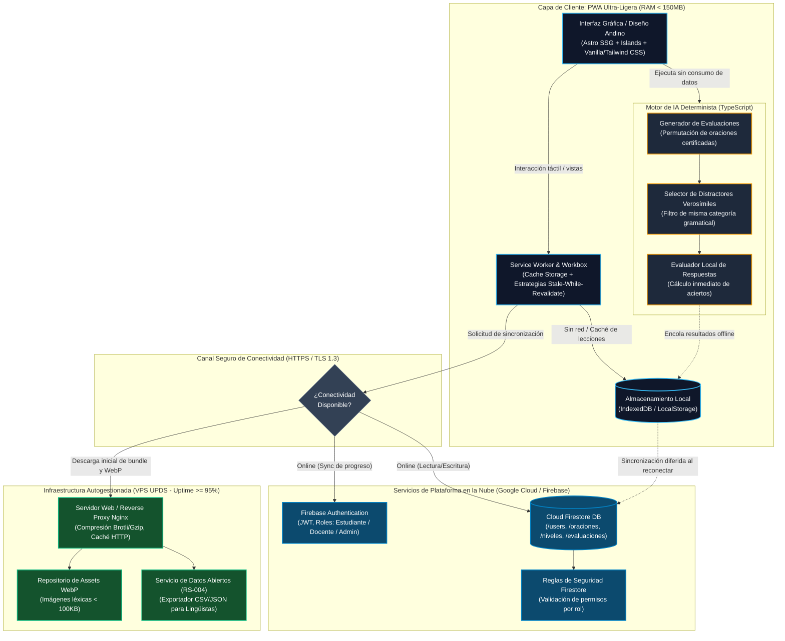
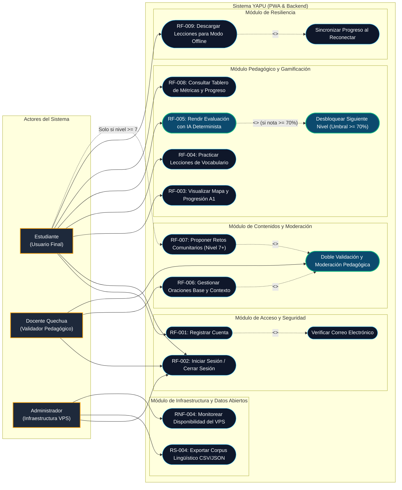
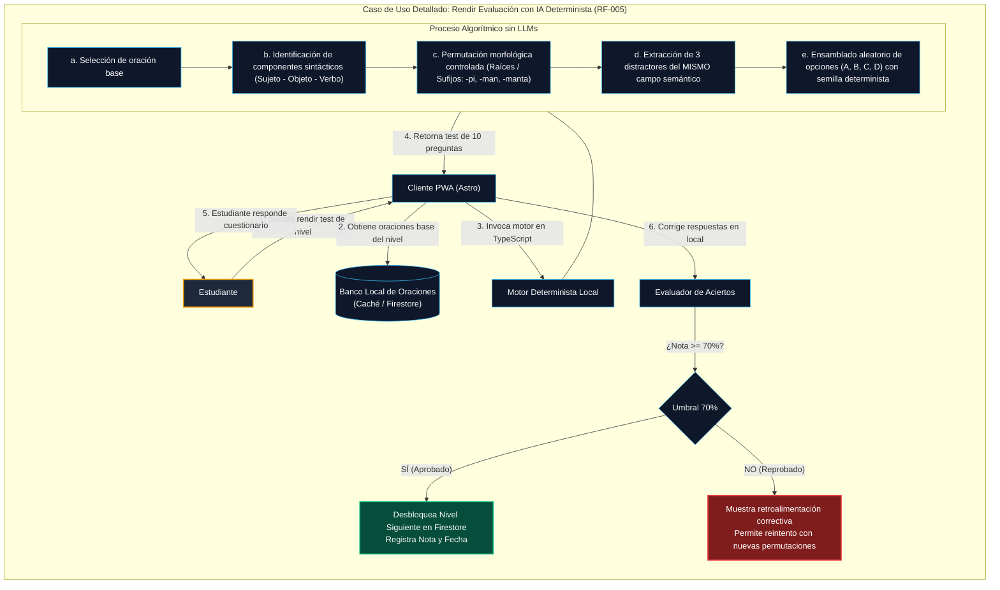
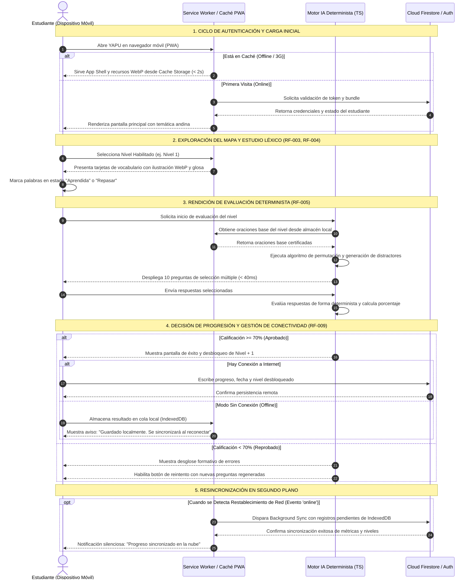
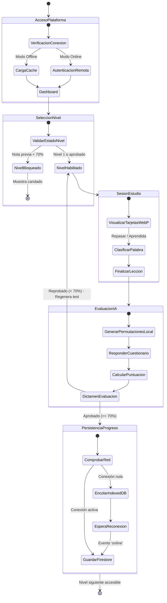
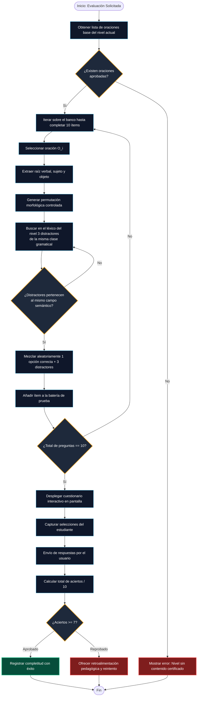

# UNIVERSIDAD PRIVADA DOMINGO SAVIO
## FACULTAD DE INGENIERÍA
### CARRERA DE INGENIERÍA DE SISTEMAS / INGENIERÍA DE SOFTWARE

---

**PROYECTO YAPU — PLATAFORMA DE APRENDIZAJE DE LENGUA QUECHUA**  
**MAPA DE DIAGRAMAS ARQUITECTÓNICOS Y DE COMPORTAMIENTO UML (BLOQUE 2)**  

- **Asignatura:** Ingeniería de Software  
- **Docente:** Ingeniero Jimmy Nataniel Requena / Ing. Fernando Pardo  
- **Equipo de Desarrollo (Autores):**
  - Emmanuel Ponce Quiroga (Líder Técnico & Gobernanza de IA)
  - Jhoel Álvaro Cruz Zurita (Arquitectura VPS & Gestión de Datos)
  - Luis Mario Rocha Vela (Aseguramiento de Calidad & Estándares APA)
- **Stakeholder Pedagógica:** Lic. María Elena Quispe Mamani (Docente Titular de Lengua Quechua — Unidad Educativa Simón Bolívar, Sucre)
- **Fecha de Emisión:** 18 de septiembre de 2026  
- **Ubicación:** Santa Cruz de la Sierra / Sucre, Bolivia  
- **Versión:** 2.0 (Consolidada con base en SRS APA 7 y Defensa Bloque 2)

---

## 1. Introducción y Contexto del Documento

El presente documento constituye el **Mapa de Diagramas de Arquitectura y Comportamiento UML** para el proyecto **YAPU** (*Sembradío* en lengua quechua), una Plataforma Web Progresiva (PWA) de alta eficiencia concebida para la enseñanza, democratización y preservación de la lengua originaria quechua (variante sureña Collao/Chuquisaca) en el Estado Plurinacional de Bolivia.

Este compendio traduce formalmente los requerimientos especificados en el documento institucional `Docs/Informe_SRS_APA7_Bloque2.pdf` y expuestos en `Docs/presentacion_srs_bloque2.html`. Incorpora el rigor del estándar **IEEE Std 830-1998** adaptado al paradigma ágil, operacionalizando las historias de usuario y criterios de aceptación BDD (Gherkin) mediante modelos visuales ejecutables y auditables.

### Objetivos Específicos del Mapa:
1. **Modelar la Arquitectura Integral del Sistema:** Exponer la separación de capas entre el cliente PWA (Astro + Service Workers), los servicios distribuidos en la nube (Firebase) y la infraestructura VPS autogestionada (Nginx).
2. **Definir el Diagrama General de Casos de Uso:** Mapear la interacción de los tres actores del ecosistema (Estudiante, Docente y Administrador) frente a los 10 Requisitos Funcionales (RF-001 al RF-010).
3. **Detallar Casos de Uso Específicos:** Describir con granularidad técnica los módulos críticos (Motor de IA Determinista, Navegación con umbral del 70% y Moderación Docente).
4. **Modelar el Diagrama General de Actividades:** Diagramar el flujo de ejecución global del software, contemplando bifurcaciones de conectividad (online/offline) y decisiones pedagógicas.
5. **Presentar la Matriz de Auditoría de IA:** Registrar de forma verificable la gobernanza sobre los diagramas y componentes estructurales propuestos inicialmente por modelos de IA y ajustados por el equipo humano en función de las directrices del stakeholder pedagógico.

---

## 2. Diagrama 1: Arquitectura General del Sistema

### 2.1 Representación Arquitectónica (Mermaid)



### 2.2 Descripción Técnica y Mapeo con el SRS
- **Propósito:** Describir la topología física y lógica de la solución de software, garantizando que el sistema sea viable en entornos con infraestructura restringida.
- **Capa Cliente (PWA):** Construida sobre el framework Astro para maximizar la velocidad de carga (FCP < 1.8s, RNF-001) sirviendo HTML pre-renderizado con JavaScript mínimo. Opera como PWA de primera clase gobernada por un Service Worker (RF-009) que gestiona Cache Storage e IndexedDB, consumiendo menos de 150 MB de memoria RAM en ejecución (RS-002) para permitir su uso en celulares de gama de entrada Android 8.0+.
- **Motor de IA Determinista:** Aislado en el cliente en TypeScript (RF-005). No efectúa peticiones HTTP externas ni llamadas a LLMs comerciales (OpenAI/Anthropic), eliminando costos recurrentes ($0 en APIs) y garantizando ausencia absoluta de alucinaciones lingüísticas.
- **Capa de Servicios Cloud (Firebase):** Maneja la autenticación robusta de usuarios con hashing no accesible por código cliente (RNF-003, RF-001, RF-002) y la base de datos documental no relacional Cloud Firestore, configurada con clústeres elásticos capaces de absorber picos de hasta 500 usuarios concurrentes (RNF-005).
- **Capa de Servidor Privado Virtual (VPS):** Un VPS Linux Debian administrado por el equipo UPDS que actúa como origen confiable mediante Nginx (RNF-004), sirviendo activos gráficos comprimidos en WebP a menos de 100 KB por recurso (RS-001) y proporcionando un endpoint utilitario para la exportación de corpus en formatos abiertos CSV/JSON (RS-004).

---

## 3. Diagrama 2: Diagrama General de Casos de Uso del Sistema

### 3.1 Representación UML de Casos de Uso (Mermaid)



### 3.2 Descripción y Catálogo de Casos de Uso

| Caso de Uso | Requisito Trazable | Actor Primario | Precondición | Postcondición Crítica |
|---|---|---|---|---|
| **CU-01: Registrar Cuenta** | RF-001 | Estudiante / Docente | Dispositivo con conexión y navegador moderno. | Cuenta creada en Firebase Auth, documento inicializado en Firestore `/users` con rol seleccionado y correo de validación despachado. |
| **CU-02: Iniciar Sesión** | RF-002 | Todos los actores | Usuario registrado con correo y contraseña. | Token JWT emitido, carga de perfil según rol y restauración de progreso en el cliente. |
| **CU-03: Visualizar Mapa A1** | RF-003, RF-010 | Estudiante | Sesión activa de estudiante. | Renderizado del mapa de 10 niveles con estilo andino; niveles no alcanzados bloqueados con candado visual. |
| **CU-04: Practicar Vocabulario** | RF-004 | Estudiante | Nivel actual desbloqueado. | Despliegue de tarjetas interactivas con ilustración WebP, glosa en castellano, ortografía normalizada y opción de marcar para repaso. |
| **CU-05: Rendir Evaluación IA** | RF-005 | Estudiante | Vocabulario de la lección completado. | Generación algorítmica local de test de 10 ítems de opción múltiple; cálculo de nota inmediata sin latencia de red. |
| **CU-06: Desbloquear Nivel** | RF-003, RF-005 | Estudiante (Disparado por Sistema) | Calificación obtenida en la evaluación $\ge 70\%$. | Se escribe en Firestore la fecha de aprobación y el Nivel $N+1$ queda habilitado para el usuario. |
| **CU-07: Gestionar Oraciones Base** | RF-006, RS-003 | Docente Quechua | Sesión iniciada con rol docente certificado. | Oración creada con texto quechua, traducción, nivel y el campo obligatorio `contexto_cultural`. Queda en cuarentena (`pendiente`). |
| **CU-08: Doble Moderación** | RF-007, RS-003 | Docente Quechua | Existencia de oraciones o retos en estado `pendiente`. | Un segundo docente evalúa lingüísticamente el contenido; al aprobarlo se publica para el motor determinista. |
| **CU-09: Descargar Modo Offline** | RF-009 | Estudiante | Conexión a internet activa al momento de navegar. | El Service Worker almacena en Cache Storage las lecciones y recursos WebP del nivel activo para su uso posterior sin internet. |
| **CU-10: Exportar Corpus Lingüístico** | RS-004 | Administrador | Rol de Administrador en el VPS. | Generación de archivo descargable CSV/JSON con metadatos léxicos libres de datos personales (GDPR/Habeas Data). |

---

## 4. Diagrama 3: Diagramas de Casos de Uso Específicos por Módulo Clave

### 4.1 Módulo Pedagógico: Generación de Evaluaciones con IA Determinista (RF-005)



#### Descripción Detallada del Flujo:
1. **Precondición:** El estudiante ha navegado y marcado como vistas las tarjetas de vocabulario del nivel correspondiente (RF-004).
2. **Disparador:** Clic en "Iniciar Evaluación de Nivel".
3. **Mecanismo Determinista:** El motor procesa el arreglo estructurado de oraciones. En vez de recurrir a servicios de generación probabilísticos que podrían introducir sufijos erróneos o alucinaciones (como mezclas con aymara advertidas por la Lic. Quispe Mamani), el algoritmo toma la raíz gramatical certificada y permuta los modificadores de caso manteniendo invariable la coherencia sintáctica.
4. **Criterio de Aceptación:** El estudiante debe responder 10 preguntas generadas en menos de 40 ms. Si la calificación final es $\ge 7$, el sistema efectúa la mutación de estado a aprobado.

---

### 4.2 Módulo Docente: Gestión y Doble Moderación de Contenidos (RF-006, RF-007, RS-003)

```mermaid
graph TD
    subgraph CU_MODERACION["Caso de Uso Detallado: Flujo de Doble Moderación Lingüística"]
        DOC1["Docente 1 o Estudiante Nivel 7+"] -->|"1. Envía propuesta de contenido"| FORM["Formulario de Aporte"]
        
        FORM -->|"Valida campos requeridos:<br/>Texto Quechua, Traducción, Nivel y Contexto Cultural"| VAL_INP{"¿Campos<br/>Válidos?"}
        
        VAL_INP -->|"No"| REJ_INP["Rechazo formal en interfaz con advertencia"]
        VAL_INP -->|"Sí"| SAVE_PEND["Guarda en Firestore /oraciones<br/>estado = 'pendiente'<br/>autor_id = Docente 1"]
        
        SAVE_PEND --> COLA["Cola de Aprobación Docente"]
        
        DOC2["Docente 2 (Hablante Nativo / Certificado)"] -->|"2. Accede a cola de revisión"| COLA
        
        COLA --> REV["Inspección Lingüística:<br/>1. Ortografía normalizada (Sucre)<br/>2. Pertinencia del Contexto Cultural<br/>3. Ausencia de mezcla con otras lenguas"]
        
        REV --> DECISION{"Dictamen del<br/>Segundo Docente"}
        
        DECISION -->|"Rechazado"| RECHAZO["Estado = 'rechazado'<br/>Registra motivo pedagógico para el autor"]
        DECISION -->|"Corrección menor"| EDITAR["Docente 2 edita texto o contexto<br/>y aprueba con observaciones"]
        DECISION -->|"Aprobado"| APROBADO["Estado = 'aprobado'<br/>validador_id = Docente 2<br/>fecha_aprobacion = timestamp"]
        
        EDITAR --> APROBADO
        APROBADO --> LIVE["Integración Inmediata al Banco de IA<br/>Disponible para todos los estudiantes"]
    end

    classDef doc1Style fill:#1e293b,stroke:#f59e0b,stroke-width:2px,color:#ffffff;
    classDef doc2Style fill:#0c4a6e,stroke:#38bdf8,stroke-width:2px,color:#ffffff;
    classDef flowStyle fill:#0f172a,stroke:#94a3b8,stroke-width:1px,color:#ffffff;
    classDef okStyle fill:#064e3b,stroke:#10b981,stroke-width:2px,color:#ffffff;
    classDef noStyle fill:#7f1d1d,stroke:#ef4444,stroke-width:2px,color:#ffffff;

    class DOC1 doc1Style;
    class DOC2 doc2Style;
    class FORM,VAL_INP,SAVE_PEND,COLA,REV,DECISION,EDITAR flowStyle;
    class APROBADO,LIVE okStyle;
    class REJ_INP,RECHAZO noStyle;
```



#### Descripción Detallada del Flujo:
- Este flujo atiende directamente a las observaciones del stakeholder (Acta de Socialización del 12/09/2026), donde se remarcó que las oraciones no contextualizadas carecen de valor pedagógico y que admitir contribuciones directas sin un segundo filtro contamina la enseñanza con variantes no normadas.
- La regla de integridad prohíbe que el mismo docente que creó la oración (`autor_id`) pueda actuar como moderador (`validador_id`), asegurando el principio de **cuatro ojos** en la preservación del patrimonio lingüístico.

---

## 5. Diagrama 4: Diagrama General de Actividades del Sistema

El siguiente diagrama modela la dinámica global del sistema YAPU, organizando los flujos a través de cuatro carriles o *swimlanes* funcionales: **Estudiante**, **Service Worker (PWA)**, **Motor Determinista** y **Servicios Cloud (Firestore/Auth)**.



### 5.1 Diagrama de Flujo de Actividades del Sistema (Workflow de Estados)



---

## 6. Diagramas de Actividades Específicos por Caso de Uso Clave

### 6.1 Actividad A: Ciclo de Vida del Motor Determinista de Preguntas (RF-005)



---

### 6.2 Actividad B: Funcionamiento Offline-First y Background Sync (RF-009)

```mermaid
flowchart TD
    A([Estudiante interactúa con la PWA]) --> B{¿Hay conexión HTTP activa?}
    
    %% Camino Online
    B -->|Sí (Online)| C[Petición estándar al servidor / Firebase]
    C --> D[Service Worker intercepta respuesta]
    D --> E[Almacena copia en Cache Storage / Workbox]
    E --> F[Renderiza vista al usuario]
    
    %% Camino Offline
    B -->|No (Offline / 3G caído)| G[Service Worker detecta fallo de red]
    G --> H[Inspecciona Cache Storage local]
    H --> I{¿Recurso disponible<br/>en caché?}
    
    I -->|Sí| J[Sirve lección y WebP desde Caché local]
    I -->|No| K[Despliega pantalla amigable de recurso no descargado]
    
    J --> L[Estudiante completa estudio o evaluación]
    L --> M[Intento de enviar nota a la nube]
    M --> N{¿Se logró comunicar<br/>con Firestore?}
    
    N -->|Sí| O[Progreso consolidado en la nube]
    N -->|No| P[Registrar transacción en tabla local IndexedDB 'pending_evals']
    P --> Q[Registrar tarea de Background Sync en el navegador]
    
    Q --> R[Esperar evento de red 'window.online']
    R --> S[Disparador de Service Worker: vaciar cola de sincronización]
    S --> T[Transmitir lotes de respuestas a Cloud Firestore]
    T --> U[Eliminar registros sincronizados de IndexedDB]
    U --> V([Fin: Base de datos sincronizada])
    O --> V
    F --> V
    K --> V

    classDef normal fill:#0f172a,stroke:#38bdf8,stroke-width:1px,color:#ffffff;
    classDef cond fill:#1e293b,stroke:#f59e0b,stroke-width:2px,color:#ffffff;
    classDef ok fill:#064e3b,stroke:#10b981,stroke-width:2px,color:#ffffff;
    classDef warn fill:#78350f,stroke:#f59e0b,stroke-width:2px,color:#ffffff;

    class A,C,D,E,F,G,H,J,L,M,P,Q,R,S,T,U normal;
    class B,I,N cond;
    class O,V ok;
    class K,warn;
```

---

## 7. Matriz de Auditoría de Inteligencia Artificial (Gobernanza de Modelos UML)

De acuerdo con las exigencias académicas y éticas de la Universidad Privada Domingo Savio (UPDS), esta sección transparenta qué componentes estructurales y de comportamiento fueron generados o sugeridos por modelos de Inteligencia Artificial y de qué manera el equipo humano de desarrollo los adaptó y corrigió para ajustarse a los requerimientos del proyecto.

### Tabla 1
*Matriz de Auditoría de Componentes Estructurales y de Comportamiento UML*

| Identificador | Componente / Diagrama UML | Propuesta Inicial de la IA | Ajuste Crítico Realizado por el Equipo Humano | Justificación y Fuente de Cambio |
|:---:|:---|:---|:---|:---|
| **AUD-01** | Diagrama de Arquitectura: Motor de IA (RF-005) | La IA propuso integrar una API externa REST de OpenAI/Gemini para generar preguntas mediante prompts en lenguaje natural. | **Se descartó la API externa.** Se sustituyó por un Motor Determinista local en TypeScript basado en permutaciones morfológicas y banco estático. | **Restricción de Presupuesto $0 (SRS 3.3)** y necesidad de ejecución offline en áreas rurales (RF-009). Cero alucinaciones lingüísticas. |
| **AUD-02** | Diagrama de Casos de Uso: Criterio de Aprobación (RF-003) | La IA propuso un umbral estándar de gamificación del 50% o simple avance por lectura lineal. | **Se impuso un umbral estricto del 70%** como precondición formal para el caso de uso `Desbloquear Nivel`. | **Validación con la Lic. Quispe Mamani (12/09/2026)**: El 70% asegura fijación cognitiva sin frustración pedagógica. |
| **AUD-03** | Diagrama de Casos de Uso: Contenido Comunitario (RF-007) | La IA propuso aprobación directa por cualquier usuario mediante un sistema de "votos positivos" tipo Reddit. | **Se estableció un flujo estricto de Doble Validación Docente** con cuarentena obligatoria en estado `pendiente`. | **Requisito de Sostenibilidad Cultural RS-003**: Evitar errores ortográficos, variantes no estandarizadas o préstamos forzados del castellano o aymara. |
| **AUD-04** | Diagrama de Actividades: Generador de Distractores | La IA propuso selección puramente aleatoria de palabras del diccionario global como distractores. | **Se implementó restricción semántica:** Los distractores deben pertenecer a la misma categoría gramatical y campo semántico del nivel en curso. | **Dictamen Pedagógico Stakeholder:** Previene que el estudiante identifique la respuesta correcta por simple descarte de opciones absurdas. |
| **AUD-05** | Diagrama de Arquitectura: Capa de Presentación (RF-010) | La IA propuso un SPA tradicional en React pesado con Tailwind genérico y gráficos complejos de alta resolución. | **Se adoptó Astro SSG + Islands con tokens andinos**, limitando el consumo total a < 150MB de RAM y assets WebP < 100KB. | **Requisito No Funcional RNF-001 y RS-002**: Garantizar compatibilidad con dispositivos de gama de entrada (2GB RAM) frecuentes en Sucre. |
| **AUD-06** | Diagrama de Casos de Uso: Panel Docente (RF-006) | La IA omitió el contexto etnográfico, incluyendo únicamente los campos `palabra_quechua` y `traduccion_espanol`. | **Se añadió el campo obligatorio `contexto_cultural`** en el caso de uso de registro de oraciones base. | **Observación Docente (Minuta 12/09/2026)**: En quechua, la significación de la frase depende del ámbito de interacción comunitaria (*ayllu*, siembra, familia). |

*Nota.* Elaboración propia por el equipo de desarrollo UPDS en cumplimiento de las directrices de auditoría y gobernanza ética de IA para la materia de Ingeniería de Software.

---

## 8. Conclusiones y Trazabilidad con el Documento Formal

1. **Alineación con el Estándar IEEE Std 830-1998:** Cada diagrama presentado en este mapa se correlaciona de manera biunívoca con la especificación de requisitos formalizada en el informe `Docs/Informe_SRS_APA7_Bloque2.pdf` y la presentación `Docs/presentacion_srs_bloque2.html`.
2. **Factibilidad Técnica y Sostenibilidad:** El modelo arquitectónico no solo resuelve los requerimientos funcionales básicos de aprendizaje (RF-001 a RF-005), sino que blinda el sistema frente a contingencias reales del contexto boliviano: conectividad deficiente mediante Service Workers (RF-009), gratuidad operativa total con IA determinista ($0.00 de costos recurrentes) y ligereza en dispositivos móviles económicos (RS-002).
3. **Soberanía y Pertinencia Pedagógica:** La estructura de casos de uso y actividades asegura que la plataforma permanezca fiel a la variante dialectal Quechua Chanka/Collao de Chuquisaca, otorgando a los docentes el control absoluto sobre la moderación de los datos que nutren la inteligencia del sistema.

---

## 9. Referencias en Formato APA 7ma Edición

<div style="padding-left: 2em; text-indent: -2em;">

Cerrón-Palomino, R. (2003). *Lingüística quechua* (2.ª ed.). Centro de Estudios Regionales Andinos Bartolomé de Las Casas.

Constitución Política del Estado Plurinacional de Bolivia. (2009). *Gaceta Oficial del Estado Plurinacional de Bolivia*. La Paz, Bolivia.

IEEE Computer Society. (2011). *IEEE Std 830-1998: IEEE Recommended Practice for Software Requirements Specifications*. IEEE. https://doi.org/10.1109/IEEESTD.1998.88286

Ministerio de Educación del Estado Plurinacional de Bolivia. (2023). *Currículo Base del Sistema Educativo Plurinacional: Educación Intracultural, Intercultural y Plurilingüe*. La Paz, Bolivia.

Pressman, R. S., & Maxim, B. R. (2020). *Software engineering: A practitioner's approach* (9.ª ed.). McGraw-Hill Education.

Sommerville, I. (2016). *Software engineering* (10.ª ed.). Pearson Education.

Wynne, M., & Hellesøy, A. (2017). *The Cucumber book: Behaviour-driven development for testers and developers* (2.ª ed.). Pragmatic Bookshelf.

</div>
