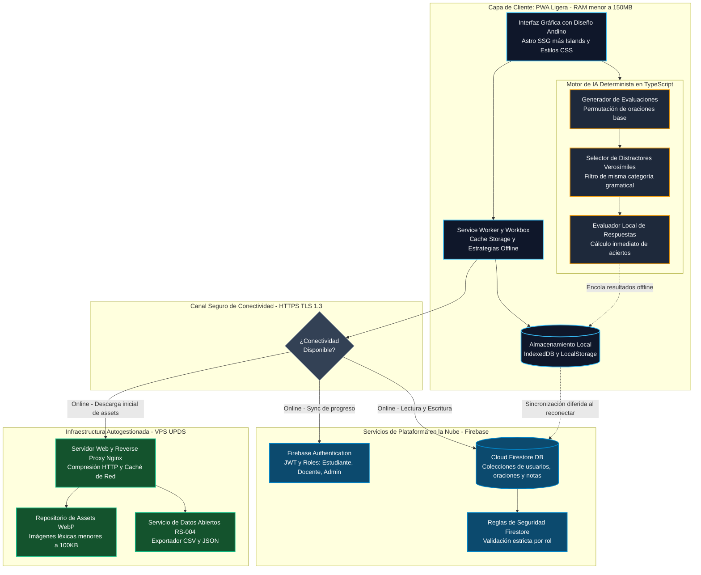
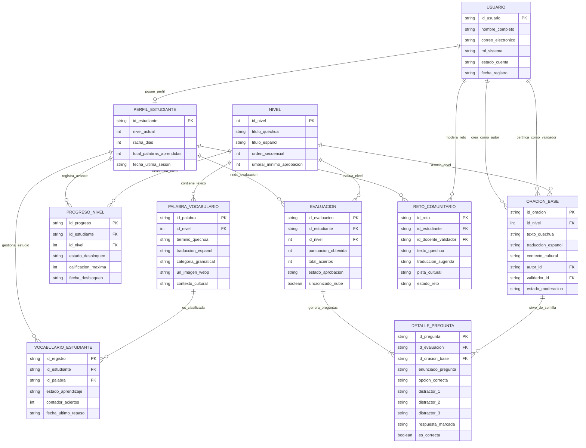
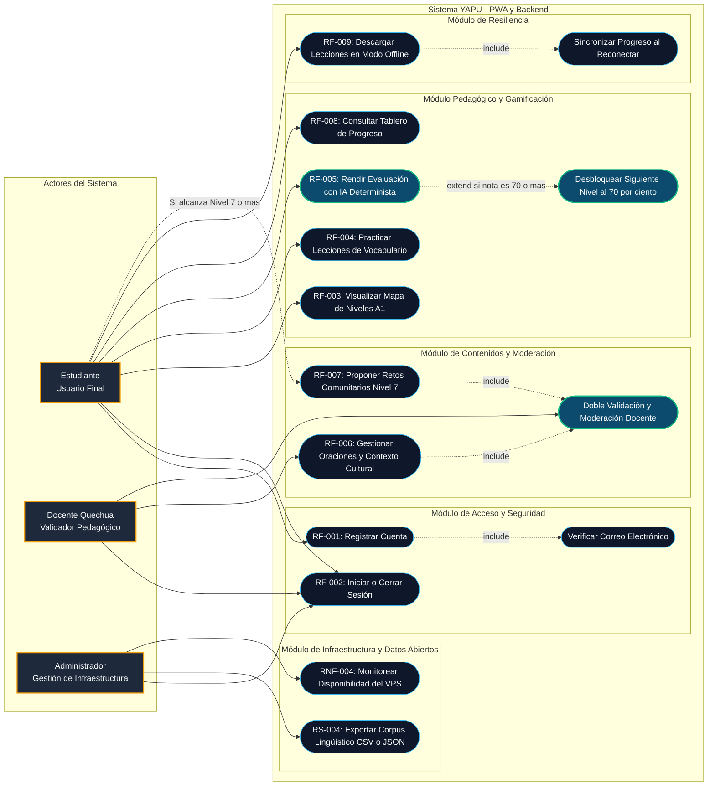
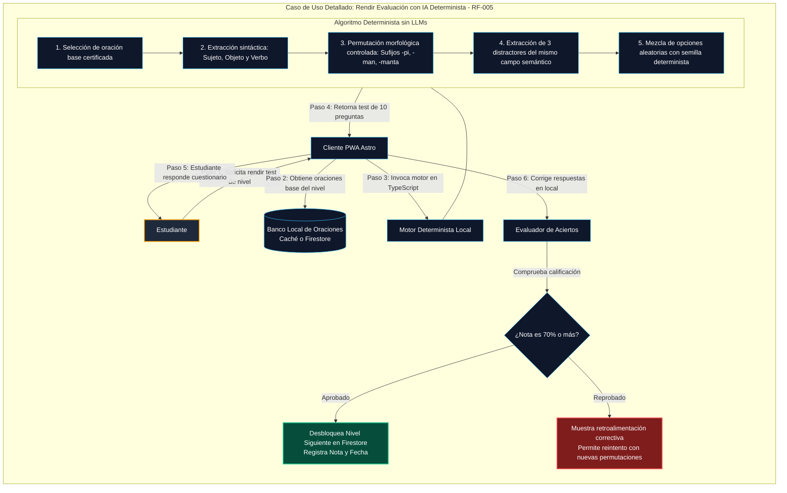
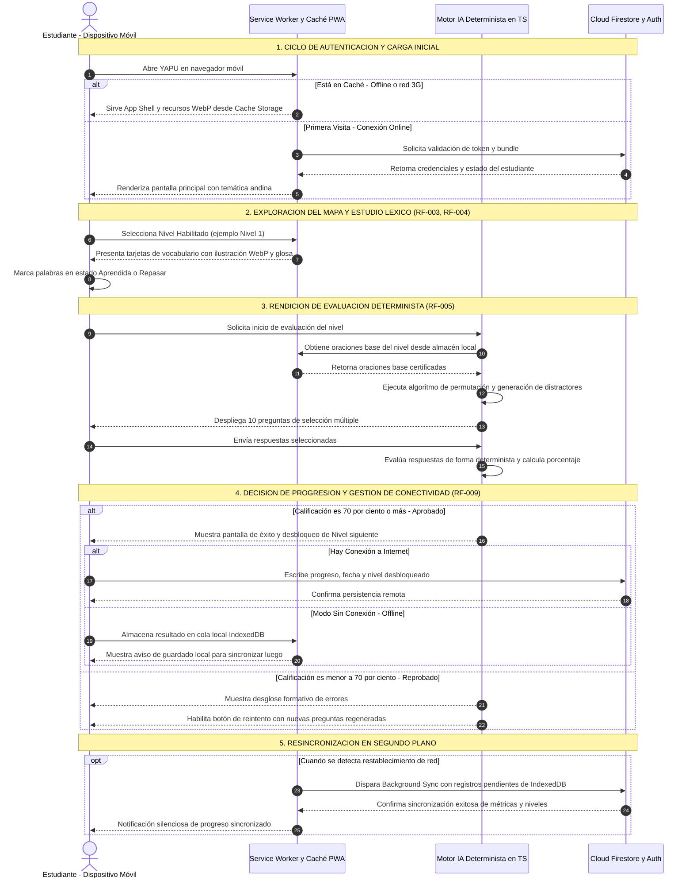
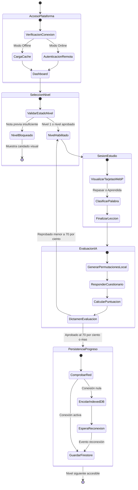
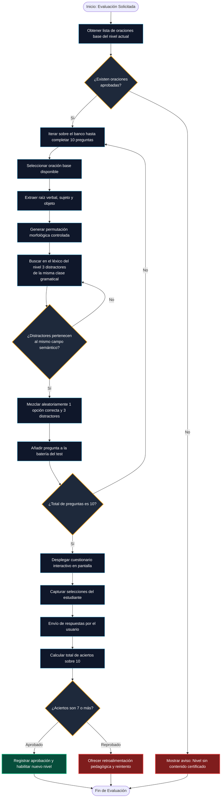
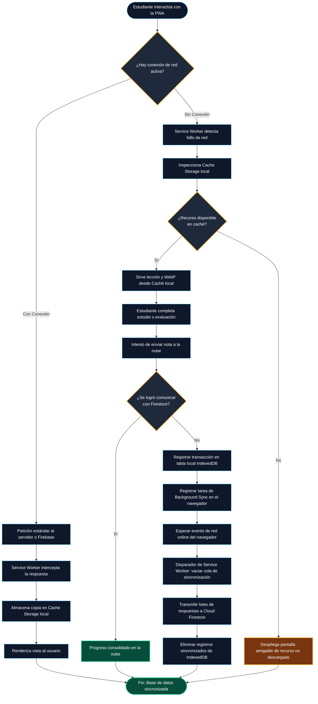

# UNIVERSIDAD PRIVADA DOMINGO SAVIO
## FACULTAD DE INGENIERÍA
### CARRERA DE INGENIERÍA DE SISTEMAS / INGENIERÍA DE SOFTWARE

---

**PROYECTO YAPU — PLATAFORMA DE APRENDIZAJE DE LENGUA QUECHUA**  
**MAPA DE DIAGRAMAS ARQUITECTÓNICOS, DE COMPORTAMIENTO Y MODELADO DE DATOS UML / ERD (BLOQUE 2)**  

- **Asignatura:** Ingeniería de Software  
- **Docente:** Ingeniero Jimmy Nataniel Requena / Ing. Fernando Pardo  
- **Equipo de Desarrollo (Autores):**
  - Emmanuel Ponce Quiroga (Líder Técnico & Gobernanza de IA)
  - Jhoel Álvaro Cruz Zurita (Arquitectura VPS & Gestión de Datos)
  - Luis Mario Rocha Vela (Aseguramiento de Calidad & Estándares APA)
- **Stakeholder Pedagógica:** Lic. María Elena Quispe Mamani (Docente Titular de Lengua Quechua — Unidad Educativa Simón Bolívar, Sucre)
- **Fecha de Emisión:** 18 de septiembre de 2026  
- **Ubicación:** Santa Cruz de la Sierra / Sucre, Bolivia  
- **Versión:** 2.1 (Consolidada con Modelo de Datos ERD, Relaciones Fuertes/Débiles, SRS APA 7 y Defensa Bloque 2)

---

## 1. Introducción y Contexto del Documento

El presente documento constituye el **Mapa Integral de Diagramas de Arquitectura, Modelado de Datos y Comportamiento UML** para el proyecto **YAPU** (*Sembradío* en lengua quechua), una Plataforma Web Progresiva (PWA) de alta eficiencia concebida para la enseñanza, democratización y revitalización de la lengua originaria quechua (variante sureña Collao/Chuquisaca) en el Estado Plurinacional de Bolivia.

Este compendio traduce formalmente los requerimientos especificados en el documento institucional `Docs/Informe_SRS_APA7_Bloque2.pdf` y expuestos en `Docs/presentacion_srs_bloque2.html`. Incorpora el rigor del estándar **IEEE Std 830-1998** adaptado al paradigma ágil, operacionalizando las historias de usuario, criterios de aceptación BDD (Gherkin), esquemas relacionales y de documentos NoSQL mediante modelos visuales ejecutables y auditables.

### Objetivos Específicos del Mapa:
1. **Modelar la Arquitectura Integral del Sistema:** Exponer la separación de capas entre el cliente PWA (Astro + Service Workers), los servicios distribuidos en la nube (Firebase) y la infraestructura VPS autogestionada (Nginx).
2. **Modelar la Estructura y Persistencia de Datos (ERD):** Definir el diagrama entidad-relación del dominio, clasificando taxónomicamente las relaciones fuertes, débiles por existencia y débiles por identificación, así como su equivalencia en Cloud Firestore e IndexedDB.
3. **Definir el Diagrama General de Casos de Uso:** Mapear la interacción de los tres actores del ecosistema (Estudiante, Docente y Administrador) frente a los 10 Requisitos Funcionales (RF-001 al RF-010).
4. **Detallar Casos de Uso Específicos:** Describir con granularidad técnica los módulos críticos (Motor de IA Determinista, Navegación con umbral del 70% y Moderación Docente).
5. **Modelar el Diagrama General de Actividades:** Diagramar el flujo de ejecución global del software, contemplando bifurcaciones de conectividad (online/offline) y decisiones pedagógicas.
6. **Presentar la Matriz de Auditoría de IA:** Registrar de forma verificable la gobernanza sobre los diagramas y componentes estructurales propuestos inicialmente por modelos de IA y ajustados por el equipo humano en función de las directrices del stakeholder pedagógico.

---

## 2. Diagrama 1: Arquitectura General del Sistema

### 2.1 Representación Arquitectónica (Mermaid)



### 2.2 Descripción Técnica y Mapeo con el SRS
- **Propósito:** Describir la topología física y lógica de la solución de software, garantizando que el sistema sea viable en entornos con infraestructura restringida.
- **Capa Cliente (PWA):** Construida sobre el framework Astro para maximizar la velocidad de carga (FCP < 1.8s, RNF-001) sirviendo HTML pre-renderizado con JavaScript mínimo. Opera como PWA gobernada por un Service Worker (RF-009) que gestiona Cache Storage e IndexedDB, consumiendo menos de 150 MB de memoria RAM en ejecución (RS-002) para permitir su uso en smartphones económicos Android 8.0+.
- **Motor de IA Determinista:** Aislado en el cliente en TypeScript (RF-005). No efectúa peticiones HTTP externas ni llamadas a LLMs comerciales (OpenAI/Anthropic), eliminando costos recurrentes ($0 en APIs) y garantizando ausencia absoluta de alucinaciones lingüísticas.
- **Capa de Servicios Cloud (Firebase):** Maneja la autenticación robusta de usuarios con hashing no accesible por código cliente (RNF-003, RF-001, RF-002) y la base de datos documental Cloud Firestore, configurada con clústeres capaces de absorber picos de hasta 500 usuarios concurrentes (RNF-005).
- **Capa de Servidor Privado Virtual (VPS):** Un VPS Linux Debian administrado por el equipo UPDS que actúa como origen confiable mediante Nginx (RNF-004), sirviendo activos gráficos comprimidos en WebP a menos de 100 KB por recurso (RS-001) y proporcionando un endpoint utilitario para la exportación de corpus en formatos abiertos CSV/JSON (RS-004).

---

## 3. Diagrama 2: Diagrama de Modelado de Datos (Entidad-Relación y Dominio)

### 3.1 Representación del Diagrama Entidad-Relación (Mermaid ERD)



---

### 3.2 Explicación Exhaustiva de las Relaciones de Datos

En el diseño de bases de datos para sistemas educativos resilientes, la categorización de las relaciones entre entidades determina la **integridad referencial**, las **reglas de cascada** en operaciones de borrado o actualización, y la **estrategia de particionamiento** entre el almacenamiento local (IndexedDB) y la nube (Cloud Firestore). A continuación se desglosa el significado conceptual y técnico de cada tipo de relación presente en el modelo:

```
                  ┌─────────────────────────────────────────────────────────────┐
                  │                 TAXONOMÍA DE RELACIONES                     │
                  └──────────────────────────────┬──────────────────────────────┘
                                                 │
                   ┌─────────────────────────────┴─────────────────────────────┐
                   ▼                                                           ▼
    ┌─────────────────────────────┐                             ┌─────────────────────────────┐
    │     RELACIONES FUERTES      │                             │      RELACIONES DÉBILES     │
    │  (Existencia Independiente) │                             │  (Dependencia Estructural)  │
    └──────────────┬──────────────┘                             └──────────────┬──────────────┘
                   │                                                           │
        ┌──────────┴──────────┐                                     ┌──────────┴──────────┐
        ▼                     ▼                                     ▼                     ▼
 ┌──────────────┐      ┌──────────────┐                      ┌──────────────┐      ┌──────────────┐
 │ Asociación   │      │ Composición  │                      │ Por          │      │ Por          │
 │ Independiente│      │ Referencial  │                      │ Existencia   │      │Identificación│
 │ (USUARIO a   │      │ (NIVEL a     │                      │ (USUARIO a   │      │ (EVALUACION a│
 │ ORACION_BASE)│      │ PALABRA)     │                      │ PERFIL)      │      │ DETALLE)     │
 └──────────────┘      └──────────────┘                      └──────────────┘      └──────────────┘
```

#### A. Relaciones Fuertes (Existencia Independiente)
Una relación es **fuerte** cuando vincula dos entidades regulares (fuertes) que poseen identidad ontológica e histórica propia en el sistema. Ambas entidades disponen de claves primarias independientes y la desaparición de una no compromete necesariamente la existencia de la otra en el registro maestro:

1. **`USUARIO` $\rightarrow$ `ORACION_BASE` (Relación de Creación y Validación 1:N):**
   - *Tipo:* Relación Fuerte de Asociación.
   - *Significado:* Un usuario con rol Docente crea una oración base lingüística (`autor_id`), mientras que un segundo usuario docente diferente certifica su corrección (`validador_id`). 
   - *Comportamiento de Integridad:* Si el usuario docente es desactivado o pasa a estado inactivo, la `ORACION_BASE` **permanece intacta** en el banco de oraciones para no descalibrar el motor de IA determinista ni privar a los estudiantes de su material de estudio (integridad histórica).
2. **`NIVEL` $\rightarrow$ `PALABRA_VOCABULARIO` (Relación Estructural de Catálogo 1:N):**
   - *Tipo:* Relación Fuerte / Jerárquica de Catálogo.
   - *Significado:* El Nivel (del 1 al 10, según la progresión A1 del Marco Común Europeo) agrupa el léxico correspondiente. Cada palabra posee su propio identificador único y metadatos léxicos autónomos.
3. **`NIVEL` $\rightarrow$ `ORACION_BASE` (Relación de Agrupación Curricular 1:N):**
   - *Tipo:* Relación Fuerte.
   - *Significado:* Vincula cada estructura oracional al nivel lingüístico específico, permitiendo al motor de IA filtrar los bancos de reactivos de acuerdo al avance curricular del estudiante.

---

#### B. Relaciones Débiles por Existencia
Una entidad es **débil por existencia** cuando su permanencia en el sistema carece de sentido lógico si no existe la entidad fuerte de la cual depende. Si la entidad padre es dada de baja o purgada, la entidad débil dependiente debe ser eliminada en cascada (*ON DELETE CASCADE*):

1. **`USUARIO` $\rightarrow$ `PERFIL_ESTUDIANTE` (Relación de Especialización 1:0..1):**
   - *Tipo:* Relación Débil por Existencia.
   - *Significado:* Todo estudiante registrado posee un perfil específico donde se acumula su gamificación (racha de días, nivel máximo y palabras dominadas). No puede existir un `PERFIL_ESTUDIANTE` sin su correspondiente cuenta raíz en `USUARIO`. Si un estudiante solicita el ejercicio de su derecho de supresión de cuenta (Habeas Data / Privacidad RNF-003), su perfil académico queda eliminado de forma sincrónica.
2. **`PERFIL_ESTUDIANTE` $\rightarrow$ `EVALUACION` (Relación Histórica de Desempeño 1:N):**
   - *Tipo:* Relación Débil por Existencia.
   - *Significado:* Cada evaluación representa el evento temporal en que un estudiante rinde una prueba de nivel. No pueden registrarse evaluaciones anónimas o huérfanas sin asociarse al identificador del estudiante que contestó las preguntas.

---

#### C. Relaciones Débiles por Identificación (Entidades Asociativas e Hijas Puras)
Una entidad es **débil por identificación** cuando, además de depender de la existencia de otra entidad, **no puede identificarse unívocamente sin la clave foránea de su entidad padre o de sus entidades relacionadas**. Su clave primaria se compone total o sustancialmente de claves foráneas:

1. **`EVALUACION` $\rightarrow$ `DETALLE_PREGUNTA` (Relación Débil por Identificación 1:N):**
   - *Tipo:* **Relación Débil por Identificación Pura (Composición Estricta).**
   - *Significado:* Una evaluación se compone de exactamente 10 preguntas generadas de forma determinista. Cada `DETALLE_PREGUNTA` registra la combinación específica de oración base, la permutación morfológica, los 3 distractores generados por el algoritmo y la opción elegida por el alumno.
   - *Comportamiento de Integridad:* Las preguntas individuales no poseen valor autónomo fuera de la evaluación que las originó. Si una evaluación se elimina o recalcula, sus 10 preguntas asociadas se destruyen en cascada.
2. **`PERFIL_ESTUDIANTE` y `NIVEL` $\rightarrow$ `PROGRESO_NIVEL` (Relación Débil Asociativa N:M):**
   - *Tipo:* Relación Débil por Identificación / Tabla Asociativa de Estado.
   - *Significado:* Resuelve la relación de muchos a muchos entre estudiantes y los 10 niveles disponibles. Cada registro modela el estado de desbloqueo (bloqueado, en curso, aprobado con fecha y nota máxima obtenida). 
   - *Regla de Negocio Crítica:* La tupla `(id_estudiante, id_nivel)` es estrictamente única (*UNIQUE CONSTRAINT*), impidiendo duplicaciones en la progresión.
3. **`PERFIL_ESTUDIANTE` y `PALABRA_VOCABULARIO` $\rightarrow$ `VOCABULARIO_ESTUDIANTE` (Relación Débil Asociativa de Aprendizaje N:M):**
   - *Tipo:* Relación Débil Asociativa.
   - *Significado:* Materializa el estado de dominio léxico individual del estudiante (RF-004). Almacena el `contador_aciertos` (requiere acumular 3 aciertos consecutivos en repasos espaciados para transicionar el estado de `"repasar"` a `"aprendida"`).

---

### 3.3 Mapeo Arquitectónico: Del Modelo Entidad-Relación al Esquema NoSQL en Cloud Firestore

En virtud de que YAPU es una aplicación web progresiva orientada a operar en redes móviles 3G con conectividad intermitente (RF-009, RNF-001), el modelo Entidad-Relación relacional conceptual se implementa físicamente sobre **Cloud Firestore** y **IndexedDB** siguiendo el patrón de documentos y subcolecciones optimizadas para consulta offline:

| Entidad Lógica (DER) | Colección / Subcolección Física Firestore | Estrategia de Caché Local en PWA (IndexedDB) |
|---|---|---|
| `USUARIO` | `/users/{id_usuario}` | Almacena perfil activo del usuario autenticado en `session_user`. |
| `PERFIL_ESTUDIANTE` | Subdocumento embebido en `/users/{id_usuario}` | Caché local con persistencia inmediata para consultas de dashboard sin red (RF-008). |
| `NIVEL` | `/niveles/{id_nivel}` | Descargado íntegramente durante la instalación del Service Worker (Cache Storage estático). |
| `PALABRA_VOCABULARIO` | `/niveles/{id_nivel}/vocabulario/{id_palabra}` | Precargado por nivel mediante Workbox. Assets WebP asociados cacheados en disco local. |
| `PROGRESO_NIVEL` | `/users/{uid}/progreso_niveles/{id_nivel}` | Mutación inmediata en IndexedDB; encolado para *Background Sync* hacia Firestore al reconectar. |
| `ORACION_BASE` | `/oraciones_base/{id_oracion}` | Sincronizado localmente para servir de insumo directo al motor determinista en TypeScript. |
| `EVALUACION` y `DETALLE_PREGUNTA` | `/evaluaciones/{id_evaluacion}/preguntas/{id_pregunta}` | Grabación atómica en lote (*Firestore Batch Write*) para minimizar consumo de cuotas concurrentes (RNF-005). |

---

## 4. Diagrama 3: Diagrama General de Casos de Uso del Sistema

### 4.1 Representación UML de Casos de Uso (Mermaid)



### 4.2 Descripción y Catálogo de Casos de Uso

| Caso de Uso | Requisito Trazable | Actor Primario | Precondición | Postcondición Crítica |
|---|---|---|---|---|
| **CU-01: Registrar Cuenta** | RF-001 | Estudiante / Docente | Dispositivo con conexión y navegador moderno. | Cuenta creada en Firebase Auth, documento inicializado en Firestore `/users` con rol seleccionado y correo de validación despachado. |
| **CU-02: Iniciar Sesión** | RF-002 | Todos los actores | Usuario registrado con correo y contraseña. | Token JWT emitido, carga de perfil según rol y restauración de progreso en el cliente. |
| **CU-03: Visualizar Mapa A1** | RF-003, RF-010 | Estudiante | Sesión activa de estudiante. | Renderizado del mapa de 10 niveles con estilo andino; niveles no alcanzados bloqueados con candado visual. |
| **CU-04: Practicar Vocabulario** | RF-004 | Estudiante | Nivel actual desbloqueado. | Despliegue de tarjetas interactivas con ilustración WebP, glosa en castellano, ortografía normalizada y opción de marcar para repaso. |
| **CU-05: Rendir Evaluación IA** | RF-005 | Estudiante | Vocabulario de la lección completado. | Generación algorítmica local de test de 10 ítems de opción múltiple; cálculo de nota inmediata sin latencia de red. |
| **CU-06: Desbloquear Nivel** | RF-003, RF-005 | Estudiante (Disparado por Sistema) | Calificación obtenida en la evaluación $\ge 70\%$. | Se escribe en Firestore la fecha de aprobación y el Nivel $N+1$ queda habilitado para el usuario. |
| **CU-07: Gestionar Oraciones Base** | RF-006, RS-003 | Docente Quechua | Sesión iniciada con rol docente certificado. | Oración creada con texto quechua, traducción, nivel y el campo obligatorio `contexto_cultural`. Queda en cuarentena (`pendiente`). |
| **CU-08: Doble Moderación** | RF-007, RS-003 | Docente Quechua | Existencia de oraciones o retos en estado `pendiente`. | Un segundo docente evalúa lingüísticamente el contenido; al aprobarlo se publica para el motor determinista. |
| **CU-09: Descargar Modo Offline** | RF-009 | Estudiante | Conexión a internet activa al momento de navegar. | El Service Worker almacena en Cache Storage las lecciones y recursos WebP del nivel activo para su uso posterior sin internet. |
| **CU-10: Exportar Corpus Lingüístico** | RS-004 | Administrador | Rol de Administrador en el VPS. | Generación de archivo descargable CSV/JSON con metadatos léxicos libres de datos personales (GDPR/Habeas Data). |

---

## 5. Diagrama 4: Diagramas de Casos de Uso Específicos por Módulo Clave

### 5.1 Módulo Pedagógico: Generación de Evaluaciones con IA Determinista (RF-005)



---

### 5.2 Módulo Docente: Gestión y Doble Moderación de Contenidos (RF-006, RF-007, RS-003)

```mermaid
graph TD
    subgraph CU_MODERACION["Caso de Uso Detallado: Flujo de Doble Moderación Lingüística"]
        DOC1["Docente 1 o Estudiante Nivel 7"] -->|Paso 1: Envía propuesta de contenido| FORM["Formulario de Aporte"]
        
        FORM -->|Valida campos requeridos| VAL_INP{"¿Campos completos?<br/>Texto, Traducción y Contexto"}
        
        VAL_INP -->|Incompleto| REJ_INP["Rechazo formal en interfaz con advertencia"]
        VAL_INP -->|Completo| SAVE_PEND["Guarda en Firestore /oraciones<br/>estado = pendiente<br/>autor_id = Docente 1"]
        
        SAVE_PEND --> COLA["Cola de Aprobación Docente"]
        
        DOC2["Docente 2 - Hablante Certificado"] -->|Paso 2: Accede a cola de revisión| COLA
        
        COLA --> REV["Inspección Lingüística:<br/>1. Ortografía normalizada Sucre<br/>2. Pertinencia del Contexto Cultural<br/>3. Cero mezcla con otras lenguas"]
        
        REV --> DECISION{"Dictamen del<br/>Segundo Docente"}
        
        DECISION -->|Rechazado| RECHAZO["Estado = rechazado<br/>Registra motivo pedagógico para el autor"]
        DECISION -->|Corrección menor| EDITAR["Docente 2 edita texto o contexto<br/>y aprueba con observaciones"]
        DECISION -->|Aprobado| APROBADO["Estado = aprobado<br/>validador_id = Docente 2<br/>fecha_aprobacion = timestamp"]
        
        EDITAR --> APROBADO
        APROBADO --> LIVE["Integración Inmediata al Banco de IA<br/>Disponible para todos los estudiantes"]
    end

    classDef doc1Style fill:#1e293b,stroke:#f59e0b,stroke-width:2px,color:#ffffff;
    classDef doc2Style fill:#0c4a6e,stroke:#38bdf8,stroke-width:2px,color:#ffffff;
    classDef flowStyle fill:#0f172a,stroke:#94a3b8,stroke-width:1px,color:#ffffff;
    classDef okStyle fill:#064e3b,stroke:#10b981,stroke-width:2px,color:#ffffff;
    classDef noStyle fill:#7f1d1d,stroke:#ef4444,stroke-width:2px,color:#ffffff;

    class DOC1 doc1Style;
    class DOC2 doc2Style;
    class FORM,VAL_INP,SAVE_PEND,COLA,REV,DECISION,EDITAR flowStyle;
    class APROBADO,LIVE okStyle;
    class REJ_INP,RECHAZO noStyle;
```



---

## 6. Diagrama 5: Diagrama General de Actividades del Sistema



### 6.1 Diagrama de Flujo de Estados del Sistema



---

## 7. Diagramas de Actividades Específicos por Caso de Uso Clave

### 7.1 Actividad A: Ciclo de Vida del Motor Determinista de Preguntas (RF-005)



---

### 7.2 Actividad B: Funcionamiento Offline-First y Background Sync (RF-009)



---

## 8. Matriz de Auditoría de Inteligencia Artificial (Gobernanza de Modelos UML y ERD)

De acuerdo con las exigencias académicas y éticas de la Universidad Privada Domingo Savio (UPDS), esta sección transparenta qué componentes estructurales, de modelado de datos y de comportamiento fueron generados o sugeridos por modelos de Inteligencia Artificial y de qué manera el equipo humano de desarrollo los adaptó y corrigió para ajustarse a los requerimientos del proyecto.

### Tabla 1
*Matriz de Auditoría de Componentes Estructurales, de Datos y de Comportamiento UML*

| Identificador | Componente / Diagrama | Propuesta Inicial de la IA | Ajuste Crítico Realizado por el Equipo Humano | Justificación y Fuente de Cambio |
|:---:|:---|:---|:---|:---|
| **AUD-01** | Diagrama de Arquitectura: Motor de IA (RF-005) | La IA propuso integrar una API externa REST de OpenAI/Gemini para generar preguntas mediante prompts en lenguaje natural. | **Se descartó la API externa.** Se sustituyó por un Motor Determinista local en TypeScript basado en permutaciones morfológicas y banco estático. | **Restricción de Presupuesto $0 (SRS 3.3)** y necesidad de ejecución offline en áreas rurales (RF-009). Cero alucinaciones lingüísticas. |
| **AUD-02** | Diagrama de Casos de Uso: Criterio de Aprobación (RF-003) | La IA propuso un umbral estándar de gamificación del 50% o simple avance por lectura lineal. | **Se impuso un umbral estricto del 70%** como precondición formal para el caso de uso `Desbloquear Nivel`. | **Validación con la Lic. Quispe Mamani (12/09/2026)**: El 70% asegura fijación cognitiva sin frustración pedagógica. |
| **AUD-03** | Diagrama de Casos de Uso: Contenido Comunitario (RF-007) | La IA propuso aprobación directa por cualquier usuario mediante un sistema de "votos positivos" tipo Reddit. | **Se estableció un flujo estricto de Doble Validación Docente** con cuarentena obligatoria en estado `pendiente`. | **Requisito de Sostenibilidad Cultural RS-003**: Evitar errores ortográficos, variantes no estandarizadas o préstamos forzados del castellano o aymara. |
| **AUD-04** | Diagrama de Actividades: Generador de Distractores | La IA propuso selección puramente aleatoria de palabras del diccionario global como distractores. | **Se implementó restricción semántica:** Los distractores deben pertenecer a la misma categoría gramatical y campo semántico del nivel en curso. | **Dictamen Pedagógico Stakeholder:** Previene que el estudiante identifique la respuesta correcta por simple descarte de opciones absurdas. |
| **AUD-05** | Diagrama de Datos (ERD): Entidad de Oraciones y Retos | La IA diseñó una sola relación simple `Usuario 1:N OracionBase` sin discriminar roles ni estados de revisión. | **Se diseñó doble relación de asociación independiente:** `autor_id` y `validador_id`, prohibiendo que coincidan. | **Principio de Doble Validación y Cuatro Ojos**: Ningún docente puede aprobar sus propios reactivos pedagógicos. |
| **AUD-06** | Diagrama de Datos (ERD): Detalle de Preguntas | La IA propuso almacenar las preguntas de evaluación como texto plano en un string JSON desnormalizado en la tabla de usuario. | **Se definió la entidad débil `DETALLE_PREGUNTA`** con cardinalidad 1:N hacia `EVALUACION` y claves foráneas tipadas. | **Rigor de Normalización e Integridad**: Permite auditar qué reactivos fallan con mayor frecuencia para mejora curricular continua. |
| **AUD-07** | Diagrama de Arquitectura: Capa de Presentación (RF-010) | La IA propuso un SPA tradicional en React pesado con Tailwind genérico y gráficos complejos de alta resolución. | **Se adoptó Astro SSG + Islands con tokens andinos**, limitando el consumo total a < 150MB de RAM y assets WebP < 100KB. | **Requisito No Funcional RNF-001 y RS-002**: Garantizar compatibilidad con dispositivos de gama de entrada (2GB RAM) frecuentes en Sucre. |
| **AUD-08** | Diagrama de Casos de Uso y Datos: Panel Docente (RF-006) | La IA omitió el contexto etnográfico, incluyendo únicamente los campos `palabra_quechua` y `traduccion_espanol`. | **Se añadió el campo obligatorio `contexto_cultural`** en el caso de uso y en la tabla de persistencia `ORACION_BASE`. | **Observación Docente (Minuta 12/09/2026)**: En quechua, la significación de la frase depende del ámbito de interacción comunitaria (*ayllu*, siembra, familia). |

*Nota.* Elaboración propia por el equipo de desarrollo UPDS en cumplimiento de las directrices de auditoría y gobernanza ética de IA para la materia de Ingeniería de Software.

---

## 9. Conclusiones y Trazabilidad con el Documento Formal

1. **Alineación con el Estándar IEEE Std 830-1998:** Cada diagrama presentado en este mapa se correlaciona de manera biunívoca con la especificación de requisitos formalizada en el informe `Docs/Informe_SRS_APA7_Bloque2.pdf` y la presentación `Docs/presentacion_srs_bloque2.html`.
2. **Factibilidad Técnica y Sostenibilidad:** El modelo arquitectónico y de modelado de datos no solo resuelve los requerimientos funcionales básicos de aprendizaje (RF-001 a RF-005), sino que blinda el sistema frente a contingencias reales del contexto boliviano: conectividad deficiente mediante Service Workers (RF-009), gratuidad operativa total con IA determinista ($0.00 de costos recurrentes) y ligereza en dispositivos móviles económicos (RS-002).
3. **Soberanía y Pertinencia Pedagógica:** La estructura de casos de uso, entidades asociativas y actividades asegura que la plataforma permanezca fiel a la variante dialectal Quechua Chanka/Collao de Chuquisaca, otorgando a los docentes el control absoluto sobre la moderación de los datos que nutren la inteligencia del sistema.

---

## 10. Referencias en Formato APA 7ma Edición

<div style="padding-left: 2em; text-indent: -2em;">

Cerrón-Palomino, R. (2003). *Lingüística quechua* (2.ª ed.). Centro de Estudios Regionales Andinos Bartolomé de Las Casas.

Constitución Política del Estado Plurinacional de Bolivia. (2009). *Gaceta Oficial del Estado Plurinacional de Bolivia*. La Paz, Bolivia.

Elmasri, R., & Navathe, S. B. (2017). *Fundamentals of database systems* (7.ª ed.). Pearson.

IEEE Computer Society. (2011). *IEEE Std 830-1998: IEEE Recommended Practice for Software Requirements Specifications*. IEEE. https://doi.org/10.1109/IEEESTD.1998.88286

Ministerio de Educación del Estado Plurinacional de Bolivia. (2023). *Currículo Base del Sistema Educativo Plurinacional: Educación Intracultural, Intercultural y Plurilingüe*. La Paz, Bolivia.

Pressman, R. S., & Maxim, B. R. (2020). *Software engineering: A practitioner's approach* (9.ª ed.). McGraw-Hill Education.

Sommerville, I. (2016). *Software engineering* (10.ª ed.). Pearson Education.

Wynne, M., & Hellesøy, A. (2017). *The Cucumber book: Behaviour-driven development for testers and developers* (2.ª ed.). Pragmatic Bookshelf.

</div>
