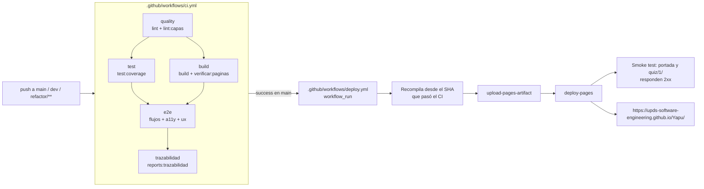

<div align="center">

# 🌾 YAPU — Runasimi Yachay

### PWA de aprendizaje de quechua (runasimi) con motor de evaluación determinista

[](https://astro.build)
[](https://react.dev)
[](https://tailwindcss.com)
[](https://www.typescriptlang.org)
[](Docs/arquitectura/ADR-001-arquitectura-hexagonal.md)
[](https://web.dev/progressive-web-apps/)

</div>

---

## 📖 Qué es YAPU y a quién sirve

**YAPU** (*sembradío* en runasimi) es una **aplicación web progresiva (PWA)** para aprender **quechua sureño (variante Collao/Chuquisaca)** desde cero, hasta cubrir el vocabulario y las estructuras de un **nivel A1 certificable** distribuido en **10 niveles**.

**A quién sirve:**

| Perfil | Qué obtiene |
| --- | --- |
| **Estudiante de runasimi** | Un recorrido secuencial de 10 niveles con flashcards, evaluaciones de 10 preguntas y un tablero con racha, XP y progreso. Funciona **sin conexión** en un teléfono modesto. |
| **Docente de lengua originaria** | Panel para registrar oraciones base al corpus, moderar los retos propuestos por la comunidad y exportar el corpus completo a CSV para investigación. |
| **Estudiante avanzado (nivel ≥ 7)** | Puede proponer retos comunitarios en runasimi, que se publican sólo tras la aprobación de **dos docentes distintos**. |
| **Investigador / comunidad** | Exportación libre del corpus lingüístico en CSV (RFC 4180 + BOM UTF-8), abrible directamente en Excel o LibreOffice. |

**Principios del producto:**

- **Sin servicios externos obligatorios.** El motor de evaluación es *determinista* y se ejecuta 100 % en el cliente: no hay llamadas a LLM, ni coste por petición, ni riesgo de alucinación lingüística.
- **Offline-first real.** El progreso, el historial de evaluaciones y la cola de sincronización viven en el navegador; el Service Worker precachea todas las rutas del build.
- **Inclusión digital.** Pensado para teléfonos económicos (RS-002) y conectividad intermitente (RF-009).
- **Accesible y predecible.** Seis leyes de UX verificadas pantalla por pantalla y accesibilidad WCAG como objetivo declarado.

**Enlaces:**

[Documentación de arquitectura](Docs/arquitectura/diagrama-de-capas.md) · [SRS del Bloque 2](Docs/SRS_YAPU_Bloque2.md) · [Mapa de diagramas UML/ERD](Docs/mapa_de_diagramas.md) · [Álbum de modelos del Bloque 3](Docs/Album_Modelos_Bloque3_YAPU.md)

---

## 🧱 Stack tecnológico

| Área | Tecnología | Versión declarada en `package.json` |
| --- | --- | --- |
| Framework de sitio | **Astro** (salida `static`) | `^5.4.2` |
| Islas interactivas | **React** + `@astrojs/react` | `^19.0.0` |
| Estilos | **Tailwind CSS** + `@astrojs/tailwind` | `^3.4.17` |
| Lenguaje | **TypeScript** en modo `strict` (`astro/tsconfigs/strict`) | `^5.8.2` |
| Validación | **Zod** (corpus sembrado) | `^3.23.8` |
| Iconografía | `lucide-react` | `^1.16.0` |
| Utilidades CSS | `clsx`, `tailwind-merge` | `^2.1.1`, `^3.0.2` |
| Celebración | `canvas-confetti` | `^1.9.4` |
| Fuentes | `@fontsource/plus-jakarta-sans`, `@fontsource/space-grotesk` | `^5.3.0` |
| Pruebas unitarias / contrato / componente | **Vitest** + `@testing-library/react` + `jsdom` | `^5.0.2` |
| Cobertura | `@vitest/coverage-v8` | `^5.0.2` |
| Pruebas E2E | **Playwright** (+ `@axe-core/playwright`) | `^1.63.0` |
| Linter | **ESLint** 10 + `typescript-eslint` + `eslint-plugin-jsx-a11y` + `eslint-plugin-react-hooks` | `^10.11.0` |
| Runtime | **Node.js 22** (fijado en `.nvmrc`) | `engines: ">=22 <23"` |
| PWA | Service Worker generado en build + `manifest.json` | — |
| Despliegue | **GitHub Pages** bajo `/Yapu/` | — |

---

## 🏛️ Arquitectura hexagonal

El proyecto sigue **arquitectura hexagonal (puertos y adaptadores)** con **cuatro capas** dentro de `src/` y reglas de dependencia **unidireccionales y verificadas automáticamente**. Toda la decisión está registrada en los ADR:

| ADR | Tema |
| --- | --- |
| [ADR-001](Docs/arquitectura/ADR-001-arquitectura-hexagonal.md) | Arquitectura hexagonal, capas, *ports & adapters* y enforzamiento |
| [ADR-002](Docs/arquitectura/ADR-002-persistencia-local-y-sincronizacion.md) | Persistencia en `localStorage` y sincronización de la cola offline |
| [ADR-003](Docs/arquitectura/ADR-003-autenticacion-simulada.md) | Autenticación simulada con `SesionPort` y `SesionLocalAdapter` |
| [ADR-004](Docs/arquitectura/ADR-004-despliegue-github-pages.md) | Despliegue en GitHub Pages bajo `/Yapu/` |

Diagramas de capas, dependencias, flujo de una petición y recorrido del estudiante con las reglas RN-01…RN-17 anotadas: **[diagrama-de-capas.md](Docs/arquitectura/diagrama-de-capas.md)**.

### Árbol de carpetas

```text
Yapu/
├── .agents/skills/
│   └── project-conventions/SKILL.md   Convenciones reales del proyecto YAPU
├── .github/workflows/
│   ├── ci.yml                         Calidad · pruebas · build · e2e · trazabilidad
│   └── deploy.yml                     Publicación en GitHub Pages + smoke test
├── Docs/
│   ├── arquitectura/                  ADR-001…004, diagrama de capas, checklist UX
│   ├── testing/                       Matriz de trazabilidad (artefacto generado)
│   └── …                              SRS, actas, álbum de modelos, presentaciones
├── public/
│   ├── manifest.json                  Manifiesto PWA bajo /Yapu/
│   ├── favicon.svg · icons/           Iconografía PWA (192 px y 512 px)
├── scripts/
│   ├── generar-service-worker.mjs     Genera dist/sw.js con precache y hash del build
│   ├── verificar-capas.mjs            Reglas de dependencia + auto-test del detector
│   ├── verificar-paginas.mjs          Verifica las 24+ rutas, el SW y el prefijo /Yapu
│   ├── generar-matriz-trazabilidad.mjs  Genera Docs/testing/matriz-trazabilidad.md
│   ├── generate-icons.py              Generador de iconos PWA
│   └── test-engine.mjs                Suite del motor determinista (script suelto)
├── src/
│   ├── domain/                        TypeScript puro: el negocio del curso A1
│   │   ├── errores.ts                 ErrorDominio tipado + mensajeAmigable()
│   │   ├── shared/                    puertos (Reloj, FuenteAleatoria, GeneradorId),
│   │   │                              tipos, texto, aleatorio
│   │   ├── value-objects/             NivelId · Puntuacion · Porcentaje · FechaDia ·
│   │   │                              TerminoQuechua
│   │   ├── aprendizaje/               Palabra · Nivel · ProgresoEstudiante ·
│   │   │                              PoliticaDesbloqueo · PoliticaRacha · PoliticaXP
│   │   ├── evaluacion/                Pregunta · Evaluacion · GeneradorEvaluacion ·
│   │   │                              Calificador · PoliticaAprobacion
│   │   └── contenido/                 OracionBase · RetoComunitario · serializadorCsv
│   ├── application/                   Orquestación: qué se hace, no cómo
│   │   ├── ports/                     13 puertos (interfaces)
│   │   ├── use-cases/                 Casos de uso por requisito RF/RS (en curso)
│   │   └── dto/                       DTOs planos que consume la UI
│   ├── infrastructure/                Adaptadores: el mundo real
│   │   ├── persistence/local-storage/ Repositorios persistentes (previsto)
│   │   ├── persistence/memory/        Repositorios para tests y SSR
│   │   ├── catalog/                   Corpus sembrado validado con Zod (previsto)
│   │   ├── system/                    RelojSistema · AleatorioMulberry32 ·
│   │   │                              GeneradorIdCrypto · ConectividadNavegador ·
│   │   │                              SesionLocalAdapter · DescargaCsvAdapter
│   │   ├── sync/                      SincronizacionNoopAdapter
│   │   └── container.ts               Composition root: ÚNICO lugar con `new` (previsto)
│   ├── ui/                            Interfaz
│   │   ├── hooks/                     Único punto que lee el contenedor (previsto)
│   │   ├── components/                Componentes por feature (previsto)
│   │   ├── design-system/             Primitivos y tokens aplicados (previsto)
│   │   └── lib/ruta.ts                Helper `ruta()` sobre `import.meta.env.BASE_URL`
│   ├── pages/                         Rutas Astro (SSG)
│   │   ├── index.astro                Portada + mapa de los 10 niveles
│   │   ├── dashboard.astro            Tablero de progreso del estudiante
│   │   ├── community.astro            Ayllu virtual: retos comunitarios
│   │   ├── docente.astro              Panel docente (Oraciones · Moderación · Exportación)
│   │   ├── lesson/[level].astro       Lección de flashcards por nivel
│   │   └── quiz/[level].astro         Evaluación determinista por nivel
│   ├── layouts/Layout.astro           Layout HTML5/PWA + banner offline + registro del SW
│   ├── styles/global.css              Directivas Tailwind
│   └── components/ · core/ · data/ · lib/ · types/
│                                      ⚠️ Código legado en proceso de migración a ui/ e
│                                      infrastructure/ (ver Límites conocidos)
├── tests/
│   ├── unit/                          Dominio puro e infraestructura
│   ├── contract/                      Misma suite contra memoria y localStorage (previsto)
│   ├── component/                     @testing-library/react sobre src/ui (previsto)
│   ├── regression/                    Flujos críticos de no-regresión
│   ├── e2e/                           Playwright: flujos, a11y y UX por leyes
│   └── helpers/                       RelojFijo · AleatorioFijo · GeneradorIdSecuencial
├── astro.config.mjs                   `base: '/Yapu'`, salida estática, puerto 9500
├── eslint.config.js                   Reglas de dependencia con no-restricted-imports
├── vitest.config.ts                   Alias @domain/@application/@infrastructure/@ui + umbrales
├── playwright.config.ts               Desktop Chrome + Pixel 5, baseURL /Yapu/
├── tailwind.config.mjs                Paleta andina y tokens de Fitts y tipografía
└── tsconfig.json                      strict + noUncheckedIndexedAccess
```

### Tabla de reglas de dependencia

Enforzadas por ESLint (`no-restricted-imports` por carpeta), por `scripts/verificar-capas.mjs` y por
`tests/unit/arquitectura/capas.test.ts` (`[RNF-005]`).

| Capa | Ruta | Puede importar | Tiene prohibido |
| --- | --- | --- | --- |
| **Dominio** | `src/domain/**` | `domain/**`, `zod` | `application`, `infrastructure`, `ui`, `react`, `react-dom`, `astro` |
| **Aplicación** | `src/application/**` | `domain/**`, `application/**` | `infrastructure`, `ui`, `react`, `react-dom`, `astro` |
| **Infraestructura** | `src/infrastructure/**` | `domain/**`, `application/**`, `infrastructure/**` | `ui`, `react`, `react-dom` |
| **Interfaz** | `src/ui/**` | `application/**`, `ui/**` | `domain/**` (directo), `infrastructure/**` |
| **Composición Astro** | `src/pages/**`, `src/layouts/**` | componentes de `ui/**`, `layouts/**` | lógica de negocio y acceso a datos |

**Prohibiciones de entorno** (además de las de importación):

| Capa | No puede usar |
| --- | --- |
| `domain` | `Math.random`, `Date.now()`, `new Date()`, `window`, `document`, `navigator`, `localStorage`, `crypto` |
| `application` | `Math.random`, `localStorage`, `window` |
| `infrastructure` | — (es el borde: aquí sí se toca el entorno) |
| `ui` | — (pero no puede importar `domain/**` directamente) |

**Regla de oro:** `src/infrastructure/container.ts` es el **único** lugar donde se hace `new` de
adaptadores, y sólo `src/ui/hooks/**` puede leerlo.

---

## 💻 Cómo ejecutarlo en local

### Requisitos previos

- **Node.js 22** — fijado en `.nvmrc` (`22`) y en `engines` (`">=22 <23"`). Con `nvm`: `nvm use`.
- **npm 10+**.
- *Opcional:* `docker` sólo si se quieren levantar los contenedores auxiliares (la aplicación **no** los usa; ver [Límites conocidos](#-límites-conocidos)).

### Instalación

```bash
git clone https://github.com/upds-software-engineering/Yapu.git
cd Yapu
npm ci --legacy-peer-deps
```

> `--legacy-peer-deps` es necesario porque `.npmrc` fija `legacy-peer-deps=true` (Astro 5 y
> `@astrojs/react` declaran rangos de peer de React que npm 10 estricto rechaza). El flag está
> declarado explícitamente en el CI para que la instalación sea determinista aunque cambie el lock.

### Servidor de desarrollo

```bash
npm run dev
```

Abre **[http://localhost:9500/Yapu/](http://localhost:9500/Yapu/)**.

> ⚠️ **La barra final y el prefijo `/Yapu/` no son opcionales.** Astro sirve el sitio bajo
> `base: '/Yapu'`, así que `http://localhost:9500/` devuelve 404. El servidor arranca con `--host`,
> por lo que también es accesible desde un móvil en la misma red WiFi en
> `http://<IP-de-tu-máquina>:9500/Yapu/`.

### Compilar y previsualizar

```bash
npm run build     # astro build + generación de dist/sw.js
npm run preview   # sirve dist/ en http://localhost:9500/Yapu/
```

`npm run build` genera el sitio estático en `dist/` y **encadena** `node scripts/generar-service-worker.mjs`,
que enumera las rutas del propio build, calcula un hash del contenido (`yapu-<12 hex>`) y escribe
`dist/sw.js` con el precache completo.

---

## 📜 Scripts del proyecto

Todos los scripts declarados en `package.json`:

| Script | Comando | Qué hace |
| --- | --- | --- |
| `dev` | `astro dev --port 9500 --host` | Servidor de desarrollo en `http://localhost:9500/Yapu/`, expuesto a la red local |
| `start` | `astro dev --port 9500 --host` | Alias de `dev` |
| `build` | `astro build && node scripts/generar-service-worker.mjs` | Compila el sitio estático a `dist/` y genera el Service Worker con precache y hash del build |
| `preview` | `astro preview --port 9500 --host` | Sirve `dist/` tal cual se publica, en `http://localhost:9500/Yapu/` |
| `astro` | `astro` | Acceso directo al CLI de Astro (`npm run astro -- check`, `-- add …`) |
| `lint` | `eslint . --max-warnings 0 && tsc --noEmit && astro check` | ESLint sin tolerar avisos, comprobación de tipos y diagnóstico de Astro. Es la primera puerta del CI |
| `lint:capas` | `node scripts/verificar-capas.mjs` | Comprueba las reglas de dependencia entre capas y **auto-testea** el detector para no dar un falso verde |
| `test` | `vitest run` | Toda la pirámide Vitest: `tests/unit`, `tests/contract` y `tests/component` |
| `test:unit` | `vitest run tests/unit` | Sólo pruebas unitarias (dominio puro e infraestructura) |
| `test:contract` | `vitest run tests/contract` | La misma suite contra los repositorios de memoria y los de `localStorage` |
| `test:component` | `vitest run tests/component` | Pruebas de componente con `@testing-library/react` |
| `test:watch` | `vitest` | Vitest en modo vigilancia |
| `test:coverage` | `vitest run --coverage` | Suite completa con cobertura V8 (umbrales en `vitest.config.ts`) y reportes en `reports/coverage` |
| `test:e2e` | `playwright test tests/e2e/flujos` | Playwright sobre los flujos críticos, contra `dist/` servido por `npm run preview` |
| `test:e2e:ux` | `playwright test tests/e2e/ux` | Pruebas de las 6 leyes UX, etiquetadas `[UX-FITTS]`, `[UX-HICK]`, `[UX-MILLER]`, `[UX-APOGEO]`, `[UX-ESTETICA]`, `[UX-JAKOB]` |
| `test:a11y` | `playwright test tests/e2e/a11y` | Accesibilidad con `@axe-core/playwright` |
| `test:e2e:ui` | `playwright test --ui` | Interfaz gráfica de Playwright para depurar |
| `test:all` | `npm run test && npm run test:e2e && npm run test:a11y && npm run test:e2e:ux` | Todo: pirámide Vitest y las tres suites E2E, en orden |
| `verificar:paginas` | `node scripts/verificar-paginas.mjs` | Verifica el build: 24+ rutas, `sw.js`, `manifest.json`, `favicon.svg` y que ningún HTML enlace assets sin el prefijo `/Yapu` |
| `reports:trazabilidad` | `node scripts/generar-matriz-trazabilidad.mjs` | Genera `Docs/testing/matriz-trazabilidad.md` a partir de los JUnit de `reports/junit/*.xml` |

> **Nota:** `scripts/test-engine.mjs` es una suite histórica del motor determinista que **no** está
> expuesta como script de `npm`; se ejecuta con `node scripts/test-engine.mjs`. Su equivalente
> mantenido y con cobertura es `tests/unit/domain/evaluacion/**` dentro de Vitest.

---

## 🔌 Puertos y adaptadores

Los puertos se declaran en `src/application/ports/`. Tres de ellos (reloj, aleatoriedad e
identificadores) se declaran en `src/domain/shared/puertos.ts` y se reexportan con el sufijo `Port`,
para que los servicios de dominio puros puedan usarlos sin invertir la dependencia.

| Puerto | Responsabilidad | Adaptadores de producción | Doble para pruebas |
| --- | --- | --- | --- |
| `ProgresoRepository` | Agregado raíz del aprendizaje: nivel, XP, racha, palabras (RN-01…RN-08) | `persistence/local-storage` (previsto) | `ProgresoMemoriaRepository` |
| `EvaluacionRepository` | Historial de evaluaciones **y** cola offline FIFO (RN-15) | `persistence/local-storage` (previsto) | `EvaluacionMemoriaRepository` |
| `CatalogoRepository` | Lectura del corpus: niveles y vocabulario | `catalog/` con Zod (previsto) | `CatalogoMemoriaRepository` |
| `OracionRepository` | Oraciones base del docente; consulta de aprobadas por nivel (RN-12) | `persistence/local-storage` (previsto) | `OracionMemoriaRepository` |
| `RetoRepository` | Retos comunitarios y su bitácora de moderación (RN-13) | `persistence/local-storage` (previsto) | `RetoMemoriaRepository` |
| `SesionPort` | Sesión y rol (`estudiante`/`docente`) — **simulado** (ADR-003) | `SesionLocalAdapter` | doble en memoria |
| `SincronizacionRemotaPort` | Envío FIFO de la cola offline | `SincronizacionNoopAdapter` (no-op, ADR-002) | doble en memoria |
| `ConectividadPort` | `navigator.onLine` y evento `online` | `ConectividadNavegador` | doble en memoria |
| `ExportadorArchivoPort` | Entrega de archivos al usuario (CSV) | `DescargaCsvAdapter` | doble en memoria |
| `BorradorEvaluacionPort` | Borrador de la evaluación en curso, **en memoria** para no exponer la respuesta correcta | `BorradorEvaluacionMemoria` | — |
| `RelojPort` | Fuente de tiempo inyectable | `RelojSistema` | `RelojFijo` (`avanzarDias`, `avanzarHoras`) |
| `AleatorioPort` | Fuente pseudoaleatoria en `[0, 1)` | `AleatorioMulberry32` (sembrable) | `AleatorioFijo`, `AleatorioGuionado` |
| `GeneradorIdPort` | Identificadores únicos | `GeneradorIdCrypto` (`crypto.randomUUID()` con cascada) | `GeneradorIdSecuencial` |

`AleatorioMulberry32` (producción) y `AleatorioFijo` (pruebas) comparten el mismo algoritmo
mulberry32, de modo que el helper `mismaSecuencia(a, b)` demuestra que ambos reproducen la misma
secuencia con la misma semilla.

---

## 🧩 Casos de uso

Los casos de uso viven en `src/application/use-cases/` y orquestan dominio + puertos. La tabla indica
el requisito que cubren y el estado real en el árbol del repositorio.

| Caso de uso | Requisito | Qué hace | Estado |
| --- | --- | --- | --- |
| `ObtenerMapaNivelesUseCase` | RF-003 | Compone `MapaNivelesDto`: nivel actual, porcentaje global (RN-03), XP, racha y los 3 tramos de Miller con el estado de cada nivel (RN-01) | Previsto |
| `ObtenerLeccionUseCase` | RF-004 | Compone `LeccionDto` con las flashcards del nivel, el estado de cada palabra (RN-08) y si es repaso | Previsto |
| `MarcarPalabraUseCase` | RF-004 | Marca una palabra como `aprendido`/`repasar` y devuelve el XP ganado y la racha (RN-05, RN-06, RN-08) | Previsto |
| `GenerarEvaluacionUseCase` | RF-005 | Genera 10 preguntas (mínimo 5) con el `GeneradorEvaluacion`, guarda el borrador y devuelve `PreguntaDto` **sin** la opción correcta (RN-09, RN-10, RN-11) | Previsto |
| `CalificarEvaluacionUseCase` | RF-005 | Califica contra el borrador, aplica la política del umbral (RN-04), persiste la `Evaluacion` con `sincronizada = false` (RN-15) y actualiza el progreso (RN-02, RN-05) | Previsto |
| `ObtenerTableroUseCase` | RF-008 | Compone `TableroDto`: métricas, palabras para repasar e historial de evaluaciones (RN-03, RN-06, RN-07, RN-08) | Previsto |
| `RegistrarOracionBaseUseCase` | RF-006 | Da de alta una oración base validando rol docente y palabra clave del mismo nivel (RN-12) | Previsto |
| `ListarOracionesUseCase` | RF-006 | Lista las oraciones existentes para el panel docente | Previsto |
| `ExportarCorpusCsvUseCase` | RS-004 | Serializa el corpus (RN-14) y lo entrega vía `ExportadorArchivoPort` | Previsto || `ProponerRetoUseCase` | RF-007 | Alta de un reto comunitario; exige rol estudiante y nivel ≥ 7 (RN-13) | Previsto |
| `ModerarRetoUseCase` | RF-007 / RS-003 | Registra el voto de un docente y resuelve la doble moderación (RN-13) | Previsto |
| `ListarRetosUseCase` | RF-007 | Retos aprobados para estudiantes; también pendientes para docentes | Previsto |
| `SincronizarPendientesUseCase` | RF-009 | Recorre la cola FIFO y la sincroniza al iniciar y al volver `online` (RN-15) | Previsto |
| `ObtenerSesionUseCase` | RF-001 (simulado) | Devuelve `SesionDto` con el rol y `esDocente` (ADR-003) | Previsto |
| `CambiarRolUseCase` | RF-002 (simulado) | Cambia entre `estudiante` y `docente` sin verificación real (ADR-003) | Previsto |

---

## 📐 Mapa de requisitos RN-01 … RN-17

Reglas de negocio del curso A1, con el archivo que las implementa. Este mapa es la fuente que
`scripts/generar-matriz-trazabilidad.mjs` usa para poblar la tabla de reglas de negocio.

| ID | Regla | Implementación verificada |
| --- | --- | --- |
| **RN-01** | Acceso sólo al nivel actual o inferior; un nivel superior lanza `NivelBloqueadoError` | `src/domain/aprendizaje/PoliticaDesbloqueo.ts`, `src/domain/value-objects/NivelId.ts`, `src/domain/errores.ts` |
| **RN-02** | Desbloqueo secuencial: aprobar `n` cuando `n === nivelActual` desbloquea `n+1`; el nivel 10 marca `cursoCompletado`; nunca se salta de nivel ni existe el "nivel 11" | `src/domain/aprendizaje/PoliticaDesbloqueo.ts` (`aplicarAprobacion`) |
| **RN-03** | Progreso global = `nivelesAprobados / 10 × 100` (100 % al completar los 10) | `src/domain/aprendizaje/PoliticaDesbloqueo.ts` (`progresoGlobal`), `src/domain/value-objects/Porcentaje.ts` |
| **RN-04** | Umbral de aprobación **70**, como constante única `PoliticaAprobacion.UMBRAL`; comparación inclusiva | `src/domain/evaluacion/PoliticaAprobacion.ts`, `src/domain/evaluacion/Calificador.ts` |
| **RN-05** | XP: **+100** la primera aprobación de cada nivel, **+10** por evaluación rendida, **+2** por palabra aprendida la primera vez. Todo idempotente | `src/domain/aprendizaje/PoliticaXP.ts`, `src/domain/aprendizaje/ProgresoEstudiante.ts` |
| **RN-06** | Racha por **días calendario locales**: perfil nuevo → 1; mismo día → sin cambio; día siguiente → +1; hueco ≥ 2 días → 1 | `src/domain/aprendizaje/PoliticaRacha.ts`, `src/domain/value-objects/FechaDia.ts` |
| **RN-07** | Perfil inicial limpio: nivel 1, racha 0, 0 palabras, 0 XP, curso sin empezar | `src/domain/aprendizaje/ProgresoEstudiante.ts` (`nuevo`, `reconstruir`) |
| **RN-08** | Palabras aprendidas = palabras **únicas** en estado `aprendido`; `repasar` conserva el histórico | `src/domain/aprendizaje/ProgresoEstudiante.ts` (`palabrasAprendidas`, `marcarPalabra`) |
| **RN-09** | Pregunta válida: **4 opciones únicas** y plausibles (prioridad de pools de distractores: misma categoría y nivel → misma categoría → mismo nivel → todo el vocabulario) | `src/domain/evaluacion/Pregunta.ts`, `src/domain/evaluacion/GeneradorEvaluacion.ts`, `src/domain/shared/texto.ts` |
| **RN-10** | Tamaño de la evaluación: **objetivo 10**, **mínimo 5**; por debajo lanza `ContenidoInsuficienteError`; sin repetir la pareja (palabra, tipo) | `src/domain/evaluacion/GeneradorEvaluacion.ts`, `src/domain/errores.ts` |
| **RN-11** | Cloze: la oración debe **contener la palabra clave** (comparación normalizada, insensible a mayúsculas, admite sufijos quechuas) | `src/domain/contenido/OracionBase.ts`, `src/domain/shared/texto.ts` (`contienePalabraClave`) |
| **RN-12** | Oraciones del docente: rol docente, palabra clave **obligatoria** y del **mismo nivel**; la oración queda aprobada y alimenta al generador | `src/domain/contenido/OracionBase.ts` (`crear`), `src/domain/errores.ts` |
| **RN-13** | Retos comunitarios: sólo estudiantes de **nivel ≥ 7** proponen; **doble moderación** con 2 docentes distintos; un rechazo cierra el reto; sin votos duplicados; el autor no modera su propio reto | `src/domain/contenido/RetoComunitario.ts` |
| **RN-14** | Exportación CSV **RFC 4180** + BOM UTF-8 + **neutralización de fórmulas** (`=`, `+`, `-`, `@`, tab, CR) | `src/domain/contenido/serializadorCsv.ts` |
| **RN-15** | Cola offline **FIFO e idempotente**: toda evaluación nace `sincronizada = false` y se sincroniza al volver `online` y al iniciar la aplicación | `src/domain/evaluacion/Evaluacion.ts`, `src/application/ports/EvaluacionRepository.ts`, `src/infrastructure/sync/SincronizacionNoopAdapter.ts` |
| **RN-16** | No se avanza sin marcar respuesta y se puede volver a la pregunta anterior mientras no se califique | `src/application/dto/evaluacion.ts`, `src/ui/components/` (previsto) |
| **RN-17** | Identificadores únicos vía `GeneradorIdPort` (nunca `Date.now()`); el dominio recibe la fecha como `FechaDia` | `src/domain/shared/puertos.ts`, `src/infrastructure/system/GeneradorIdCrypto.ts`, `src/infrastructure/system/RelojSistema.ts` |

**Requisitos funcionales y de sostenibilidad asociados:**

| ID | Descripción |
| --- | --- |
| RF-001 / RF-002 | Registro, inicio de sesión y roles — **simulados** (ver [ADR-003](Docs/arquitectura/ADR-003-autenticacion-simulada.md)) |
| RF-003 … RF-010 | Mapa, lecciones, evaluación, oraciones, retos, tablero, offline y panel docente |
| RS-003 / RS-004 | Gobernanza del contenido comunitario y datos abiertos (exportación CSV) |
| RNF-002 / RNF-005 / RNF-006 | Accesibilidad, mantenibilidad (arquitectura hexagonal) y rendimiento (Service Worker) |

---

## 🧪 Pruebas: cómo ejecutar cada suite y dónde quedan los reportes

### 1. Suite de Vitest (unitaria, contrato y componente)

```bash
npm run test            # toda la pirámide
npm run test:unit       # tests/unit  → dominio puro e infraestructura
npm run test:contract   # tests/contract → misma suite contra memoria y localStorage
npm run test:component  # tests/component → @testing-library/react
npm run test:watch      # modo vigilancia
npm run test:coverage   # con cobertura
```

Configuración en `vitest.config.ts`: entorno `jsdom`, alias `@domain`/`@application`/`@infrastructure`/`@ui`,
setup global en `tests/helpers/setup.ts` (matchers de `jest-dom`, limpieza del DOM y de `localStorage`).

**Umbrales de cobertura** (el build falla si no se alcanzan):

| Ámbito | Líneas | Ramas | Funciones | Sentencias |
| --- | ---: | ---: | ---: | ---: |
| `src/domain/**` | 90 % | 90 % | 90 % | 90 % |
| `src/application/**` | 90 % | 90 % | 90 % | 90 % |
| Global (incluye infraestructura) | 80 % | 80 % | 80 % | 80 % |

### 2. Suite de Playwright (E2E)

```bash
npm run test:e2e       # flujos críticos (tests/e2e/flujos)
npm run test:a11y      # accesibilidad (tests/e2e/a11y)
npm run test:e2e:ux    # leyes UX (tests/e2e/ux)
npm run test:e2e:ui    # interfaz gráfica de Playwright
npm run test:all       # todo lo anterior en orden
```

Playwright **no** arranca un servidor propio de desarrollo: su `webServer` ejecuta `npm run preview`
sobre `dist/`, así que **hay que compilar antes**:

```bash
npm run build
npm run test:e2e
```

La `baseURL` es `http://localhost:9500/Yapu/` (configurable con `YAPU_BASE_URL`) y se ejecuta en dos
*viewports*: **Desktop Chrome** (1280 × 900) y **Pixel 5**.

### 3. Dónde quedan los reportes

| Ruta | Contenido | Se genera con |
| --- | --- | --- |
| `reports/` | Raíz de todos los reportes de Vitest | `npm run test:coverage` |
| `reports/junit/vitest.xml` | Resultado JUnit de Vitest (lo consume la matriz de trazabilidad) | `npm run test` / `test:coverage` |
| `reports/junit/playwright.xml` · `playwright-flujos.xml` · `playwright-a11y.xml` · `playwright-ux.xml` | JUnit de cada suite de Playwright, uno por suite para que ninguno sobrescriba a otro | `npm run test:e2e*` |
| `reports/coverage/` | Cobertura en `text`, `json-summary`, `html` y `lcov` | `npm run test:coverage` |
| `reports/html/vitest/index.html` | Reporte HTML de Vitest | `npm run test` |
| `playwright-report/index.html` | Reporte HTML de Playwright (`open: 'never'`) | `npm run test:e2e*` |
| `test-results/` | Trazas, capturas de fallos y vídeo (desactivado por defecto) | `npm run test:e2e*` |

> `reports/`, `playwright-report/` y `test-results/` están en `.gitignore`: son artefactos efímeros
> que se regeneran. El CI los sube como artefactos descargables de cada ejecución.

### 4. Verificaciones de arquitectura y del build

```bash
npm run lint:capas        # reglas de dependencia entre capas (+ auto-test del detector)
npm run build             # necesario antes de la siguiente
npm run verificar:paginas # 24+ rutas, sw.js, manifest.json y prefijo /Yapu en todos los HTML
```

### 5. Matriz de trazabilidad

```bash
npm run test             # 1) genera reports/junit/vitest.xml
npm run test:e2e         # 2) genera los JUnit de Playwright
npm run reports:trazabilidad   # 3) escribe la matriz
```

`scripts/generar-matriz-trazabilidad.mjs` lee **todos** los XML de `reports/junit/`, extrae de cada
`<testcase>` las etiquetas `[RF-xxx]`, `[RNF-xxx]`, `[RS-xxx]`, `[RN-xx]` y `[UX-*]` presentes en el
nombre del test y en el `classname` de su suite, y escribe el documento en:

**`Docs/testing/matriz-trazabilidad.md`**

> Ese archivo es un **artefacto autogenerado**: no se edita a mano. Se produce con
> `npm run reports:trazabilidad` y no se versiona como fuente de verdad. El catálogo de requisitos
> vive dentro del propio script (`CATALOGO`), e incluye 44 requisitos: 10 RF, 7 RNF, 4 RS, 17 RN y
> las 6 leyes UX (`UX-JAKOB`, `UX-HICK`, `UX-FITTS`, `UX-MILLER`, `UX-APOGEO`, `UX-ESTETICA`).
>
> Si el archivo no existe todavía en el clon, es porque no se han generado reportes: ejecuta las
> suites primero. Con `--estricto` el script sale con código 1 cuando no encuentra ningún XML (útil
> en CI).

En el CI, el job `trazabilidad` descarga los JUnit de los jobs `test` y `e2e`, regenera la matriz y la
publica como artefacto y en el *Summary* de la ejecución.

### 6. Checklist manual de UX

El documento [`Docs/arquitectura/checklist-leyes-ux.md`](Docs/arquitectura/checklist-leyes-ux.md)
recoge, pantalla por pantalla, qué componente implementa cada una de las 6 leyes UX, qué medida
concreta se exige (≥ 44 × 44 px en móvil, ≥ 24 × 24 px en escritorio, separación ≥ 8 px, ≤ 7 opciones
primarias, exactamente 1 CTA `data-cta="primario"`, ≤ 3 tamaños tipográficos + caption, tramos Miller
1–3 / 4–7 / 8–10, confeti desactivado con `prefers-reduced-motion`) y qué prueba lo verifica. Los
puntos no verificables están marcados con ⚠️.

---

## 🚀 Despliegue en GitHub Pages

El sitio se publica en **`https://upds-software-engineering.github.io/Yapu/`**, bajo el subdirectorio
`/Yapu/` que fija `base: '/Yapu'` en `astro.config.mjs`.

### Cómo funciona



- El **CI** no publica: sólo verifica. El despliegue vive en `deploy.yml`, que se dispara cuando el
  workflow *CI* termina con éxito en `main` (`workflow_run`) o manualmente (`workflow_dispatch`).
- `deploy.yml` **recompila desde el commit exacto** (`github.event.workflow_run.head_sha`), en lugar
  de reutilizar el artefacto del CI, para garantizar que el sitio servido corresponde a ese SHA.
- La autenticación usa OIDC sin secretos: `permissions: contents: read, pages: write, id-token: write`.
- Tras publicar, un **smoke test** con `curl --retry-all-errors` comprueba la portada y `quiz/1/`.

### ⚠️ Requisito operativo manual (una sola vez)

> En **Settings → Pages → Source** del repositorio debe seleccionarse **«GitHub Actions»**.
>
> Mientras no se habilite, `deploy.yml` puede ejecutarse pero `deploy-pages` **fallará** porque el
> sitio de Pages no está inicializado. Es un ajuste que sólo puede hacer una persona con permisos de
> administración; ningún workflow puede activarlo por sí mismo.

### Reglas de rutas bajo `/Yapu/`

Todo enlace, `fetch` y ruta del Service Worker se construye con el helper `ruta()` de
`src/ui/lib/ruta.ts`, que lee `import.meta.env.BASE_URL`. **Está prohibido escribir `href="/algo"` a
mano.** `npm run verificar:paginas` falla si algún HTML del build referencia assets sin el prefijo.

### Service Worker

`dist/sw.js` se **genera** en el build (no es un archivo estático escrito a mano):

| Aspecto | Decisión |
| --- | --- |
| Lista de precache | Se enumera del propio `dist/`, así que ninguna ruta generada queda fuera |
| Invalidación | El nombre de caché incluye un **hash del contenido del build** (`yapu-<12 hex>`); `activate` borra las cachés antiguas |
| HTML | **network-first** con respaldo al precache (y, en último término, la portada) |
| Assets | **cache-first** (los nombres llevan hash de contenido) |
| Origen distinto | No se intercepta: el SW no cachea terceros |
| Sin conexión y sin copia local | Responde `503` con un mensaje en español, nunca una pantalla en blanco |

---

## ⚠️ Límites conocidos

Transparencia de alcance: lo que **no** hace esta iteración, y por qué.

| Límite | Detalle | Decisión |
| --- | --- | --- |
| **Autenticación simulada** | No hay registro, contraseña, verificación ni recuperación de cuenta. El rol es autoasignable: cualquiera puede llamar a `cambiarRol('docente')` desde las herramientas del navegador y entrar al panel docente. **RF-001 y RF-002 quedan fuera del alcance real** | [ADR-003](Docs/arquitectura/ADR-003-autenticacion-simulada.md). `SesionLocalAdapter` sobre `localStorage` (`yapu:sesion:v1`); `SesionFirebaseAdapter` documentado como adaptador futuro, **sin añadir dependencias ni credenciales** |
| **Sincronización no-op** | `SincronizacionNoopAdapter` **marca como sincronizado sin enviar nada**: no hay copia de seguridad en la nube, ni resolución de conflictos, ni multidispositivo. La cola FIFO se vacía localmente para que nunca quede encadenada para siempre | [ADR-002](Docs/arquitectura/ADR-002-persistencia-local-y-sincronizacion.md). El contrato de `SincronizacionRemotaPort` ya es el de una nube real |
| **`docker-compose.yml` es opcional y la aplicación no lo usa** | Levanta PostgreSQL 16 (`9532`), MySQL 8.0 (`9506`), Adminer (`9580`) y Redis 7 (`9579`). **Ninguno de esos servicios es consumido por el código**: la persistencia real es `localStorage` detrás de repositorios y la sincronización es un no-op | Se conservan como **referencia de la arquitectura de datos prevista** (ERD del Bloque 2 del SRS) para futuras iteraciones. `docker compose up -d` no es necesario para desarrollar ni para desplegar |
| **Código legado en proceso de migración** | El árbol hexagonal nuevo convive con `src/components/`, `src/core/`, `src/data/`, `src/lib/` y `src/types/`. En particular, `src/lib/storage/local-repository.ts` sigue conteniendo la clase `LocalRepository` (la "clase Dios" que los puertos vienen a sustituir) y `src/lib/ai/deterministic-engine.ts` sigue usando `Math.random` | Los ADR registran la decisión; la migración está en curso. Los `href="/…"` del legado también deben pasar por `ruta()` (ADR-004) |
| **Módulos previstos que aún no existen** | `src/application/use-cases/**`, `src/infrastructure/container.ts`, `src/infrastructure/persistence/local-storage/**`, `src/infrastructure/catalog/**`, `src/ui/hooks/**`, `src/ui/components/**` y `src/ui/design-system/**` | Declarados en [diagrama-de-capas.md](Docs/arquitectura/diagrama-de-capas.md) y en [checklist-leyes-ux.md](Docs/arquitectura/checklist-leyes-ux.md) con su estado |
| **Borrador de evaluación en memoria** | Si el estudiante recarga la página a mitad de la evaluación, el borrador se pierde y la evaluación se regenera | Consecuencia aceptada de no persistir la opción correcta en el cliente ([ADR-002](Docs/arquitectura/ADR-002-persistencia-local-y-sincronizacion.md), §2.4) |
| **`localStorage` tiene cuota (~5 MB por origen)** | Suficiente para el progreso y el historial de un estudiante; si el corpus crece mucho, la salida es IndexedDB detrás del mismo puerto | Cada `setItem` está protegido con `try/catch`; la sesión degrada a memoria |
| **Sin cabeceras HTTP propias en Pages** | No se pueden fijar `Cache-Control` ni `Content-Security-Policy`: la estrategia de caché queda enteramente en el Service Worker | [ADR-004](Docs/arquitectura/ADR-004-despliegue-github-pages.md) |

---

## 👥 Equipo y créditos académicos

Proyecto de la materia de **Ingeniería de Software** — **Universidad Privada Domingo Savio (UPDS)**.

- **Docentes de la materia:** Ing. Jimmy Nataniel Requena · Ing. Fernando Pardo
- **Equipo de desarrollo:**
  - **Emmanuel Ponce Quiroga** — *Líder Técnico & Gobernanza de IA*
  - **Jhoel Álvaro Cruz Zurita** — *Arquitectura VPS & Gestión de Datos*
  - **Luis Mario Rocha Vela** — *Aseguramiento de Calidad & Estándares APA*
- **Stakeholder pedagógica:**
  - **Lic. María Elena Quispe Mamani** — *Docente Titular de Lengua Quechua (U.E. "Simón Bolívar", Sucre, Bolivia)*

---

<div align="center">

<sub>YAPU — Runasimita yachakuna kusisqa kawsanapaq (Aprendamos quechua para vivir en armonía).</sub>

</div>
